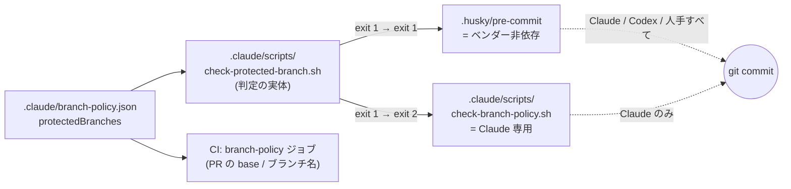

# 設計書

## アーキテクチャ概要

保護ブランチ判定の**実体を 1 ファイルに集約**し、Claude 専用層とベンダー非依存層の両方から呼ぶ。`latest-steering.sh` を hook・fork・スキルで共有しているのと同じ構造(判定がずれないことが要件)。



**変更前後の防衛範囲:**

| コミット経路 | 変更前 | 変更後 |
| --- | --- | --- |
| Claude Code | `check-branch-policy.sh` | 同左 + `.husky/pre-commit` |
| Codex / 手動 `git` / 他ツール | **無防備** | `.husky/pre-commit` |
| `--no-verify` 付き | 無防備 | 無防備(git の仕様。スコープ外) |

## コンポーネント設計

### 1. `.claude/scripts/check-protected-branch.sh`(新規)

**責務**: 現在のブランチが `protectedBranches` に含まれるかだけを判定し、終了コードで返す。

**終了コード契約**:

| コード | 意味 |
| --- | --- |
| `0` | コミットしてよい / 判定できない(フェイルオープン) |
| `1` | 現在のブランチが保護ブランチ(stderr に理由と対処法) |

**フェイルオープンにする条件**(いずれも exit 0):

- git リポジトリ外
- `.claude/branch-policy.json` が無い
- `jq` が無い
- `git branch --show-current` が空(detached HEAD = rebase / bisect / merge 中)

> **なぜフェイルオープンか**: ポリシーファイルや `jq` が無い環境(テンプレート導入直後・最小コンテナ)でコミット不能にしないため。CI の `branch-policy` ジョブと同じ判断で、最終的な砦は CI 側に置く。

**配置場所の根拠**: `.claude/scripts/` は `.claude/template-manifest.json` の `owned`(テンプレート同期で上書き)。ここに置けばテンプレート更新が自動で伝播する。`.husky/` は `merge` なので、そちらには薄い呼び出しだけを残す。

**実装(そのまま作成する)**:

```bash
#!/bin/bash
# 保護ブランチ上にいるかを判定する共有スクリプト(ベンダー非依存)。
#
# 呼び出し元:
#   - .husky/pre-commit                      … git hook。Claude / Codex / 人手を問わず効く
#   - .claude/scripts/check-branch-policy.sh … Claude の PreToolUse hook
#
# 両者が同じ判定になることが要件のため、ルールの実体はこのファイルだけに置く
# (latest-steering.sh を hook・fork・スキルで共有しているのと同じ思想)。
#
# 終了コード:
#   0 … コミットしてよい / 判定できない(フェイルオープン)
#   1 … 現在のブランチが保護ブランチ
#
# フェイルオープンにする理由: ポリシーファイルや jq が無い環境で commit 不能に
# しないため。最終的な砦は CI の branch-policy ジョブ(.github/workflows/ci.yml)。
set -uo pipefail

ROOT="$(git rev-parse --show-toplevel 2>/dev/null || true)"
[ -n "$ROOT" ] || exit 0
cd "$ROOT" || exit 0

POLICY=".claude/branch-policy.json"
[ -f "$POLICY" ] || exit 0
command -v jq >/dev/null 2>&1 || exit 0

# detached HEAD(rebase / bisect / merge 中)は空を返す → 判定しない
CUR="$(git branch --show-current 2>/dev/null || true)"
[ -n "$CUR" ] || exit 0

# index() は見つからなければ null を返し、jq -e が非ゼロで終わる
jq -e --arg b "$CUR" '.protectedBranches // [] | index($b)' "$POLICY" >/dev/null 2>&1 || exit 0

cat >&2 <<MSG
保護ブランチ '$CUR' への直接コミットはポリシーで禁止されています($POLICY)。
作業ブランチを切ってからコミットしてください:

  git switch -c feature/[作業名]
MSG
exit 1
```

> **メッセージに `--no-verify` を書かない**: バイパス手段を、まさにブロックしている画面で案内するのはガードレールとして本末転倒。git の標準機能として存在することは design/README に留める。

### 2. `.husky/pre-commit`(変更)

**責務**: `lint-staged` の**前**に保護ブランチ検査を通す。

**実装(全文置き換え)**:

```sh
# 保護ブランチへの直接コミットを止める(ベンダー非依存の防衛線)。
# Claude の PreToolUse hook は Claude 以外の経路(Codex・手動 git・他ツール)に
# 効かないため、git hook 側にも同じ検査を置く。判定の実体は共有スクリプトに一本化。
GUARD=".claude/scripts/check-protected-branch.sh"
if [ -f "$GUARD" ]; then
  bash "$GUARD" || exit 1
fi

npx lint-staged
```

**実装の要点**:

- `if` 文で書く(`[ -f ... ] && { ... }` 形式にしない)。スクリプト不在時に最後の式が非ゼロを返し、シェル設定によっては commit を落とす事故を避けるため
- `bash "$GUARD"` と明示的に `bash` 経由で呼ぶ。実行権限が落ちていても動く(`session-start.sh` が権限落ちを警告する運用と整合)
- スクリプトが無ければ検査を飛ばして `lint-staged` は動く(テンプレート同期の途中状態でコミット不能にしない)

### 3. `.claude/scripts/check-branch-policy.sh`(変更)

**責務は変えない。** インラインの `protectedBranches` 判定だけを共有スクリプトの呼び出しに置き換える。

**変更箇所(`--- 1) 保護ブランチへの直接コミット ---` のブロックのみ)**:

置き換え前:

```bash
if printf '%s' "$cmd" | grep -qE "${CMD_START}git[[:space:]]+commit([[:space:]]|$)"; then
  if [ -n "$CUR" ] && jq -e --arg b "$CUR" '.protectedBranches // [] | index($b)' "$POLICY" >/dev/null 2>&1; then
    echo "check-branch-policy.sh: 保護ブランチ '$CUR' への直接コミットはポリシーで禁止されています(.claude/branch-policy.json)。作業ブランチを切ってからコミットしてください。" >&2
    exit 2
  fi
fi
```

置き換え後:

```bash
if printf '%s' "$cmd" | grep -qE "${CMD_START}git[[:space:]]+commit([[:space:]]|$)"; then
  # 判定の実体は共有スクリプト(.husky/pre-commit と同じルールになることが要件)。
  # 共有スクリプトは違反を exit 1 で返すが、PreToolUse hook のブロックは exit 2 なので読み替える。
  if ! bash .claude/scripts/check-protected-branch.sh; then
    exit 2
  fi
fi
```

**実装の要点**:

- メッセージは共有スクリプトが stderr に出すため、ここでは出さない(文言が 2 箇所に散らない)
- `CUR` 変数は後続の PR base 検査でまだ使うので**削除しない**
- 2 つ目のブロック(PR 作成コマンドの base 検査)は**一切触らない**

## データフロー

### 保護ブランチ上で Codex がコミットしようとした場合(移植の主目的)

```
1. Codex が git commit を実行
2. git が .husky/pre-commit を起動
3. pre-commit が check-protected-branch.sh を呼ぶ
4. branch-policy.json の protectedBranches に main が含まれる → exit 1
5. pre-commit が exit 1 → コミット中断。stderr に作業ブランチの作り方が出る
6. lint-staged には到達しない
```

### 作業ブランチ上の通常コミット

```
1. git commit
2. pre-commit → check-protected-branch.sh → exit 0(無出力)
3. npx lint-staged が従来どおり走る
```

## テスト戦略

シェルスクリプトのため vitest の対象外。**使い捨ての git リポジトリを作って終了コードを検証する**(本リポジトリの HEAD を汚さないため)。

### 検証マトリクス

| # | 条件 | 期待 exit | 期待 stderr |
| --- | --- | --- | --- |
| 1 | 保護ブランチ(`main`)上 | 1 | 理由 + `git switch -c` の案内 |
| 2 | 作業ブランチ(`feature/x`)上 | 0 | 空 |
| 3 | `branch-policy.json` 無し | 0 | 空 |
| 4 | detached HEAD | 0 | 空 |
| 5 | git リポジトリ外 | 0 | 空 |
| 6 | `protectedBranches` が空配列 | 0 | 空 |

### 統合の確認

- `.husky/pre-commit` を保護ブランチ上で直接実行し、`lint-staged` に到達せず中断すること
- `check-branch-policy.sh` に PreToolUse hook 相当の JSON を stdin で流し、保護ブランチ上のコミットが exit 2 になること
- PR 作成コマンドの base 検査が従来どおり動くこと(回帰確認)

## 既知の制約(実装後に README / 計画へ反映する)

1. **husky は `npm install` 後にしか有効にならない。** `prepare: "husky"` で `core.hooksPath` が設定される仕組みのため、依存未インストールのクローン直後は git hook 自体が動かない。**この devcontainer は現在まさにその状態**(`core.hooksPath` 未設定・`.husky/_/` 不在)
2. **`--no-verify` で素通しできる。** git の仕様でローカルからは塞げない。リモート側のブランチ保護と CI が最終防衛線
3. CI の `branch-policy` ジョブは PR の base とブランチ名しか見ない。「保護ブランチへ直接コミットされたか」は**依然としてリモートのブランチ保護設定に依存する**

## 実装の順序

1. `.claude/scripts/check-protected-branch.sh` を作成し、`chmod +x`
2. 検証マトリクス 1〜6 を使い捨てリポジトリで通す
3. `.husky/pre-commit` を差し替え、統合確認
4. `check-branch-policy.sh` を差し替え、回帰確認
5. `docs/template-dev/codex-delegation-plan.md` §11 の段階1 を完了として更新し、既知の制約を §8 に追記

## セキュリティ考慮事項

- 共有スクリプトはブランチ名を stderr に出す。ブランチ名は秘匿情報ではないため問題ない
- `jq --arg` で値を渡しており、ブランチ名によるインジェクションは起きない
- フェイルオープン設計のため、**このスクリプト単体をセキュリティ境界として扱わない**。あくまで事故防止のガードレールであり、権限境界は git のリモート側で張る
