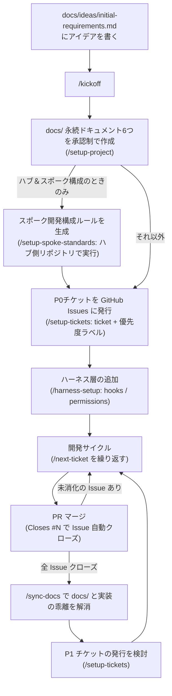
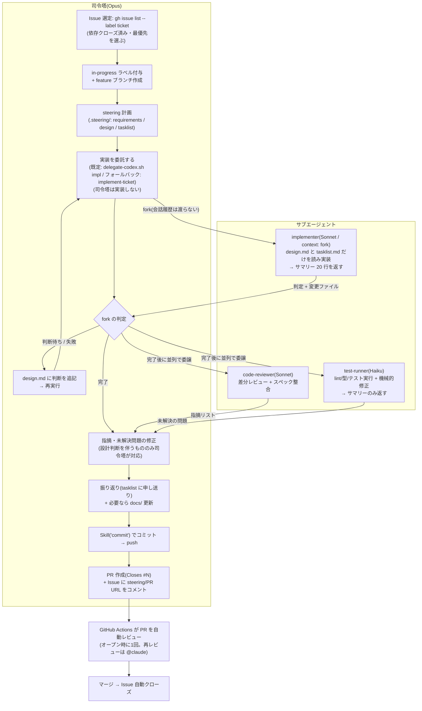

# claude-code-template

スペック駆動開発 + ハーネスエンジニアリングのための Claude Code プロジェクトテンプレート。

- **スペック駆動開発**: 永続ドキュメント(`docs/`)で「何を作るか」を定義し、作業単位のステアリングファイル(`.steering/`)で「今回何をするか」を計画してから実装する
- **ハーネスエンジニアリング**: hooks / permissions / subagents / Agent Teams で「必ず起こすべきこと」を仕組みで保証する
- **モデル戦略**: 司令塔 = Opus、実装フェーズ = Codex への委託(既定)/ Sonnet の fork(フォールバック)、最難関タスクのみ Fable 5 に一時切替。いずれも手動切替なし

---

## プロジェクト開始手順

> **最短ルート**: Step 0 のあと、アイデアを `docs/ideas/initial-requirements.md` に書いて **`/kickoff`** を実行すると、Step 2〜4 + README のプロダクト化までを対話的に一気通貫でガイドします。

### Step 0: リポジトリの準備

1. GitHub で **Use this template** から新規リポジトリを作成する
   - (テンプレート配布側の設定: Settings → General で **Template repository** を有効化しておく)
2. 新リポジトリの Settings → Secrets and variables → Actions に **`CLAUDE_CODE_OAUTH_TOKEN`** を設定する
   - 未設定の間、PR 自動レビュー・`@claude` メンションの Actions はスキップされる(失敗はしない)
   - **スキップしてもジョブは `success` を返す。** 緑のチェックはレビュー通過を意味しない
     (未設定時は run の annotation と Summary に「未実行」が出る)
   - 機械的な品質ゲート(`ci.yml`: lint・型チェック・フォーマット・テスト・secretlint・npm audit)はシークレット不要で常に走る
3. Settings → Code security で **Secret scanning + Push protection** を有効化する(公開リポジトリなら無料)
   - リポジトリ内の secretlint(pre-commit / CI)と合わせた二段構えになる
4. devcontainer で開く(VS Code / GitHub Codespaces)
   - `post_create.sh` が Claude Code のインストールと GitHub 認証を自動で行う(GitHub は OS の環境変数から認証。Claude Code の認証は初回 `claude` 実行時に一度だけ走る)
   - Codex CLI も同時に入る(Codex 併用ハーネス用)。**認証は初回と devcontainer リビルドのたびに手動**で `codex login` を実行する(通らなければ `codex login --device-auth`)。`~/.codex` はコンテナ内にしか無く、永続化していない(判断の根拠: `docs/template-dev/codex-delegation-plan.md` §11)
     - `--with-api-key` は使わないこと(ChatGPT Plus 枠ではなく API 従量課金になる)
   - devcontainer の表示名(`devcontainer.json` の `name`)は `/kickoff` フェーズ5がプロダクト名に書き換える
5. ターミナルで `claude` を起動し、以下を確認する:
   - `/model` が **Opus** になっていること(`.claude/settings.json` で司令塔として固定済み)
   - `gh auth status` が認証済みであること

### Step 1: アイデアの言語化

作りたいものの構想を **`docs/ideas/initial-requirements.md`** に書く(見出し構造の雛形が用意済み)。

- 全項目を埋める必要はない。空欄は `/setup-project` の対話で補完される
- 記入例: `docs/template-dev/initial-requirements.example.md`
- Claude Code に「このアイデアについて壁打ちして」と依頼して対話しながら書いてもよい
- 補足資料(技術調査メモ等)は同じ `docs/ideas/` に追加してよい(`*.example.md` は読み込み対象外)
- 技術スタックがテンプレート既定(Node.js/TypeScript)と異なる場合(モバイルアプリ等)も、そのまま書けばよい。`/kickoff` が検証コマンド・devcontainer・ツールチェーンの置換を提案する

### Step 2: 永続ドキュメントの作成 — `/setup-project`

```
> /setup-project
```

対話形式で以下の 6 つを **1 ファイルずつ、承認を取りながら** 作成する。

| ドキュメント                | 内容                                                 |
| --------------------------- | ---------------------------------------------------- |
| `product-requirements.md`   | プロダクト要求定義書(何を作るか・ユーザーストーリー) |
| `functional-design.md`      | 機能設計書(機能の振る舞い)                           |
| `architecture.md`           | 技術仕様書(技術スタック・非機能要件)                 |
| `repository-structure.md`   | リポジトリ構造定義書                                 |
| `development-guidelines.md` | 開発ガイドライン(規約・検証コマンド)                 |
| `glossary.md`               | ユビキタス言語定義                                   |

詳細なレビューが必要なときは `/review-docs docs/product-requirements.md` のように依頼する。

### Step 3: 実装計画の分割(任意)

```
> /setup-spoke-standards    # スポーク公開向けの構成ルールを生成(必要な場合のみ。先に実行)
> /setup-tickets            # 永続ドキュメントを段階的な実装チケットに分割 → GitHub Issues に発行
```

**順序は固定** — `/setup-spoke-standards` を使う場合は `/setup-tickets` の**前**に実行する。構成ルールの MUST 項目(セキュリティヘッダ・SEO・レジストリメタデータ等)がチケットの受け入れ条件になるため、後から生成すると発行済みチケットを作り直すことになる。

**`/setup-spoke-standards` はどこで実行するか** — ハブ&スポーク構成(一覧する**ハブ** + そこから飛ぶ独立サイト/ゲーム=**スポーク**)のときだけ使う。

- **実行する場所: ハブ側のリポジトリ**(このテンプレートで開始したプロジェクト本体)。ハブのレジストリスキーマ・ドメイン規約・既存の `_headers` などを読んでルールを具体化するため、ハブのコードが見える場所で実行する必要がある
- **生成物**: `docs/playbook/spoke-development-standards.md` と、そこへの参照を `CLAUDE.md` に追記
- **スポーク側リポジトリでは実行しない**。スポークは 1 リポジトリ = 1 サブドメインの独立リポジトリで、ハブ側で生成したこのルールを**読んで従う**側になる(スポーク開発を Claude Code に依頼するときは、このファイルを参照させる)
- ハブ&スポーク構成でないプロジェクトでは実行不要

チケットは GitHub Issues(`ticket` + 優先度ラベル)で管理する。ステータス更新のコミットが不要になり、PR の `Closes #N` でマージ時に自動クローズされる。並行作業(複数ブランチ・Agent Teams)でもチケット状態が競合しない。

### Step 4: ハーネス層の追加 — `/harness-setup`

検証コマンド(lint / typecheck / test)が確定したら実行する。

```
> /harness-setup
```

対話形式で以下を生成・統合する:

- **CLAUDE.md への「ハーネス」節追記**(検証コマンド・必須ルール・委譲ルール)
- **settings.json の統合**(危険コマンドの `permissions.deny`・lint/typecheck 非同期 hook は既定導入済み。プロジェクト固有の deny パターンや hook をここで統合する)
- **worker subagents**(code-reviewer は導入済み。security-reviewer 等を必要に応じ追加。全て Sonnet)
- **Agent Teams の有効化**(任意。experimental)と `.harness/`(decisions.jsonl / team_runbook.md)

Agent Teams を有効化した場合は、`/config` で **Default teammate model を Sonnet** に設定し、Claude Code を再起動して環境変数を反映する。

### Step 5: 開発サイクル

基本は普通に会話で依頼すればよい。定型フローにはコマンドを使う。

```
> /status                                # 現在地の確認と次の一手の提案
> /next-ticket                           # 次のチケットに着手(ステータス管理込み)
> /add-feature ユーザープロフィール編集   # 機能追加(計画→実装→検証→PR まで自動)
> /fix-issue 42                          # GitHub Issue の修正と PR 作成
> /check                                 # lint・型チェック・テスト・フォーマット一括実行&自動修正
> /commit                                # 変更を適切な粒度でコミット
> /resume-work                           # 中断した .steering/ の作業を再開
> /sync-docs                             # 実装と docs/ の乖離を検出・更新
```

作業計画・実装・振り返りは `steering` スキルが `.steering/[YYYYMMDD]-[タスク名]/` に記録する(`/add-feature` 等が内部で使用)。

---

## 実運用フロー

### 全体の流れ(プロジェクトライフサイクル)



### チケット1件の実装フロー(委譲構造)

司令塔(Opus)は判断と統合に専念し、ログの長い作業・レビューはサブエージェントに委譲する。



補足:

- **広範囲のコード探索**(実装前の類似実装調査など)は組み込みの Explore サブエージェントに委譲し、司令塔は結論だけ受け取る
- **`/sync-docs`** も乖離検出フェーズを読み取り専用サブエージェント(Sonnet)に委譲し、更新判断は司令塔が行う
- **Edit/Write 直後に prettier が自動実行**され、lint・型チェックも非同期で走る(PostToolUse hooks)。フォーマット起因のチェック失敗は原則発生せず、型エラーも早期に検知される
- **危険コマンドは二段構えでブロック**する(`permissions.deny` + PreToolUse の `block-dangerous-cmds.sh` パターン検査)
- **実装フェーズの委譲は hook で強制される**: 実装フェーズ進行中(最新 `.steering/` の `tasklist.md` に未完了タスクがある状態)にメインセッションが実装コードを編集しようとすると、PreToolUse の `check-implementation-phase.sh` がブロックする。フックはサブエージェント内でも発火するが、入力に `agent_id` が載るかどうかで司令塔と実装 subagent を区別している。`.steering/` / `docs/` / `.claude/` / `.github/` / `.husky/`(計画・ドキュメント・ハーネス)への編集は司令塔の仕事なので通る
  - 検査対象は **Edit / Write ツール**。`sed -i` やリダイレクトによる Bash 経由の書き込みまでは見ていない(逸脱を止めるガードレールであって、サンドボックスではない)
  - 「最新の `.steering/`」の判定は `.claude/scripts/latest-steering.sh` に集約している(日付プレフィックス降順 → 同日は mtime 降順)。hook・fork・SessionStart が同じディレクトリを指すことが前提のため、**自前で `ls | sort` しないこと**
  - テンプレート自体の改修など司令塔が実装すべき作業では、`tasklist.md` に `<!-- main-edit-ok -->` を書いて解除する。**このマーカー付きの `.steering/` をプロダクト側に残さないこと**(`/kickoff` フェーズ5 が削除する)
- **共通ルールは 2 層**: `.claude/rules/*.md` は CLAUDE.md 経由で**全サブエージェントにも毎回ロードされる**ため、実装者・レビュアーにも要る内容だけを置く。司令塔だけが使うルールは `.claude/rules/lead/*.md` に置き、SessionStart hook がメインセッションにのみ注入する(SessionStart はサブエージェントでは発火しない)
- **PR ボディは `.github/pull_request_template.md`** に従う(`Closes #N` と `.steering/` ディレクトリ名を記録する)
- **Claude Code on the web** から開いた場合は SessionStart hook が `npm install` を自動実行する(devcontainer 不要で `/check` が通る)。web のリモート環境には `gh` CLI がないため、GitHub 操作は MCP ツールで代替される(CLAUDE.md に明記済み)
- **MCP は最小構成**: 既定は Context7(最新ライブラリドキュメント参照。`.mcp.json` に登録済み、初回セッションで承認が必要)のみ。プロジェクト特性に応じた追加は `/kickoff` フェーズ1.5 が提案する(判断基準: `.claude/docs/mcp-introduction-guide.md`)
- **`/clear`・resume 後は SessionStart hook が現在地を自動注入**する(ブランチ・**ポリシー上のベースブランチと乖離警告**・未コミット変更・in-progress Issue・最新 `.steering/` の未完了タスク)。web リモートは毎回新セッションで始まるため、セッション開始時にも注入される
- **ブランチ戦略は `.claude/branch-policy.json` が単一ソース**。アプリ/web のリモートセッションはプラットフォームが `claude/*` ブランチを既定ブランチ起点で先に作るため、規約から乖離しやすい。対策は 4 段構え(**実際に阻止するのは 2 の PreToolUse hook と 3 の git hook 2 ファイルだけ**。1 は追認、4 は別軸の最終検証):
  1. `claude/*` を `feature/*` と同格の正規ブランチとして**追認**する(リネームするとセッションとの紐付けが壊れるため禁止)
  2. SessionStart hook がベースブランチを事実として注入する(**情報提供であり、それ自体は何も阻止しない**)。実際に止めるのは PreToolUse hook で、保護ブランチへの直接コミットと `gh pr create --base` の誤りをブロックする(**Claude 経由のみ**)
  3. `.husky/` の git hook が保護ブランチへの直接コミットをブロックする(**ベンダー非依存**なので、手動 `git` や Claude 以外の AI ツールにも効く)。`pre-commit` が `git commit` / `--amend` を、`prepare-commit-msg` が `git revert` / `git cherry-pick` を止め(後者は `pre-commit` が発火しない)、`git merge` / `git pull` の取り込みだけを通す(`.git/MERGE_HEAD` の有無で判別する。フックの第 2 引数だけで判断すると `git revert -e` / `git cherry-pick -e` がすり抜ける)。判定の実体は 2 と共有(`.claude/scripts/check-protected-branch.sh`)なので経路によらず同じ結果になる
  4. CI の `branch-policy` ジョブがクライアント(CLI / アプリ / GitHub UI)によらずマージ前に最終検証する。ただし見るのは **PR の base とブランチ名だけ**で、直接コミットされたかは見ない(そこは 2・3 が担う)
  - **アプリからセッションを作るときは、セッションのベースブランチにポリシーの `baseBranch` を選ぶ**と 1 段目から乖離しない(テンプレート既定は `main` の GitHub Flow。`develop` 統合ブランチを採るプロジェクトは `/kickoff` でポリシーファイルを更新する)
- **チケット完了(PR 作成)ごとに `/clear`** してから次の `/next-ticket` を始める。作業状態は Issue・`.steering/`・git に永続化済みなので、コンテキストを持ち越す必要がない(トークン消費の最大の削減ポイント)

---

## Codex 併用の委託運用

Claude の週枠を守るため、実装・調査・レビューの一部を **Codex CLI(ChatGPT Plus 枠)** に委託できる。委託の入口は `.claude/scripts/delegate-codex.sh` の 1 本だけで、司令塔は**終了コードだけを見て**分岐する(サマリーの文面から成否を推測しない)。

### 3 つの運用モード(切替を宣言するのは人間)

| モード  | `.harness/mode`   | 使いどころ        | Claude の役割                                                                                   |
| ------- | ----------------- | ----------------- | ----------------------------------------------------------------------------------------------- |
| A(通常) | 未設定 / `normal` | 週枠に余裕がある  | 計画・検収・統合をすべて行う                                                                    |
| B(節約) | `econ`            | 週枠を温存したい  | `design.md` を書き切ったら閉じる。検収は CI に預け、PR は **draft** で積む                      |
| C(縮退) | `degraded`        | Claude が使えない | 不在。Codex が `.codex/skills/degraded-mode-ticket/` に従って単独で走り、成果をキューとして積む |

`.harness/mode` は **Claude が自分で書き換えない**。モードごとの司令塔の作法は `.claude/rules/mode/*.md` が SessionStart で注入する。

### 委託の粒度と `delegate:codex` ラベル

判定軸は「仕様が書き切れているか × 途中で設計判断が発生するか」で、モデルの賢さではなく**往復コスト**で決める。ルールの全文は `.claude/rules/lead/delegation-policy.md`(司令塔にのみ注入される)。

| 粒度                                | 経路                                                                                              |
| ----------------------------------- | ------------------------------------------------------------------------------------------------- |
| tasklist 1〜3 項目                  | `delegate-codex.sh impl`                                                                          |
| **チケット 1 枚**(1 Issue = 1 PR)   | 同上 + Issue に **`delegate:codex`** ラベル。`/next-ticket` が tasklist を分割せず 1 回で委託する |
| 行き詰まり調査 / 重要変更のレビュー | `delegate-codex.sh explore` / `review`(read-only)                                                 |
| 委託しない                          | 委託禁止領域・新規依存の追加・`.git` を書き換えるタスク                                           |

> **委託は「`design.md` を書き切るコスト」<「実装ループのコスト」のときだけ得になる。** 新規パターンの 1 例目は前者が大きいので委託しない(参照実装は司令塔が書く)。

### 委託禁止領域

認証・決済・データ移行・ガードレールなど、事故のコストが高い領域は**パスで**列挙して委託対象から外す。判断材料(パス一覧と理由)は `.claude/rules/lead/delegation-policy.md`、Codex 側への指示は `AGENTS.md` §4、根拠は `docs/template-dev/codex-delegation-plan.md` §9.1。一覧は `bash .claude/scripts/delegate-codex.sh --print-forbidden` で出る。`/kickoff` フェーズ4 が、アーキテクチャ確定後にプロジェクトの実パスへ書き換える。

**`.claude/codex-denylist.txt`(機密の送信禁止)とは別の層。** denylist は該当ファイルが存在するだけで委託を止めるフェイルクローズ検査で、モジュールパスを入れると全委託が止まる。

### Codex を使わない場合

Codex CLI が無い・未認証の環境では `delegate-codex.sh` が `exit 3` を返し、**そのセッションは以降ずっと `implement-ticket`(Sonnet fork)にフォールバックする**。`delegate:codex` ラベルが付いていても同じで、テンプレートの全フローは Codex 無しでも成立する。

---

## モデル運用方針

| 役割                          | モデル                | 備考                                                                                                                                                |
| ----------------------------- | --------------------- | --------------------------------------------------------------------------------------------------------------------------------------------------- |
| 司令塔(メインセッション)      | **Opus**              | 計画・設計判断・統合・報告。プロジェクト設定で固定済み                                                                                              |
| **実装フェーズ**              | **Codex / Sonnet**    | 既定は Codex(`delegate-codex.sh impl`)。使えなければ `implement-ticket` スキル(`context: fork`)が Sonnet で実行。**ユーザーもモデルも切り替えない** |
| 委譲作業(subagent / teammate) | **Sonnet**            | レビュー(code-reviewer)・検証(implementation-validator)・調査(Explore)                                                                              |
| 品質チェック実行              | **Haiku**             | test-runner。lint/テスト実行と機械的修正、サマリーのみ返す                                                                                          |
| 最難関タスク                  | **Fable 5**(一時切替) | 難度の高い設計・原因不明の調査のみ。`/model fable` → 完了後 `/model opus`                                                                           |

### 実装フェーズが司令塔から切り離される仕組み

トークン消費が最も大きいのは「実装 → テスト → エラーを読む → 修正」のループで、ここを安いモデルで回すのが上限消費を減らす最大の手段になる。ただし手動で `/model` を切り替える運用は、**切替前の `/clear` を忘れると膨らんだコンテキスト全体がキャッシュミスとなり全額課金される**という失敗モードを持っていた。

そこで実装フェーズを司令塔から切り離している。**既定は Codex への委託**(`delegate-codex.sh impl`)で、Codex が使えない環境では `implement-ticket` スキル(Sonnet fork)にフォールバックする。**委託先が変わっても司令塔の分岐(完了 / 判断待ち / 失敗)は同じ**であることが設計要件。

- **Codex 委託**: 実装ループは別プロセスで回り、司令塔には**終了コードとサマリーだけ**が返る(生ログは `.harness/codex-runs/`)。Claude の枠を消費しない

- `context: fork` + `model: sonnet` により、**フォークされた subagent が Sonnet で実装を行う**。司令塔は Opus のまま
- 実装ループの長いログは fork 側で完結し、司令塔には**サマリー 20 行だけ**が返る
- 設計判断が必要になったら fork は**停止して報告**する。司令塔が `design.md` を更新してから再実行する(fork は会話履歴を持たず `design.md` / `tasklist.md` だけを読むため、**計画の粒度がそのまま往復コストになる**)
- 司令塔が委譲を迂回して自分で実装しようとすると、PreToolUse hook(`check-implementation-phase.sh`)がブロックする

判断の根拠と実測値は `docs/template-dev/cost-model.md` を参照。

---

## コマンド早見表

| コマンド                 | タイミング                 | 内容                                                   |
| ------------------------ | -------------------------- | ------------------------------------------------------ |
| `/setup-project`         | 初回                       | 永続ドキュメント 6 つを対話作成                        |
| `/setup-spoke-standards` | 初回(任意・チケット発行前) | スポーク公開向け構成ルール(**ハブ側リポジトリで実行**) |
| `/setup-tickets`         | 初回(任意)                 | 実装チケットを GitHub Issues に発行                    |
| `/harness-setup`         | 初回(検証コマンド確定後)   | ハーネス層の追加                                       |
| `/add-feature [機能]`    | 日常                       | 機能追加の全自動フロー                                 |
| `/fix-issue [番号]`      | 日常                       | Issue 修正と PR 作成                                   |
| `/check`                 | 日常                       | 品質チェック一括実行&自動修正                          |
| `/commit`                | 日常                       | 適切な粒度でのコミット                                 |
| `/resume-work`           | 日常                       | 中断作業の再開                                         |
| `/sync-docs`             | 定期                       | 実装とドキュメントの同期                               |
| `/review-docs [パス]`    | 随時                       | ドキュメントの詳細レビュー                             |
| `/kickoff`               | 初回                       | Step 2〜4 を一気通貫で実行                             |
| `/next-ticket`           | 日常                       | 次のチケットに着手                                     |
| `/status`                | 随時                       | 現在地と次の一手                                       |
| `/sync-template`         | 随時(テンプレート更新時)   | テンプレートの更新差分を取り込む                       |

## テンプレート更新の取り込み

このテンプレートから作ったプロジェクトは、テンプレート側でルール・コマンド・ハーネスが更新されたときに **`/sync-template`** で差分を取り込める。

- **所有権の分離**: 共通ルールは `.claude/rules/`(テンプレート所有・上書き対象)に切り出してある。全エージェント共通のものは `CLAUDE.md` が `@` インポートし、司令塔専用のもの(`lead/`)は SessionStart hook が注入する。プロジェクト固有の追記は `CLAUDE.md` の「プロジェクト固有ルール」節に書く(同期で失われない)
- **同期対象の単一ソース**: `.claude/template-manifest.json` の `owned`(上書き)/ `merge`(手動統合)/ `never`(触らない)。`syncedAt` に前回同期した**テンプレート側の commit SHA** を持ち、そこからの差分だけを見る(`/kickoff` フェーズ0が初期値を刻む)
- **変更の伝達**: テンプレート側の `docs/template-dev/CHANGELOG.md` に `[auto]`(上書きで完結)/ `[manual]`(取り込む側の作業が必要)を明示する。`/sync-template` はリモートから直接読むため、`docs/template-dev/` を削除済みのプロジェクトでも機能する
- **検知**: 月次の `template-update-check` ワークフロー(毎月1日)が未取り込みの更新を検出して Issue を立てる(Claude は起動しないため枠を消費しない)。急ぐときは Actions から手動実行するか、直接 `/sync-template` を実行する

> ⚠️ `.claude/rules/`(`lead/` を含む)を直接編集しないこと。次回の `/sync-template` で上書きされる。共通ルールを変えたい場合はテンプレート側を直すか、`CLAUDE.md` に例外を書く。

### 同期未対応のプロジェクトを追いつかせる(初回ブートストラップ)

`.claude/template-manifest.json` が導入される前のテンプレートで始めたプロジェクト(手元に `/sync-template` が無い)は、**同期の起点を手で刻んでから** `/sync-template` に載せる。`/kickoff` の再実行はしないこと(ドキュメントとチケットを作り直す流れのため、開発が進んだプロジェクトには当てられない)。

作業ツリーをクリーンにしてから、プロジェクト側リポジトリで:

```bash
git switch -c chore/sync-template-$(date +%Y%m%d)
git remote add template https://github.com/fuji18/claude-template.git
git fetch template main --quiet
git checkout template/main -- .claude/commands/sync-template.md .claude/template-manifest.json
```

取り込んだ `.claude/template-manifest.json` の `syncedAt` に、**そのプロジェクトが出発点にしたテンプレート側の commit SHA**(`syncedDate` にはその日付)を書く。`null`(初回扱い)のままだと差分抽出が全ファイル比較になり、CHANGELOG も全期間が対象になる。SHA が分からない場合は、プロジェクトの最初のコミット日以前で最も近いテンプレート側のコミットを使う。

あとは Claude Code を再起動して(コマンド定義の読み込みのため)`/sync-template` を実行する。以降は通常の同期フローに乗る。

古い出発点ほど CHANGELOG の `[manual]` が積み上がっている。特に以下は取りこぼしやすい:

- **`CLAUDE.md` のルール分離**(2026-08-11 / 08-12): 共通ルールがインラインで書かれている世代なら、該当節を削除して `@.claude/rules/spec-driven.md` の 1 行に置き換える。司令塔専用ルールは SessionStart hook が注入するので `@` インポートは不要
- **手動 `/model sonnet` 運用の削除**(2026-08-12): 実装フェーズは `implement-ticket` の fork 委譲に変わった。`docs/development-guidelines.md` 等に手動切替を書いていれば消す
- **`.claude/settings.json`**(merge 対象なので上書きされない): `hooks.PreToolUse` の `matcher: "Edit|Write"` エントリと、`permissions.allow` への追加分を自分の配列に手で足す

最後に `chmod +x .claude/hooks/*.sh .claude/scripts/*.sh` → `/check` → `/commit` → PR。hooks / scripts / `settings.json` が入れ替わるため、**反映には Claude Code の再起動が必要**。

## ディレクトリ構造

```
docs/                  永続ドキュメント(プロジェクトの北極星)
├── ui-design-guidelines.md  UI 品質基準(スタック非依存。画面がある場合に参照。6つとは別枠の同梱ガイド)
├── ui-design-request-template.md  AIに画面デザインを依頼するプロンプト雛形(記入例つき)
├── ideas/             下書き・アイデア(開始の起点は initial-requirements.md)
└── template-dev/      テンプレート開発の記録・記入例・CHANGELOG(開発開始後は削除可)
.steering/             作業単位の計画・タスクリスト(作業ごとに作成、履歴として保持。テンプレート由来のものは /kickoff で削除)
.harness/              ハーネス状態(decisions.jsonl 等。/harness-setup が生成)
                       ├ decisions.jsonl … 横断的な判断ログ(削除禁止・追記のみ。**コミットする**)
                       ├ mode            … Codex 併用時の運用モード(normal / econ / degraded。切替は人間が宣言。gitignore 済み)
                       └ codex-runs/     … Codex 委託の run record と生ログ(gitignore 済み)
AGENTS.md              Codex 向けの規約(Codex は CLAUDE.md も hooks も読まないため、写像はここだけ)
.codex/
├── config.toml        Codex CLI のプロジェクト設定(防衛線ではない。詳細はファイル冒頭のコメント)
└── skills/            Codex 用のワークフロー(モード C = 縮退運用でチケットを単独完走する手順)
.claude/
├── agents/            サブエージェント定義(implementer / レビュー系は Sonnet、test-runner は Haiku)
├── skills/            スキル(implement-ticket, steering, harness-setup ほか)
├── commands/          スラッシュコマンド
├── rules/             全エージェント共通ルール(テンプレート所有。CLAUDE.md が @ インポート)
│   ├── lead/          司令塔専用ルール(SessionStart hook が注入。サブエージェントには載らない)
│   └── mode/          モード別の司令塔ルール(SessionStart hook が normal 以外のときだけ注入)
├── scripts/           PreToolUse hook のスクリプト(危険コマンド・ブランチ・実装フェーズの検査)、共通ロジック(最新 steering・保護ブランチの判定)、Codex への委託経路(delegate-codex.sh)、Codex 委託の run record 操作(codex-run.sh)
├── hooks/             SessionStart hook(現在地の注入・lead ルールの注入)
├── docs/              恒久参照ガイド(MCP 導入ガイド・serena 再導入手順。プロジェクト開始後も残す)
├── template-manifest.json  テンプレート追従の所有権マニフェスト(owned / merge / never + syncedAt)
└── settings.json      モデル固定・権限・hooks
```

## 免責事項

- **危険コマンドのブロックはベストエフォート**: `permissions.deny` と `block-dangerous-cmds.sh` は文字列パターンによる防衛線であり、サンドボックスではない。変数展開等による迂回は原理的に防げないため、本当の境界は permission mode と実行環境の隔離(devcontainer / リモート環境)が担う
- **AI レビューは人間のレビューを代替しない**: Claude による自動レビュー(PR レビュー・code-reviewer subagent)は見落としがありうる。マージ判断と生成されたコード・ドキュメントの最終的な検証責任は利用者にある
- **利用料金は利用者の負担**: GitHub Actions の実行時間、Claude API / サブスクリプションのトークン消費は、このテンプレートの構成(自動レビュー・subagent 委譲・hooks)によって発生する。各 Actions には `timeout-minutes` を設定済みだが、コストの監視は利用者が行う
- 本テンプレートは MIT ライセンスに基づき**無保証**で提供される(下記ライセンス参照)

## ライセンス

[LICENSE](./LICENSE) を参照。
