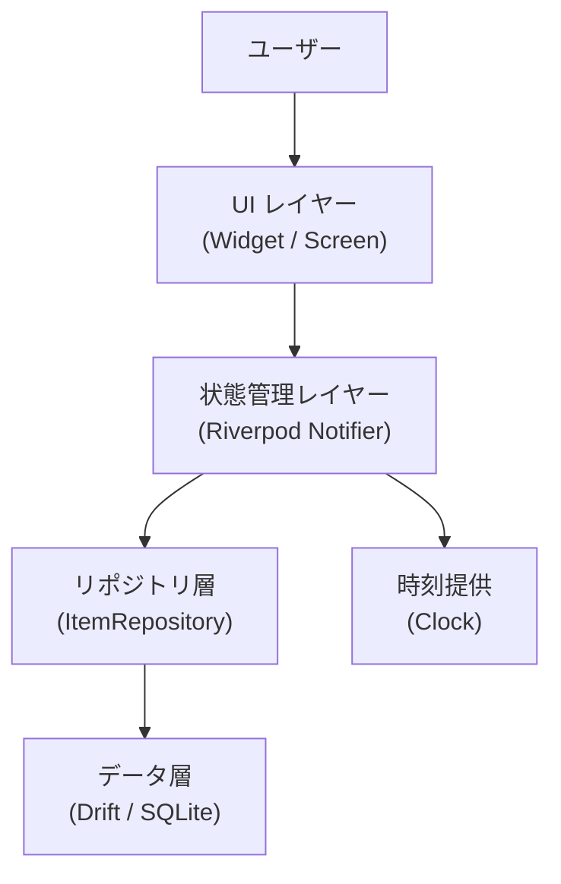
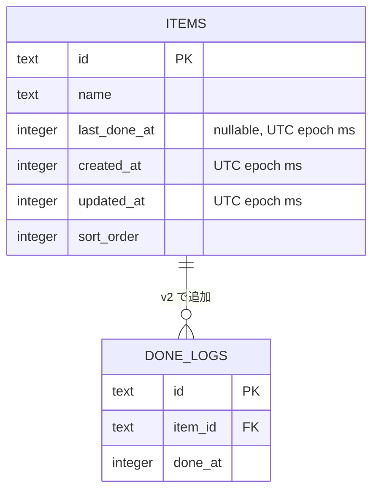
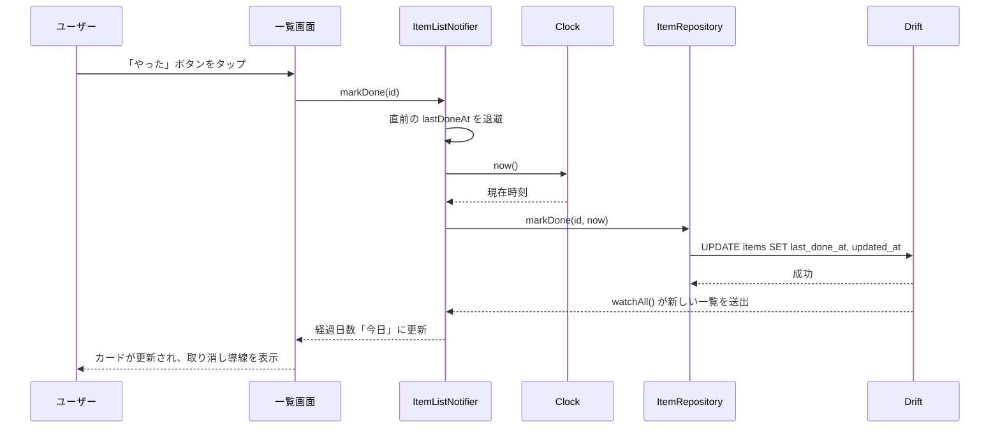
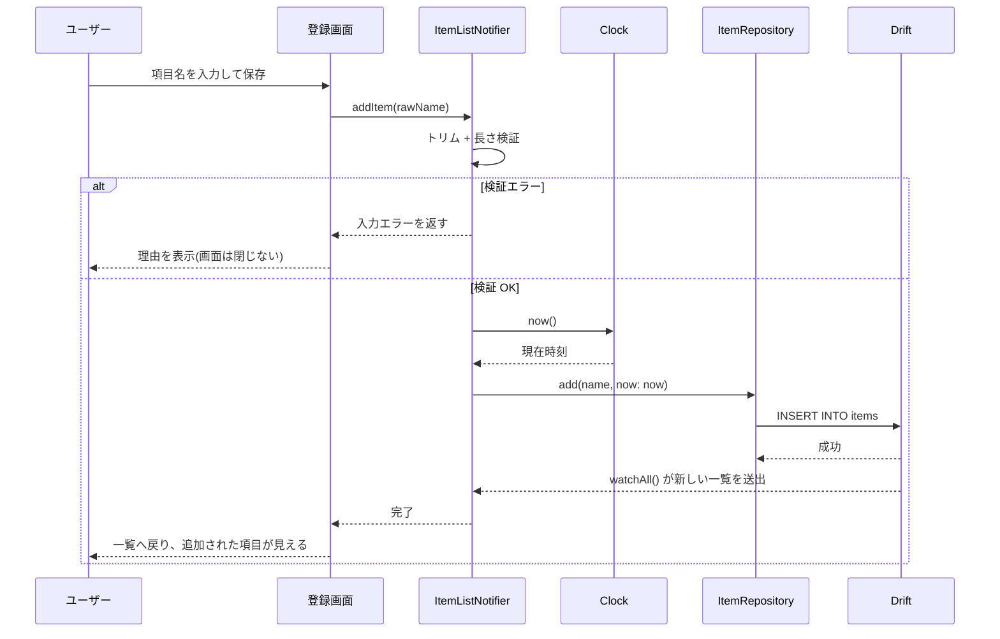
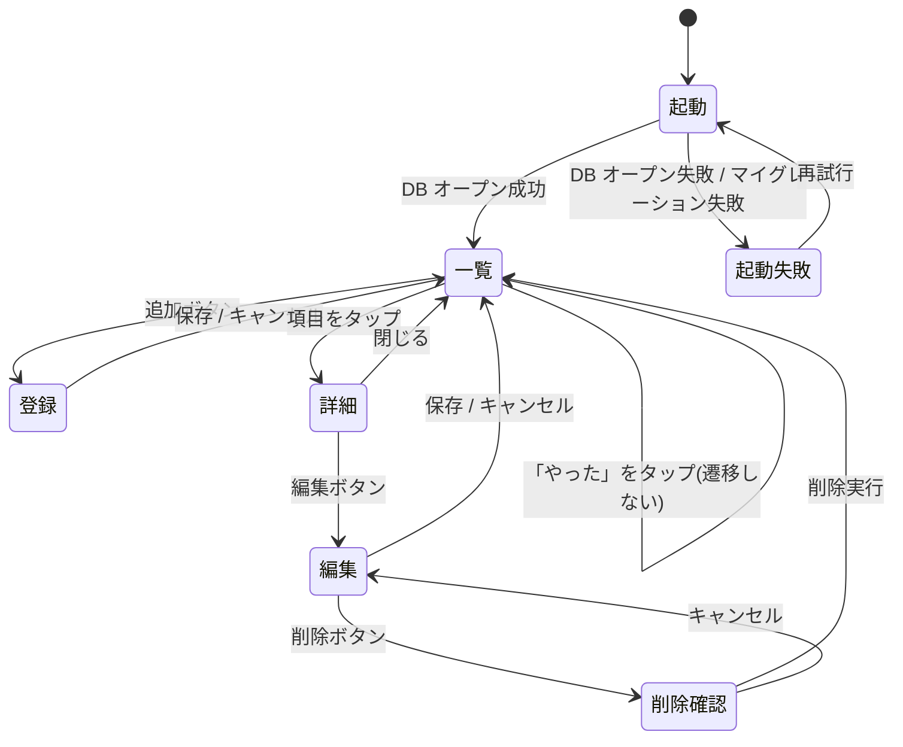

# 機能設計書 (Functional Design Document)

対象は `docs/product-requirements.md` の P0 機能(F1〜F8)。P1 / P2 は、データモデルの拡張余地に
関わる範囲でのみ言及する。

## システム構成図



**依存の向きは一方向**(UI → 状態管理 → リポジトリ → データ)。逆流させない。
UI は Drift の生成型を直接触らず、ドメインモデルだけを見る。

## 技術スタック

| 分類 | 技術 | 選定理由 |
|------|------|----------|
| 言語 | Dart 3 | Flutter の単一言語。null 安全と sealed class がドメインモデルに使える |
| フレームワーク | Flutter(stable) | iOS / Android を単一コードベースで出せる。個人開発の工数が半分になる |
| UI | Material 3(組み込み) | 追加依存ゼロ。アクセシビリティとタッチターゲットの既定値が出発点として妥当(UI ガイドライン §7)。**56dp と主要テキストのコントラストは個別に指定・検証する** |
| 状態管理 | Riverpod | 依存注入とテスト時の差し替え(特に `Clock`)が素直。`InheritedWidget` の定型句が消える |
| データベース | Drift(SQLite) | 型安全なクエリがコンパイル時に検査される。P1 の履歴テーブル追加をマイグレーションとして扱える |
| 日時 | 自前の `Clock` 抽象 | 経過日数の算出をテスト可能にする。`DateTime.now()` を直接呼ぶ箇所を 1 つに閉じ込める |
| テスト | `flutter_test` + `drift` のインメモリ DB | 追加依存なしでリポジトリ層まで通しで検証できる |

> **意図的に入れないもの**: 追加の UI パッケージ、HTTP クライアント、解析 SDK、
> 状態管理の 2 つ目のライブラリ。MVP は端末内完結であり、依存が増えるほど
> ストア審査・ビルド・保守のコストが上がる。

## データモデル定義

### エンティティ: Item(管理項目)

```dart
/// 管理する生活行動 1 件。
class Item {
  final ItemId id;
  final String name;          // 1〜50 文字。前後の空白は保存前に除去する
  final DateTime? lastDoneAt; // 最終実施日時。未実施なら null
  final DateTime createdAt;
  final DateTime updatedAt;
  final int sortOrder;        // 表示順。MVP は登録順で固定、P1 の並び替えで使う
}
```

**制約**:

| 項目 | 制約 |
| --- | --- |
| `id` | UUID v4 の文字列。主キー |
| `name` | NOT NULL。トリム後 1〜50 文字。空文字・空白のみは不可 |
| `lastDoneAt` | NULL 許容。**NULL = 一度も記録がない**(F4 の「未実施」表示の根拠) |
| `createdAt` / `updatedAt` | NOT NULL。UTC で保存し、表示時に端末のローカル時刻へ変換する。`updatedAt` は**書き込みが起きた時刻**を表すので、「やった」の取り消しでも前進させる(巻き戻さない) |
| `sortOrder` | NOT NULL。既定は `MAX(sort_order) + 1`。**MVP では常に登録順と一致する**(並び替えが無いため)。採番のために INSERT ごとに 1 本クエリが増えるが、P1 の F15(並び替え)で初めて意味を持つ列なので、そのコストは許容する |

> **設計判断: 日時は UTC で保存する。** 端末のタイムゾーンが変わっても保存値がずれない。
> 経過日数の算出だけがローカル時刻に依存するので、変換は表示側の 1 箇所に閉じる。

> **設計判断: `lastDoneAt` を Item に持たせる(履歴テーブルを MVP では作らない)。**
> P1 の F12(履歴)は `done_logs` テーブルの追加で実現し、そのとき `lastDoneAt` は
> 「最新ログのキャッシュ」という位置づけに変わる。列を消す必要がないため、
> このスキーマは P1 への移行を妨げない。

### ER図

MVP は `items` 単一テーブル。`done_logs` は v2 のマイグレーションで追加した(#20)。



## コンポーネント設計

### ItemRepository(リポジトリ層)

**責務**:
- Drift のテーブル行とドメインモデル `Item` の相互変換
- 永続化の成否を呼び出し元に伝える(**例外を握りつぶさない**)
- UI と状態管理層から SQL を隠す

**インターフェース**:

```dart
abstract interface class ItemRepository {
  /// 表示順に並んだ全項目を流す。DB の変更で自動的に再送出される
  Stream<List<Item>> watchAll();

  /// 項目を追加する。id は UUID v4 でこの層が採番する
  Future<Item> add(String name, {required DateTime now});

  Future<void> rename(ItemId id, String name, {required DateTime now});
  Future<void> delete(ItemId id);

  /// 最終実施日時を記録する。`updatedAt` も `doneAt` と同じ値になる。
  /// `done_logs` への追加と同一トランザクションで書く(#20)
  Future<void> markDone(ItemId id, DateTime doneAt);

  /// markDone の取り消し。直前の値に戻す。`done_logs` の直近 1 行の削除と
  /// 同一トランザクションで書く(#20)
  Future<void> restoreLastDoneAt(
    ItemId id,
    DateTime? previous, {
    required DateTime now,
  });
}
```

> **すべての書き込みが `now` を引数で受け取る理由**: データレイヤーは `Clock` に依存できない
> (`architecture.md`「データレイヤー」の禁止事項)。`createdAt` / `updatedAt` は NOT NULL なので、
> 時刻の出どころを呼び出し元に一本化しないと、この層で `DateTime.now()` を呼ぶしかなくなる。
> `markDone` だけは例外で、記録時刻がそのまま `updatedAt` になるため引数は 1 つでよい。
> **P1 の F16(最終実施日の手動修正)は `doneAt` が過去日になる**ので、
> `setLastDoneAt(id, doneAt, {required now})` を別メソッドとして足す(MVP では作らない)。

**依存関係**: Drift の `AppDatabase`、`uuid`(id の採番)。

> **`watchAll` を Stream にする理由**: 記録・編集・削除のたびに UI が自力で再取得する設計だと、
> 更新漏れの経路が機能の数だけ増える。Drift の `watch()` は DB 変更を購読できるので、
> 書き込み側は UI を意識しない。

### ItemListNotifier(状態管理層)

**責務**:
- `ItemRepository` の Stream を購読し、UI 向けの表示モデルへ変換する
- **経過日数の算出**(`Clock` を使う)
- `Item` → `ItemView` への変換(**`lastDoneAt == null` → `NeverDone` の判定はここ**)
- 「やった」の取り消し用に、直前の `lastDoneAt` を一時保持する。
  **保持するのは直近 1 件のみ**で、別の項目を記録した時点で前の取り消し対象は破棄する
- 入力バリデーション(項目名の長さ・空チェック)
- 書き込み失敗を、**一覧の state とは別のチャネル**で UI へ伝える(下記「エラーの分類」)

**インターフェース**:

```dart
class ItemListNotifier extends AsyncNotifier<List<ItemView>> {
  Future<void> addItem(String rawName);
  Future<void> renameItem(ItemId id, String rawName);
  Future<void> deleteItem(ItemId id);
  Future<void> markDone(ItemId id);
  Future<void> undoMarkDone(ItemId id);
}

/// 書き込み失敗を一度きりのメッセージとして運ぶ。一覧の state とは分ける
final writeErrorProvider = StateProvider<String?>((ref) => null);

/// UI が描画に必要とするものだけを持つ。DateTime の解釈を UI に漏らさない
class ItemView {
  final ItemId id;
  final String name;
  final ElapsedLabel elapsed;   // 「今日」「昨日」「42日前」「未実施」
  final String? lastDoneText;   // 「2026年9月12日」。未実施なら null
}
```

**依存関係**: `ItemRepository`、`Clock`。

> **書き込み失敗で `state` を `AsyncError` にしないこと。** `AsyncNotifier<List<ItemView>>` の
> state をエラーにすると **UI が一覧そのものを失う**。「保存失敗時もカードは元の値のまま」という
> 要件(下記「状態ごとの表示」)と両立しないため、一覧は `watchAll()` の購読結果だけを反映させ、
> 失敗は `writeErrorProvider` に載せて UI が `SnackBar` で出す。

### Clock(時刻提供)

**責務**: 現在時刻を返す唯一の口。

```dart
abstract interface class Clock {
  DateTime now();
}
```

> **なぜ抽象化するか**: 経過日数は本プロダクトの中心機能で、境界(日付をまたぐ瞬間・
> 月末・うるう年・夏時間)の検証が要る。`DateTime.now()` を直呼びすると
> テストが書けず、F5 の受け入れ条件を機械的に確認できない。

### ElapsedDays(経過日数の算出)

**責務**: 2 つの時刻から**暦日の差**を求め、表示ラベルへ変換する。

```dart
/// 暦日の差を返す。時刻成分は無視し、負数は 0 に丸める
int elapsedDays({required DateTime lastDoneAt, required DateTime now});

/// 表示ラベルへ変換する
sealed class ElapsedLabel {}
class NeverDone extends ElapsedLabel {}   // 「未実施」
class Today extends ElapsedLabel {}       // 「今日」
class Yesterday extends ElapsedLabel {}   // 「昨日」
class DaysAgo extends ElapsedLabel { final int days; }  // 「42日前」
```

**依存関係**: なし(純関数)。

## アルゴリズム設計

### 経過日数の算出

**目的**: 「最後にやったのは何日前か」を、ユーザーの体感と一致する形で求める。

**計算ロジック**:

#### ステップ1: ローカル時刻へ変換する

保存値は UTC なので、まず端末のタイムゾーンに直す。

```
lastLocal = lastDoneAt.toLocal()
nowLocal  = now.toLocal()
```

#### ステップ2: 暦日を UTC 上の点として取り直す

時刻成分を落とすだけでなく、**`DateTime.utc` で作り直す**。理由はステップ3 の注記。

```
lastDate  = DateTime.utc(lastLocal.year, lastLocal.month, lastLocal.day)
todayDate = DateTime.utc(nowLocal.year,  nowLocal.month,  nowLocal.day)
```

#### ステップ3: 日数差を取る

```
elapsed = todayDate.difference(lastDate).inDays
```

> **ローカルの `DateTime` 同士で `difference()` を取らないこと。** Dart の `difference()` は
> 実時間差を返す。夏時間のある地域では 1 日が 23 時間または 25 時間になるため、
> **深夜 0 時に正規化しても `inDays` は 1 日ずれる**(切替日をまたぐと 23 時間 → `inDays == 0`)。
> ステップ2 で暦日を `DateTime.utc` の点として取り直せば 1 日が常に 24 時間になり、
> この差分が暦日数と一致する。

#### ステップ4: ラベルへ分類する

| 条件 | ラベル |
| --- | --- |
| `lastDoneAt == null` | `未実施` |
| `elapsed == 0` | `今日` |
| `elapsed == 1` | `昨日` |
| `elapsed >= 2` | `{elapsed}日前` |
| `elapsed < 0` | 起きない(`elapsedDays` が 0 に丸めるため。下記) |

> **負数の丸めは `elapsedDays` の責務。** 端末時計の巻き戻しに対する防御を `elapsedDays` の中に
> 閉じ、ラベル分類は「非負の日数 → ラベル」の純粋な写像に保つ。
> **`lastDoneAt == null`(= `NeverDone`)の判定だけは `elapsedDays` の外**で行う。
> 判定場所は `Item` → `ItemView` を変換する `ItemListNotifier`。
> `elapsedDays` は non-null の日時 2 つだけを受け取り、`null` を知らない。

**実装例**:

```dart
/// 暦日の差を返す。端末時計が巻き戻った場合に備え、負数は 0 に丸める。
int elapsedDays({required DateTime lastDoneAt, required DateTime now}) {
  final last = lastDoneAt.toLocal();
  final current = now.toLocal();
  // ローカルの DateTime 同士の difference は実時間差になる。DST のある地域では
  // 1 日が 23/25 時間になり inDays がずれるため、暦日を UTC 上の点として持ち直す。
  final lastDate = DateTime.utc(last.year, last.month, last.day);
  final todayDate = DateTime.utc(current.year, current.month, current.day);
  final diff = todayDate.difference(lastDate).inDays;
  return diff < 0 ? 0 : diff;
}
```

**検証すべき境界**:

| ケース | 期待 |
| --- | --- |
| 今日 23:59 に記録 → 今日 23:59 に表示 | `今日` |
| 昨日 09:00 に記録 → 今日 08:00 に表示 | `昨日`(24 時間未満でも 1 日前) |
| 1月31日に記録 → 2月1日に表示 | `昨日` |
| 2月28日に記録 → 3月1日に表示(うるう年) | `2日前` |
| 12月31日に記録 → 1月1日に表示 | `昨日` |
| 夏時間の切替日をまたぐ | 暦日どおり |
| 端末時計を過去に戻した | `今日`(負数を出さない) |

## ユースケース図

### UC1: 「やった」を記録する(F3 / F5)



**フロー説明**:
1. ユーザーがカード内の「やった」ボタンを押す。確認ダイアログは出さない
2. Notifier は取り消し用に直前の `lastDoneAt` を保持する(未実施だった場合は `null` を保持)
3. `Clock` から現在時刻を取り、リポジトリへ渡す
4. 書き込みが成功すると、Drift の購読経由で一覧が再送出される
5. UI は経過日数を「今日」に更新し、**4 秒間**だけ取り消し導線を出す(`SnackBar` の既定)。
   取り消せるのは**直近の 1 件のみ**で、別の項目を記録すると前の導線は消える
6. **書き込みが失敗した場合**は一覧を更新せず、失敗した旨を表示する(信頼性要件)

### UC2: 項目を登録する(F2)



## 画面遷移図



**通常操作の画面は 3 つだけ**(一覧・登録・編集)と、一覧に重ねる詳細シート(F29)。記録は遷移を伴わない —— これが「1 タップ」の実体。
起動失敗時のエラー画面は例外で、通常フローには現れない(エラー分類表の「DB オープン失敗」
「マイグレーション失敗」に対応する)。

## UI設計

### 一覧のカード(最重要コンポーネント)

**表示項目**:

| 項目 | 説明 | フォーマット | 視覚的優先度 |
|------|------|-------------|------|
| 経過日数 | 最終実施日からの暦日差 | `42日前` / `今日` / `昨日` / `未実施` | **最大・最も太い** |
| 項目名 | ユーザーが付けた名前 | プレーンテキスト、1 行で省略 | 中 |
| 最終実施日 | 実際の日付 | `2026年9月12日` | 最小・低コントラスト |
| やったボタン | 記録操作 | アイコン + ラベル、56dp 以上 | 操作対象として明確 |

配置は、左に「項目名 + 最終実施日」、中央から右に「経過日数」、右端に「やったボタン」。
**やったボタンは親指の可動域に入る右側**に置く(片手操作要件)。

### 詳細シート(F29)

カードをタップすると開き、見出しに項目名を示す。シート内の「編集」ボタンから編集画面へ進む。

| 行 | 内容 | 出さない条件 |
| --- | --- | --- |
| 1 | `最後：14日前`(`今日` / `昨日` は一覧と同じ表記)。未実施なら `まだ記録がありません` | なし |
| 2 | `前回：7日間隔` | 未実施、または記録が 1 件以下 |
| 3 | 経年ステージに応じた一言(下表) | 未実施、または相対経過度が 1.0 未満 / null |

| 経年ステージ | 3 行目の文言 |
| --- | --- |
| そろそろ(`dueSoon`) | そろそろかも。 |
| 経過(`aged`) | いつもより間が空いているかも。 |
| かなり経過(`heavilyAged`) | だいぶ間が空いているかも。 |

- **3 行を超える情報を出さない**。履歴一覧・統計・基準間隔は出さない。
- **削除の入口を置かない**。削除は編集画面の中だけ(F7)。
- **開くときに取り消し導線を閉じる**。

### 状態ごとの表示

| 状態 | 表示 |
| --- | --- |
| 項目 0 件 | 空状態。「まだ項目がありません」+ 追加への導線を画面中央に置く |
| 未実施の項目 | 経過日数の位置に `未実施`。日付は出さない |
| 記録直後 | カードが `今日` に変わり、取り消し導線が **4 秒間**出る(`SnackBar` の既定)。直近 1 件のみ |
| 記録直後に画面遷移 | 取り消し導線を閉じる(下記) |
| 保存失敗 | カードは元の値のまま。`writeErrorProvider` 経由で失敗を `SnackBar` に出す |

> **画面遷移時に取り消し導線を閉じる**(`ScaffoldMessenger.hideCurrentSnackBar`)。
> 詳細シートを開くときも同じく閉じる。
> Flutter の `ScaffoldMessenger` は `Navigator` の上にあるため、**何もしないと `SnackBar` は
> 画面遷移後も表示され続ける**。記録直後に編集画面へ入ってその項目を削除すると、
> 存在しない項目に対する取り消しが走り、押しても無言で何も起きない状態になる。
> 取り消しを一覧に留まっている間だけ有効にすれば、この競合は構造的に発生しない。

### 色の使い方

状態は相対経過度(経過日数 ÷ 基準間隔)による**経年ステージ**で表す(F28 / Issue #21)。
**境界は下側を含む**(0.5 は「少し経過」)。相対経過度が **null は真新しいと同じ描画**で、絶対日数で代用しない。

| 相対経過度 | ステージ | 紙の表現 |
| --- | --- | --- |
| 0.5 未満 | 真新しい | 明るい紙、滑らかな縁 |
| 0.5 以上 1.0 未満 | 少し経過 | 紙の色が変わり、小さなシミが加わる |
| 1.0 以上 1.5 未満 | そろそろ | シミが増え、縁が焼ける |
| 1.5 以上 2.0 未満 | 経過 | シミと縁の焼けが強まり、端が傷む |
| 2.0 以上 | かなり経過 | さらに古び、隅に欠けが加わる |

紙の色は `AgingPalette`(`ThemeExtension`)で持ち、ライト / ダーク両方に値がある。
**古びは紙の面と装飾だけ**に掛け、テキストの色は `ColorScheme` のまま変えない。
全ステージ × 明暗で、紙の面とシミの上のテキストのコントラストが **4.5:1 以上**であることをテストで検査する。
強調はサイズとウェイトで作り、経過日数を最大・最も太くする。

色だけに頼らず、シミ・縁の焼け・端の傷み・欠けの形状を段階的に足す。
読み上げには「状態は少し経過」などのステージ名を含める(真新しいは付加しない)。
アイコンの掠れは項目アイコン(#32)の導入時に掛ける。

## ファイル構造(データ保存形式)

SQLite ファイル 1 つ。配置はプラットフォーム既定のアプリケーションドキュメント領域。

```
<app documents>/
└── lastwhen.sqlite    # Drift が管理。items テーブル 1 つ
```

> **バックアップ対象からの除外はしない。** iOS の iCloud バックアップ / Android の
> 自動バックアップに含まれることで、機種変更時にデータが引き継がれる。
> MVP にエクスポート機能(F26)が無い以上、これが唯一の移行手段になる。

## パフォーマンス最適化

- **一覧は遅延生成する**(`ListView.builder`)。100 件で全カードを同時に構築しない
- **経過日数は `List<Item>` → `List<ItemView>` の変換時に、`Clock.now()` を 1 回取って
  全件分をまとめて算出する。** `ListView.builder` は完成した `ItemView` を描画するだけで、
  `elapsedDays` も `Clock` も呼ばない
- **`Clock.now()` をカードごとに呼ばない。** 描画中に日付をまたいだ場合、カード間で基準時刻が
  食い違って表示が矛盾する。変換 1 回につき `now` は 1 つ
- **Drift のクエリは `watchAll` の 1 本**に絞る。カードごとの個別クエリを出さない
- 起動時は DB オープンと初回クエリのみ。マイグレーションは必要なときだけ走る

## セキュリティ考慮事項

| 考慮事項 | 対策 |
| --- | --- |
| データの外部送信 | ネットワーク通信を行う依存を入れない。MVP のビルドに HTTP クライアントを含めない |
| 端末紛失時のデータ | OS のファイル暗号化に委ねる。MVP でアプリ独自の暗号化・ロックは実装しない |
| 権限 | ネットワーク・通知・ストレージいずれの権限も要求しない |
| ログ出力 | リリースビルドで項目名を含むログを出さない |
| 機密の混入 | secretlint を pre-commit と CI の 2 層で回す(既設) |

## エラーハンドリング

### エラーの分類

| エラー種別 | 処理 | ユーザーへの表示 |
|-----------|------|-----------------|
| 入力バリデーション(空・長すぎ) | 保存せず、入力欄にとどまる | 「項目名を入力してください」/「50文字以内で入力してください」 |
| DB 書き込み失敗 | 一覧の state を変更しない。例外をログへ出し、`writeErrorProvider` に載せる | 「保存できませんでした。もう一度お試しください」(`SnackBar`) |
| DB オープン失敗(起動時) | 一覧を表示せずエラー画面へ | 「データを読み込めませんでした」+ 再試行 |
| マイグレーション失敗 | 起動を続行しない。**データを消さない** | 「アプリの更新に失敗しました」+ 問い合わせ導線 |
| 対象項目が存在しない(削除と同時操作) | 無視して一覧を再取得 | 表示しない |

> **原則: 失敗を成功に見せない。** 楽観的 UI 更新(先に画面を変えて後で保存)は採らない。
> 記録の信頼性が本プロダクトの価値そのものであり、100ms の応答要件は
> ローカル SQLite なら楽観更新なしでも満たせる。

> **エラーの運び方: 一覧の state とは別のチャネルを使う。** 書き込み失敗で
> `AsyncNotifier<List<ItemView>>` の state を `AsyncError` にすると、UI は一覧を失って
> エラー画面に切り替わる。これは「カードは元の値のまま」という要件と衝突する。
> 一覧は `watchAll()` の購読結果だけを反映し、失敗は `writeErrorProvider`(一度きりの
> メッセージ)に載せて `SnackBar` で出す。**state をエラーにしてよいのは、一覧そのものを
> 表示できない場合(DB オープン失敗・購読の切断)だけ。**

## テスト戦略

### ユニットテスト

| 対象 | 検証内容 |
| --- | --- |
| `elapsedDays` | 上記「検証すべき境界」の全ケース。**夏時間の切替日をまたぐケースを必ず含める**(`DateTime.utc` への取り直しが無いと落ちる) |
| `ElapsedLabel` への分類 | 未実施 / 今日 / 昨日 / N日前 / 負数の防御 |
| 項目名のバリデーション | 空 / 空白のみ / 1 文字 / 50 文字 / 51 文字 / 前後空白のトリム |
| レイヤー依存の検査 | `lib/domain/` が Flutter / Drift / Riverpod を import していない。`lib/ui/` が `lib/data/` を import していない(`test/architecture/layer_dependency_test.dart`) |

### 統合テスト(インメモリ DB を使ったリポジトリ層)

| シナリオ | 検証内容 |
| --- | --- |
| 追加 → 一覧取得 | 登録した項目が `lastDoneAt == null` で並ぶ |
| 記録 → 再取得 | `lastDoneAt` が更新され、`updatedAt` も進む |
| 記録 → 取り消し | `lastDoneAt` が直前の値(未実施なら null)に戻り、`updatedAt` は引数の `now` で進む |
| 名称変更 | `name` だけが変わり `lastDoneAt` は不変 |
| 削除 | 対象だけが消え、他項目に影響しない |
| 100 件投入 → 一覧取得 | 表示順が安定し、クエリが 1 回で済む |

### ウィジェットテスト

| シナリオ | 検証内容 |
| --- | --- |
| 一覧の空状態 | 0 件のとき空状態と追加導線が出る |
| 「やった」タップ | 確認ダイアログが出ず、カードが「今日」になる |
| 「やった」の取り消し | 取り消し導線が 4 秒間出て、押すと元に戻る |
| 連続で 2 件記録 | 取り消せるのは後から押した 1 件のみ。前の導線は消えている |
| 保存失敗 | 一覧が消えず、カードは元の値のまま `SnackBar` が出る |
| 削除 | 確認を挟んでから消える |
| 文字サイズ 200% | 一覧のカードが破綻せず、ボタンが押せる |
