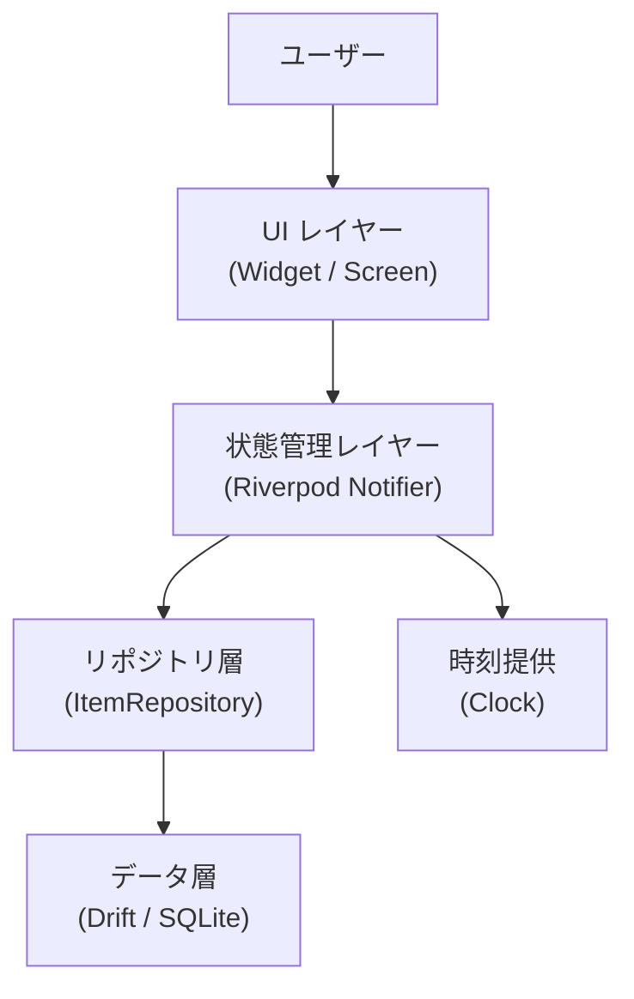
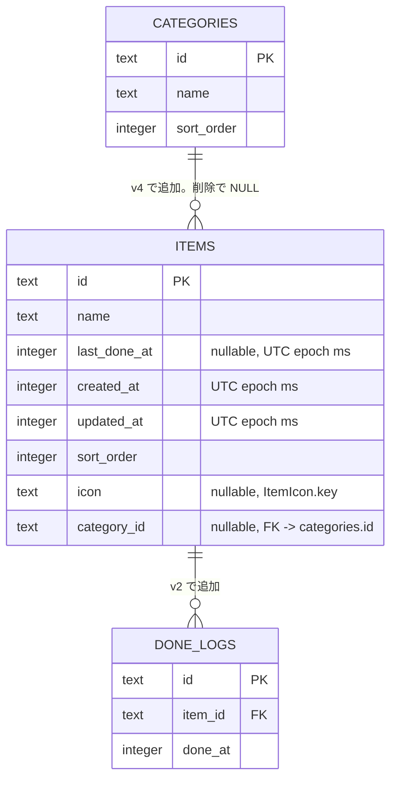
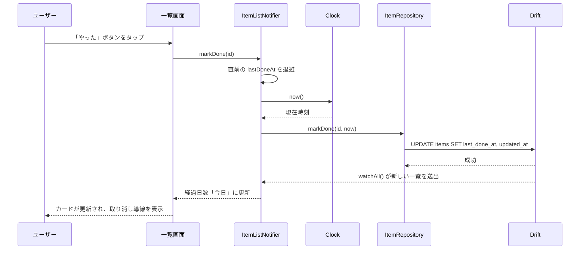
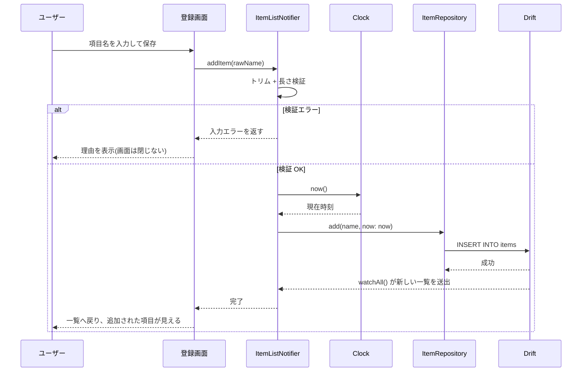
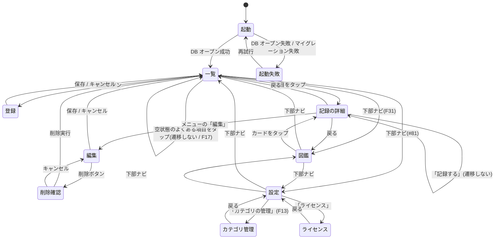

# 機能設計書 (Functional Design Document)

対象は `docs/product-requirements.md` の P0 機能(F1〜F8)。P1 / P2 は、データモデルの拡張余地に
関わる範囲でのみ言及する。

## システム構成図


```mermaid
graph TB
    User[ユーザー]
    UI["UI レイヤー<br/>(Widget / Screen)"]
    State["状態管理レイヤー<br/>(Riverpod Notifier)"]
    Repo["リポジトリ層<br/>(ItemRepository)"]
    DB["データ層<br/>(Drift / SQLite)"]
    Clock["時刻提供<br/>(Clock)"]

    User --> UI
    UI --> State
    State --> Repo
    State --> Clock
    Repo --> DB
```

**依存の向きは一方向**(UI → 状態管理 → リポジトリ → データ)。逆流させない。
UI は Drift の生成型を直接触らず、ドメインモデルだけを見る。

## 技術スタック

| 分類 | 技術 | 選定理由 |
|------|------|----------|
| 言語 | Dart 3 | Flutter の単一言語。null 安全と sealed class がドメインモデルに使える |
| フレームワーク | Flutter(stable) | iOS / Android を単一コードベースで出せる。個人開発の工数が半分になる |
| UI | Material 3(組み込み) | 追加依存ゼロ。アクセシビリティとタッチターゲットの既定値が出発点として妥当(UI ガイドライン §7)。**56dp と主要テキストのコントラストは個別に指定・検証する** |
| 状態管理 | Riverpod | 依存注入とテスト時の差し替え(特に `Clock`)が素直。`InheritedWidget` の定型句が消える |
| データベース | Drift(SQLite) | 型安全なクエリがコンパイル時に検査される。P1 の履歴テーブル追加をマイグレーションとして扱える |
| 日時 | 自前の `Clock` 抽象 | 経過日数の算出をテスト可能にする。`DateTime.now()` を直接呼ぶ箇所を 1 つに閉じ込める |
| テスト | `flutter_test` + `drift` のインメモリ DB | 追加依存なしでリポジトリ層まで通しで検証できる |

> **意図的に入れないもの**: 追加の UI パッケージ、HTTP クライアント、解析 SDK、
> 状態管理の 2 つ目のライブラリ。MVP は端末内完結であり、依存が増えるほど
> ストア審査・ビルド・保守のコストが上がる。

## データモデル定義

### エンティティ: Item(管理項目)

```dart
/// 管理する生活行動 1 件。
class Item {
  final ItemId id;
  final String name;          // 1〜50 文字。前後の空白は保存前に除去する
  final DateTime? lastDoneAt; // 最終実施日時。未実施なら null
  final DateTime createdAt;
  final DateTime updatedAt;
  final int sortOrder;        // 登録順。F30 の並びのタイブレークに使う
  final ItemIcon? icon;       // null = 未選択(F14)
  final CategoryId? categoryId;   // null = 未分類(F13)
}
```

**制約**:

| 項目 | 制約 |
| --- | --- |
| `id` | UUID v4 の文字列。主キー |
| `name` | NOT NULL。トリム後 1〜50 文字。空文字・空白のみは不可 |
| `lastDoneAt` | NULL 許容。**NULL = 一度も記録がない**(F4 の「未実施」表示の根拠)。**`done_logs` の `MAX(done_at)` と常に一致させる**(最新ログのキャッシュ)。過去の日付で記録(F16)しても、それが最新でなければ動かない |
| `createdAt` / `updatedAt` | NOT NULL。UTC で保存し、表示時に端末のローカル時刻へ変換する。`updatedAt` は**書き込みが起きた時刻**を表すので、「やった」の取り消しでも前進させる(巻き戻さない) |
| `sortOrder` | NOT NULL。既定は `MAX(sort_order) + 1`。**MVP では常に登録順と一致する**(並び替えが無いため)。採番のために INSERT ごとに 1 本クエリが増えるが、P1 の F15(並び替え)で初めて意味を持つ列なので、そのコストは許容する。 F30 では相対経過度の同値時と、相対経過度が null の項目群の順序に使う。 |
| `icon` | NULL 許容。`ItemIcon.key` を保存。未知のキーは未選択として読む。CHECK 制約は付けない(候補が増えるため) |
| `categoryId` | NULL 許容(FK → categories.id)。**NULL = 未分類**。カテゴリの削除で NULL に戻る(ON DELETE SET NULL)。v4 で追加(#33) |

> **設計判断: 日時は UTC で保存する。** 端末のタイムゾーンが変わっても保存値がずれない。
> 経過日数の算出だけがローカル時刻に依存するので、変換は表示側の 1 箇所に閉じる。

> **設計判断: `lastDoneAt` を Item に持たせる(履歴テーブルを MVP では作らない)。**
> P1 の F12(履歴)は `done_logs` テーブルの追加で実現し、そのとき `lastDoneAt` は
> 「最新ログのキャッシュ」という位置づけに変わる。列を消す必要がないため、
> このスキーマは P1 への移行を妨げない。

### エンティティ: Category(カテゴリ)

```dart
/// 項目を分けるためのカテゴリ(F13)。ユーザーが追加・名前変更・削除できる。
class Category {
  final CategoryId id;
  final String name;      // トリム後 1〜10 文字。重複不可(ドメイン層で検証)
  final int sortOrder;    // 追加順。MAX(sort_order) + 1
}
```

- 項目あたり 0 か 1 つ(多対多にしない)
- 時刻の列を持たない(表示・並びに使わないため)
- 削除しても項目・記録は消えない。**そのカテゴリの項目は未分類(NULL)になる**(ON DELETE SET NULL)

### ER図

`categories` と `category_id` は v4 で追加した(#33)。`done_logs` は v2 のマイグレーションで
追加した(#20)。`icon` 列は v3 で追加した(#32)。


```mermaid
erDiagram
    ITEMS {
        text id PK
        text name
        integer last_done_at "nullable, UTC epoch ms"
        integer created_at "UTC epoch ms"
        integer updated_at "UTC epoch ms"
        integer sort_order
        text icon "nullable, ItemIcon.key"
        text category_id "nullable, FK -> categories.id"
    }
    DONE_LOGS {
        text id PK
        text item_id FK
        integer done_at
    }
    CATEGORIES {
        text id PK
        text name
        integer sort_order
    }
    ITEMS ||--o{ DONE_LOGS : "v2 で追加"
    CATEGORIES ||--o{ ITEMS : "v4 で追加。削除で NULL"
```

## コンポーネント設計

### ItemRepository(リポジトリ層)

**責務**:
- Drift のテーブル行とドメインモデル `Item` の相互変換
- 永続化の成否を呼び出し元に伝える(**例外を握りつぶさない**)
- UI と状態管理層から SQL を隠す

**インターフェース**:

```dart
abstract interface class ItemRepository {
  /// 表示順に並んだ全項目を流す。DB の変更で自動的に再送出される
  Stream<List<Item>> watchAll();

  /// 項目を追加する。id は UUID v4 でこの層が採番する
  Future<Item> add(String name, {ItemIcon? icon, CategoryId? categoryId, required DateTime now});

  /// 項目名・アイコン・カテゴリを変更する
  Future<void> edit(ItemId id, {required String name, required ItemIcon? icon, required CategoryId? categoryId, required DateTime now});
  Future<void> delete(ItemId id);

  /// 最終実施日時を記録する。`updatedAt` も `doneAt` と同じ値になる。
  /// `done_logs` への追加と同一トランザクションで書く(#20)
  Future<void> markDone(ItemId id, DateTime doneAt);

  /// markDone の取り消し。直前の値に戻す。`done_logs` の直近 1 行の削除と
  /// 同一トランザクションで書く(#20)
  Future<void> restoreLastDoneAt(
    ItemId id,
    DateTime? previous, {
    required DateTime now,
  });

  /// 過去の日付で記録する(F16)。`done_logs` に 1 行追加し、`lastDoneAt` を
  /// `MAX(done_at)` に揃える。`updatedAt` は [now]。同一トランザクション。
  /// 追加した履歴の ID を返す(取り消しに使う)。対象が無ければ書かずに null
  Future<DoneLogId?> addDoneLog(ItemId id, DateTime doneAt, {required DateTime now});

  /// addDoneLog の取り消し。指定した履歴 1 行だけを消し、`lastDoneAt` を残りの
  /// `MAX(done_at)`(無ければ null)に揃える。同一トランザクション
  Future<void> removeDoneLog(ItemId id, DoneLogId logId, {required DateTime now});
}
```

> **すべての書き込みが `now` を引数で受け取る理由**: データレイヤーは `Clock` に依存できない
> (`architecture.md`「データレイヤー」の禁止事項)。`createdAt` / `updatedAt` は NOT NULL なので、
> 時刻の出どころを呼び出し元に一本化しないと、この層で `DateTime.now()` を呼ぶしかなくなる。
> `markDone` だけは例外で、記録時刻がそのまま `updatedAt` になるため引数は 1 つでよい。
> **F16(過去の日付で記録)は `doneAt` が過去日になる**ので、`updatedAt` を別に受け取る
> `addDoneLog` を足した(#49)。当初の案の `setLastDoneAt`(最終実施日の置き換え)は採らない。
> 置き換えると記録忘れの後追いで直近の実施が消え、基準間隔の学習から 1 回分が欠ける。
> 取り消しは「直近 1 行」ではなく**追加した 1 行を ID で**消す(過去日の行は直近とは限らない)。

**依存関係**: Drift の `AppDatabase`、`uuid`(id の採番)。

> **`watchAll` を Stream にする理由**: 記録・編集・削除のたびに UI が自力で再取得する設計だと、
> 更新漏れの経路が機能の数だけ増える。Drift の `watch()` は DB 変更を購読できるので、
> 書き込み側は UI を意識しない。

### CategoryRepository(リポジトリ層・F13)

`ItemRepository` と同じ形の小さなインターフェース(`watchAll` / `add` / `rename` / `delete`)。
**書き込みは `now` を取らない**(カテゴリは時刻の列を持たない)。`delete` は対象カテゴリの
項目を未分類(`categoryId: null`)に戻す更新と、カテゴリ行の削除を 1 トランザクションで行う。

### ItemListNotifier(状態管理層)

**責務**:
- `ItemRepository` の Stream を購読し、UI 向けの表示モデルへ変換する
- **経過日数の算出**(`Clock` を使う)
- `Item` → `ItemView` への変換(**`lastDoneAt == null` → `NeverDone` の判定はここ**)
- 「やった」の取り消し用に、直前の `lastDoneAt` を一時保持する。
  **保持するのは直近 1 件のみ**で、別の項目を記録した時点で前の取り消し対象は破棄する
- 入力バリデーション(項目名の長さ・空チェック)
- 書き込み失敗を、**一覧の state とは別のチャネル**で UI へ伝える(下記「エラーの分類」)

**インターフェース**:

```dart
class ItemListNotifier extends AsyncNotifier<List<ItemView>> {
  Future<void> addItem(String rawName, {ItemIcon? icon});
  Future<void> editItem(ItemId id, String rawName, {required ItemIcon? icon});
  Future<void> deleteItem(ItemId id);
  Future<void> markDone(ItemId id);
  Future<void> undoMarkDone(ItemId id);
}

/// 書き込み失敗を一度きりのメッセージとして運ぶ。一覧の state とは分ける
final writeErrorProvider = StateProvider<String?>((ref) => null);

/// UI が描画に必要とするものだけを持つ。DateTime の解釈を UI に漏らさない
class ItemView {
  final ItemId id;
  final String name;
  final ElapsedLabel elapsed;   // 「今日」「昨日」「42日前」「未実施」
  final String? lastDoneText;   // 「2026年9月12日」。未実施なら null
}
```

**依存関係**: `ItemRepository`、`Clock`。

> **書き込み失敗で `state` を `AsyncError` にしないこと。** `AsyncNotifier<List<ItemView>>` の
> state をエラーにすると **UI が一覧そのものを失う**。「保存失敗時もカードは元の値のまま」という
> 要件(下記「状態ごとの表示」)と両立しないため、一覧は `watchAll()` の購読結果だけを反映させ、
> 失敗は `writeErrorProvider` に載せて UI が `SnackBar` で出す。

### Clock(時刻提供)

**責務**: 現在時刻を返す唯一の口。

```dart
abstract interface class Clock {
  DateTime now();
}
```

> **なぜ抽象化するか**: 経過日数は本プロダクトの中心機能で、境界(日付をまたぐ瞬間・
> 月末・うるう年・夏時間)の検証が要る。`DateTime.now()` を直呼びすると
> テストが書けず、F5 の受け入れ条件を機械的に確認できない。

### ElapsedDays(経過日数の算出)

**責務**: 2 つの時刻から**暦日の差**を求め、表示ラベルへ変換する。

```dart
/// 暦日の差を返す。時刻成分は無視し、負数は 0 に丸める
int elapsedDays({required DateTime lastDoneAt, required DateTime now});

/// 表示ラベルへ変換する
sealed class ElapsedLabel {}
class NeverDone extends ElapsedLabel {}   // 「未実施」
class Today extends ElapsedLabel {}       // 「今日」
class Yesterday extends ElapsedLabel {}   // 「昨日」
class DaysAgo extends ElapsedLabel { final int days; }  // 「42日前」
```

**依存関係**: なし(純関数)。

## アルゴリズム設計

### 経過日数の算出

**目的**: 「最後にやったのは何日前か」を、ユーザーの体感と一致する形で求める。

**計算ロジック**:

#### ステップ1: ローカル時刻へ変換する

保存値は UTC なので、まず端末のタイムゾーンに直す。

```
lastLocal = lastDoneAt.toLocal()
nowLocal  = now.toLocal()
```

#### ステップ2: 暦日を UTC 上の点として取り直す

時刻成分を落とすだけでなく、**`DateTime.utc` で作り直す**。理由はステップ3 の注記。

```
lastDate  = DateTime.utc(lastLocal.year, lastLocal.month, lastLocal.day)
todayDate = DateTime.utc(nowLocal.year,  nowLocal.month,  nowLocal.day)
```

#### ステップ3: 日数差を取る

```
elapsed = todayDate.difference(lastDate).inDays
```

> **ローカルの `DateTime` 同士で `difference()` を取らないこと。** Dart の `difference()` は
> 実時間差を返す。夏時間のある地域では 1 日が 23 時間または 25 時間になるため、
> **深夜 0 時に正規化しても `inDays` は 1 日ずれる**(切替日をまたぐと 23 時間 → `inDays == 0`)。
> ステップ2 で暦日を `DateTime.utc` の点として取り直せば 1 日が常に 24 時間になり、
> この差分が暦日数と一致する。

#### ステップ4: ラベルへ分類する

| 条件 | ラベル |
| --- | --- |
| `lastDoneAt == null` | `未実施` |
| `elapsed == 0` | `今日` |
| `elapsed == 1` | `昨日` |
| `elapsed >= 2` | `{elapsed}日前` |
| `elapsed < 0` | 起きない(`elapsedDays` が 0 に丸めるため。下記) |

> **負数の丸めは `elapsedDays` の責務。** 端末時計の巻き戻しに対する防御を `elapsedDays` の中に
> 閉じ、ラベル分類は「非負の日数 → ラベル」の純粋な写像に保つ。
> **`lastDoneAt == null`(= `NeverDone`)の判定だけは `elapsedDays` の外**で行う。
> 判定場所は `Item` → `ItemView` を変換する `ItemListNotifier`。
> `elapsedDays` は non-null の日時 2 つだけを受け取り、`null` を知らない。

**実装例**:

```dart
/// 暦日の差を返す。端末時計が巻き戻った場合に備え、負数は 0 に丸める。
int elapsedDays({required DateTime lastDoneAt, required DateTime now}) {
  final last = lastDoneAt.toLocal();
  final current = now.toLocal();
  // ローカルの DateTime 同士の difference は実時間差になる。DST のある地域では
  // 1 日が 23/25 時間になり inDays がずれるため、暦日を UTC 上の点として持ち直す。
  final lastDate = DateTime.utc(last.year, last.month, last.day);
  final todayDate = DateTime.utc(current.year, current.month, current.day);
  final diff = todayDate.difference(lastDate).inDays;
  return diff < 0 ? 0 : diff;
}
```

**検証すべき境界**:

| ケース | 期待 |
| --- | --- |
| 今日 23:59 に記録 → 今日 23:59 に表示 | `今日` |
| 昨日 09:00 に記録 → 今日 08:00 に表示 | `昨日`(24 時間未満でも 1 日前) |
| 1月31日に記録 → 2月1日に表示 | `昨日` |
| 2月28日に記録 → 3月1日に表示(うるう年) | `2日前` |
| 12月31日に記録 → 1月1日に表示 | `昨日` |
| 夏時間の切替日をまたぐ | 暦日どおり |
| 端末時計を過去に戻した | `今日`(負数を出さない) |

### 通知(F11 / #51)

「いつもより間が空いた」項目を、**1 項目につき 1 回だけ**控えめに知らせる。設定は求めない。

| 決めごと | 値 | 理由 |
| --- | --- | --- |
| 通知する条件 | 相対経過度が **1.5 以上**(経年ステージ `aged`)に入った暦日 | 記録の詳細の「いつもより…」と同じ段階。`dueSoon`(1.0)では鳴る頻度が上がり、控えめでなくなる |
| 通知する暦日 | 最終実施日の暦日 + **n 日**。n は `n ÷ 基準間隔 ≥ 1.5` を満たす最小の整数 | 経過日数(暦日の差)と同じ規則で数え、一覧のカードが `aged` に変わる日と一致させる |
| 通知する時刻 | その暦日の**ローカル 19:00** | 仕事・学校の後で、その日のうちに対応できる時間帯 |
| 対象外 | 未実施、記録が 1 件以下(基準間隔が null)、予定時刻が現在以前 | 基準間隔が分からない項目にアプリが期限を決めない。過ぎた予定を後から鳴らさない = 同じ経過で繰り返し鳴らない |
| 予約の仕方 | **OS に予約する**(`zonedSchedule`)。アプリを開かない期間でも鳴る | 起動時の再計算だけでは、開かない限り鳴らない |
| 予約の更新 | 項目の一覧(`watchAll`)が流れるたびに、**未配信の予約を全部取り消して計画どおりに張り直す** | 記録・取り消し・編集・削除・過去日付の記録のすべてで、その項目の予約が自動的に追従する。項目ごとの差分管理を持たない |
| 予約の上限 | 予定時刻の早い順に **60 件** | iOS の予約上限(64)に余裕を残す。次の張り直しで繰り上がる |
| 通知の ID | 項目 ID から導く 31 bit の整数(FNV-1a) | 張り直しても同じ項目は同じ ID になり、OS 側で置き換わる |
| 権限の要求 | 計画が**初めて 1 件以上になった時点**で要求する(プロセスにつき 1 回)。初回起動では要求しない | 「設定を求めない」方針。拒否されても予約は張り、他の機能は変わらない(後から OS の設定で許可すれば鳴る) |
| オフにする手段 | **OS の通知設定**。アプリ内に設定を持たない | 保存先(ユーザー設定)を持たずに済む。Android は通知チャンネル単位でも切れる |
| 配信済みの通知 | 触らない(記録しても通知センターからは消さない) | スコープ外。張り直しで消すのは未配信の予約だけ |

**文言**(用語集に従う):

| 部分 | 内容 |
| --- | --- |
| タイトル | 項目名 |
| 本文 | `最後：N日前。いつもより間が空いているかも。`(N は通知する暦日の経過日数) |
| Android の通知チャンネル名 | `いつもより間が空いた項目` |

通知をタップするとアプリが開くだけにする(通知からの記録はスコープ外)。

## ユースケース図

### UC1: 「やった」を記録する(F3 / F5)


```mermaid
sequenceDiagram
    participant User as ユーザー
    participant UI as 一覧画面
    participant N as ItemListNotifier
    participant C as Clock
    participant R as ItemRepository
    participant DB as Drift

    User->>UI: 「やった」ボタンをタップ
    UI->>N: markDone(id)
    N->>N: 直前の lastDoneAt を退避
    N->>C: now()
    C-->>N: 現在時刻
    N->>R: markDone(id, now)
    R->>DB: UPDATE items SET last_done_at, updated_at
    DB-->>R: 成功
    DB-->>N: watchAll() が新しい一覧を送出
    N-->>UI: 経過日数「今日」に更新
    UI-->>User: カードが更新され、取り消し導線を表示
```

**フロー説明**:
1. ユーザーがカード内の「やった」ボタンを押す。確認ダイアログは出さない
2. Notifier は取り消し用に直前の `lastDoneAt` を保持する(未実施だった場合は `null` を保持)
3. `Clock` から現在時刻を取り、リポジトリへ渡す
4. 書き込みが成功すると、Drift の購読経由で一覧が再送出される
5. UI は経過日数を「今日」に更新し、**4 秒間**だけ取り消し導線を出す(`SnackBar` の既定)。
   取り消せるのは**直近の 1 件のみ**で、別の項目を記録すると前の導線は消える
6. **書き込みが失敗した場合**は一覧を更新せず、失敗した旨を表示する(信頼性要件)

### UC1b: 過去の日付で記録する(F16)

1. 記録の詳細の右上のメニューから「日付を指定して記録」を選ぶ。日付の選択を開く(初期値は今日、最終日は今日)
2. 日付を選んで「記録する」を押す。キャンセルなら何もしない
3. Notifier は選んだ暦日を記録日時に直す: **今日なら現在時刻、過去日ならその日のローカル 12:00**
   (0:00 にするとタイムゾーンを西へまたいだとき前日に読める。正午なら ±12 時間まで同じ暦日に収まる)
4. リポジトリが `done_logs` に 1 行追加し、`lastDoneAt` を `MAX(done_at)` に揃える。
   **選んだ日が既存の最終実施日より古ければ `lastDoneAt` は動かない**(履歴と基準間隔だけが変わる)
5. 同じ暦日の記録が既にあっても追加する。基準間隔の計算は暦日単位でまとめるため 0 日間隔は生まれない
6. 成功したら `M月d日で記録しました` と取り消し導線を 4 秒出す。取り消すと追加した 1 行だけを消す。
   並びは組み替えない(F30)
7. 書き込みが失敗したら「保存できませんでした。もう一度お試しください」を出す

### UC2: 項目を登録する(F2)


```mermaid
sequenceDiagram
    participant User as ユーザー
    participant UI as 登録画面
    participant N as ItemListNotifier
    participant C as Clock
    participant R as ItemRepository
    participant DB as Drift

    User->>UI: 項目名を入力して保存
    UI->>N: addItem(rawName)
    N->>N: トリム + 長さ検証
    alt 検証エラー
        N-->>UI: 入力エラーを返す
        UI-->>User: 理由を表示(画面は閉じない)
    else 検証 OK
        N->>C: now()
        C-->>N: 現在時刻
        N->>R: add(name, now: now)
        R->>DB: INSERT INTO items
        DB-->>R: 成功
        DB-->>N: watchAll() が新しい一覧を送出
        N-->>UI: 完了
        UI-->>User: 一覧へ戻り、追加された項目が見える
    end
```

よくある項目(F17)は同じ `addItem` を通る。空状態のチップは項目名とアイコンをそのまま渡して即保存し、
登録画面のチップは入力欄を埋めるだけで、保存はこの UC と同じ流れになる。

## 画面遷移図


```mermaid
stateDiagram-v2
    [*] --> 起動
    起動 --> 一覧: DB オープン成功
    起動 --> 起動失敗: DB オープン失敗 / マイグレーション失敗
    起動失敗 --> 起動: 再試行
    一覧 --> 一覧: 「やった」をタップ(遷移しない)
    一覧 --> 一覧: 空状態のよくある項目をタップ(遷移しない / F17)
    一覧 --> 登録: 追加ボタン
    登録 --> 一覧: 保存 / キャンセル
    一覧 --> 記録の詳細: 項目をタップ
    記録の詳細 --> 記録の詳細: 「記録する」(遷移しない)
    記録の詳細 --> 一覧: 戻る
    記録の詳細 --> 編集: メニューの「編集」
    編集 --> 一覧: 保存 / キャンセル
    編集 --> 削除確認: 削除ボタン
    削除確認 --> 一覧: 削除実行
    削除確認 --> 編集: キャンセル
    一覧 --> 設定: 下部ナビ(#81)
    設定 --> 一覧: 下部ナビ
    図鑑 --> 設定: 下部ナビ
    設定 --> 図鑑: 下部ナビ
    設定 --> カテゴリ管理: 「カテゴリの管理」(F13)
    カテゴリ管理 --> 設定: 戻る
    設定 --> ライセンス: 「ライセンス」
    ライセンス --> 設定: 戻る
    一覧 --> 図鑑: 下部ナビ(F31)
    図鑑 --> 一覧: 下部ナビ
    図鑑 --> 記録の詳細: カードをタップ
    記録の詳細 --> 図鑑: 戻る
```

**通常操作の画面は 3 つ**(一覧・登録・編集)と、一覧・図鑑から開く記録の詳細(F29)。
一覧・図鑑(F31)・設定(#81)は下部ナビで切り替える兄弟の画面で、起動直後は必ず一覧(ホーム)に出る。
図鑑から開いた記録の詳細から編集へ進んだ後、保存・キャンセルで戻る先は記録の詳細、
そこから戻ると図鑑になる。記録は遷移を伴わない —— これが「1 タップ」の実体。
削除したときは記録の詳細も自動で閉じ、開いた側(ホーム/図鑑)へ戻る。
起動失敗時のエラー画面は例外で、通常フローには現れない(エラー分類表の「DB オープン失敗」
「マイグレーション失敗」に対応する)。

## UI設計

### 一覧のカード(最重要コンポーネント)

**表示項目**:

| 項目 | 説明 | フォーマット | 視覚的優先度 |
|------|------|-------------|------|
| アイコン | 項目のアイコン(未選択は既定) | Material Symbols 24dp。経年ステージで掠れる | 装飾(読み上げない) |
| 経過日数 | 最終実施日からの暦日差 | `42日前` / `今日` / `昨日` / `未実施` | **最大・最も太い** |
| 項目名 | ユーザーが付けた名前 | プレーンテキスト、1 行で省略 | 中 |
| 最終実施日 | 実際の日付 | `2026年9月12日` | 最小・低コントラスト |
| やったボタン | 記録操作 | アイコン + ラベル、56dp 以上 | 操作対象として明確 |

配置は、左に「アイコン + 項目名 + 最終実施日」、中央から右に「経過日数」、右端に「やったボタン」。
**やったボタンは親指の可動域に入る右側**に置く(片手操作要件)。

### 記録の詳細(F29)

カードをタップすると全画面(push 遷移)で開く。見出しのカードに項目アイコン(読み上げない)と
項目名を示し、以下の情報を並べる。

| 行 | 内容 | 出さない条件 |
| --- | --- | --- |
| 最後にやった日 | `2026年9月12日（4日前）`(`今日` / `昨日` は一覧と同じ表記)。未実施なら `まだ記録がありません` | なし |
| 平均の間隔 | 基準間隔(F27)を四捨五入した `7日`。記録 1 件以下は `学習中` | なし(未実施でも出す) |
| 前回からの間隔 | 経過日数を日数で示した `4日`(`今日` は `0日`)。相対経過度 1.5 以上(経年ステージ `aged` 以上)なら「いつもより長め」のバッジを添える | 未実施 |
| 経年ステージの一言(下表) | | 未実施、または相対経過度が 1.0 未満 / null |
| 記録の履歴 | `Item.recentDoneAts`(直近最大 10 件)を暦日単位でまとめ、新しい順に日付と前回からの間隔を示す。10 件で切り詰められているときは「直近10件まで表示しています」を添える。各行の右端に削除ボタンを置く(下記) | なし(0 件なら「まだ記録がありません」) |

| 経年ステージ | 一言 |
| --- | --- |
| そろそろ(`dueSoon`) | そろそろかも。 |
| 経過(`aged`) | いつもより間が空いているかも。 |
| かなり経過(`heavilyAged`) | だいぶ間が空いているかも。 |

- **「前回からの間隔」は経過日数(相対経過度の分子)**。履歴の行間隔(暦日の差)とは別物
- **平均の間隔は基準間隔(F27)そのもの**。直近最大 5 間隔の中央値という定義は変えず、
  「過去N回の」のような付記も付けない(定義と食い違うため)
- 下部に「記録する」を固定で置く。押すと確認なしに記録し、`記録しました` と取り消し導線を
  **4 秒間**出す(一覧の「やった」と同じ関数を使う)
- 右上の「…」メニューは「日付を指定して記録」(F16)と「編集」の 2 つ。
  「日付を指定して記録」は `showDatePicker` を開く。選べるのは今日まで(未来日は選べない)。
  選ぶと記録し、`M月d日で記録しました` と取り消し導線を出す。キャンセルなら何もしない。
  **どちらも確認ダイアログは出さない**(選択・タップそのものが意思表示で、誤りは取り消しで救う)。
  一覧・図鑑のどちらから開いても同じメニューを出す
- **項目の削除の入口を置かない**。項目の削除は編集画面の中だけ(F7)。編集画面で削除すると、この画面は
  自分のルートを取り除いてホーム(または図鑑)へ戻る
- **開くとき・戻るときに取り消し導線を閉じる**
- 画面は一覧の状態を watch して項目 ID で引く。記録すると画面の内容がその場で更新される
  (楽観的更新はしない)

- **記録の履歴の各行から、その暦日の記録をすべて削除できる**(#63)。行の右端の削除ボタン
  (読み上げは `2026年9月12日の記録を削除`)を押すと確認ダイアログ(`9月12日の記録を削除しますか?` /
  キャンセル・削除)を出し、削除すると `9月12日の記録を削除しました` と取り消し導線を **4 秒間**出す。
  取り消すと消した記録を元の日時で戻す。最終実施日は残りの履歴の最大値に揃い、全件消すと未実施に戻る。
  暦日の範囲はローカルの 0:00〜翌 0:00 を状態管理層で作り、リポジトリには日時の範囲として渡す

### 一覧の並び順(F30)

1. 相対経過度の**降順**(大きいほど上)
2. 相対経過度が null(記録 1 件以下・未実施)の項目は**下部にまとめ、登録順**
3. 同値は登録順(`sortOrder`)

- **記録操作では並びを組み替えない。** 並びは一覧を表示した時点(起動・再試行)と、アプリが前面に
  復帰したときにだけ確定させる。記録・取り消し・改名・登録・削除では確定済みの並びを保ち、
  新しく登録した項目は末尾に付く。押したカードが画面外へ飛ぶと、取り消し導線がどのカードを
  指しているか分からなくなり、隣のカードを続けて押す動線も壊れるため
- 並び替えは SQL ではなく `ItemListNotifier` のメモリ上で行う(相対経過度が `Clock` に依存するため)
- null を上に置かない。基準間隔が分からない項目を上げるのは、アプリが勝手に期限を決めることに近い
- これは**既定の並び**。一覧で別の並びを選べる(下記 F15)。図鑑は常にこの並び

### 一覧の並び替え(F15)

一覧の AppBar の並び替えボタン(`Icons.sort`、ツールチップ「並び順」)からメニューを開き、並び順を選ぶ。
選択中の候補にはチェックを付ける。ボタンは一覧に項目が 1 件以上あるときだけ出す(追加の FAB と同じ条件)。

| 並び順 | UI 文言 | 並べ方 | 未実施の位置 | 同値 |
| --- | --- | --- | --- | --- |
| 既定(F30) | 経年順 | 相対経過度の降順 | 相対経過度が null の項目と一緒に下部 | 登録順 |
| 経過日数 | 経過日数順 | 経過日数の降順(長く空いている項目が上) | **下部にまとめる** | 登録順 |
| 名前 | 名前順 | 項目名の昇順(下記の比較) | 区別しない(名前の位置に並ぶ) | 登録順 |
| 登録 | 登録順 | `sortOrder` の昇順(古い項目が上) | 区別しない | — |

- **記録操作では並びを組み替えない(F30 の規則を全ての並び順で保つ)。** 並びを確定させるのは F30 と同じ
  タイミング(一覧の表示・再試行・前面への復帰)と、**並び順を選び直したとき**。選び直したときは
  その時点の時刻で経過日数を数え直す。いま選んでいる並び順をもう一度選んでも何も起きない
- 改名しても名前順の位置は変わらない(確定済みの並びを保つ)。次の確定で反映する
- **選択は保存しない。** 再起動すると経年順に戻る(F13 と同じ方針。ユーザー設定の保存先を持たない)
- カテゴリの絞り込み(F13)は、選んだ並びの**部分列**として表示する
- 図鑑(F31)の並びは一覧の選択に追従しない
- 並べ替えは F30 と同じく `ItemListNotifier` のメモリ上で行う。データ層のクエリは変えない

**名前順の比較**: 読み仮名のデータを持たないため、項目名を次の順に正規化したキーを**文字コード順**で比べる。

1. 全角英数字・記号(U+FF01〜U+FF5E)を半角(U+0021〜U+007E)へ、全角スペース(U+3000)を半角スペースへ
2. 英字を小文字へ
3. カタカナ(U+30A1〜U+30F6)をひらがな(U+3041〜U+3096)へ

- かな同士は五十音順(清音の直後に濁音・半濁音)に並ぶ。「ゴミ出し」と「ごはん」は隣り合う
- **漢字は読みではなく文字コード順**で、かなより後ろに来る(制約。読み仮名の入力を持つまで解消しない)
- 半角カタカナは正規化しない(入力で使われることが稀なため)。長音符「ー」はそのまま

### カテゴリの絞り込み(F13)

一覧上部にカテゴリのチップ列(先頭は「すべて」)を置き、選んだカテゴリの項目だけを表示する。

- **絞り込みは表示の上での部分列。** 選んだ並び(既定は F30)を絞り込み後も保つ
- カテゴリが 0 件ならチップ列そのものを出さない
- 絞り込みの結果が 0 件になったら「このカテゴリの項目はありません」と出す(空状態とは別の文言)
- **選択は保存しない。** 再起動すると「すべて」に戻る
- 選択中のカテゴリが削除されたら「すべて」に戻る
- 絞り込み中に項目を追加すると、選択中のカテゴリが既定で選ばれた状態で登録画面が開く
- カテゴリの追加・名前変更・削除は設定から開くカテゴリ管理画面で行う(入口は設定の 1 つだけ。一覧の AppBar には置かない。#81)

### よくある項目(F17)

歯ブラシ交換・美容院・エアコン掃除・歯医者・洗車・布団干しの 6 件。定義は `lib/domain/item_template.dart` の定数で、
それぞれアイコンを持つ(カテゴリは持たない)。

- **一覧の空状態**: 「項目を追加」の下に「よくある項目からすぐ追加」とチップを並べる。**タップで未実施の項目として
  即追加する(確認なし)**。カテゴリは「項目を追加」と同じく選択中の絞り込み。追加中は全チップを塞ぎ、失敗したら
  登録画面と同じ `SnackBar` を出して塞ぎを解く。成功時は何も出さない(カードが現れる)
- **登録画面**: 項目名の下に「よくある項目から選ぶ」とチップを並べる。**タップで項目名とアイコンを入力欄に入れるだけ**
  で、保存は「保存」ボタン。カテゴリの選択は変えない
- **登録済みの項目と同名(前後の空白を除いて完全一致)のものは出さない。** 1 件も残らなければ欄ごと出さない
- 画面上の呼び名は「よくある項目」。「テンプレート」とは書かない

### 図鑑(F31)

下部ナビ(`NavigationBar`)の「ホーム / 図鑑 / 設定」で一覧・設定と切り替える。**1 回以上記録した項目**のカードを
グリッドで並べる。

- **載る条件は「未実施でないこと」。** 一覧との違いを作るのはここで、未実施の項目は図鑑に載らない
- 並びは**常に F30**(確定のタイミングも一覧と同じ)。一覧で選んだ並び順(F15)には追従しない。
  図鑑専用の並び替えは持たない
- カードは「アイコン・項目名・`平均7日`(基準間隔を四捨五入)」。基準間隔が無ければ `学習中`。
  紙の古び(経年ステージ)は一覧のカードと同じに掛ける
- **記録(「やった」)の入口を置かない。** カードのタップは記録の詳細(F29)を開くだけ。
  この決まりはカード上の 1 タップの記録を指す。記録の詳細の「記録する」と
  「日付を指定して記録」は一覧から開いたときと同じく出す(#49 / #58)
- 上部にカテゴリのチップ列(F13 と同じ規則)。**選択は一覧と独立**で、保存しない
- AppBar の検索ボタンで項目名の検索欄に切り替える。部分一致・英字の大文字小文字を区別しない。
  検索を閉じると条件を消す。検索中はシステムの戻る(Android の戻るボタン・ジェスチャー)でも
  検索を閉じる(アプリを終了させない)。図鑑タブが表示されていないときは戻るを横取りしない
- 記録済みの項目が 0 件なら「まだ図鑑にカードがありません」、絞り込み・検索の結果が 0 件なら
  「条件に合う項目はありません」。図鑑には項目の追加導線を置かない
- タブを切り替えるときは取り消し導線を閉じる(画面遷移と同じ理由)

### 設定(#81)

下部ナビの 3 つ目。**保存される設定値を持たない**(「設定を求めない」方針は変えない)。
中身は入口と情報の表示だけで、上から次の順に並べる。

| 区切り | 行 | 動き |
| --- | --- | --- |
| (見出しなし) | カテゴリの管理 | カテゴリ管理画面(F13)を開く |
| バックアップ | データを書き出す | 全データを JSON 1 ファイルにまとめ、OS の共有シートで端末の外へ渡す(F26 / #68) |
| 〃 | データを復元する | ファイルを選ばせて検証 → 件数つきの確認 → 全置換で復元する(F26 / #68) |
| 注意事項 | 端末の中にだけ保存し、送信しない / アプリを削除すると消える(書き出しで復元できる)/ OS のバックアップで複製がクラウドに保存される | 表示のみ。文面は「セキュリティ考慮事項」・architecture「セキュリティ制約」・プライバシーポリシーと揃える |
| このアプリについて | プライバシーポリシー(URL) | **URL を表示し、タップでコピーする**。ブラウザは開かない(アプリにインターネットへ接続する機能を持たせない。ポリシー本文と揃える) |
| 〃 | バージョン | `pubspec.yaml` の versionName(`lib/ui/app_info.dart` の定数。テストが照合する) |
| 〃 | ライセンス | `showLicensePage`(同梱フォント Zen Maru Gothic の OFL を含む) |

- 設定タブも図鑑と同じく専用の `ScaffoldMessenger` で包む(#34 判断9)。タブ切替ではコピー完了の `SnackBar` も閉じる
- マイページは中身が決まるまで置かない
- 復元はファイルの検証 → 件数つきの確認 → 全置換の順で進む
- 不正なファイルは理由を出して何も変えない
- 復元の成功で絞り込み(カテゴリフィルタ)を「すべて」に戻す

### 状態ごとの表示

| 状態 | 表示 |
| --- | --- |
| 項目 0 件 | 空状態。「まだ項目がありません」+ 追加への導線 + よくある項目(F17)を画面中央に置く |
| 未実施の項目 | 経過日数の位置に `未実施`。日付は出さない |
| 記録直後 | カードが `今日` に変わり、取り消し導線が **4 秒間**出る(`SnackBar` の既定)。直近 1 件のみ。**カードの位置は動かない**(F30) |
| 記録直後に画面遷移 | 取り消し導線を閉じる(下記) |
| 保存失敗 | カードは元の値のまま。`writeErrorProvider` 経由で失敗を `SnackBar` に出す |

> **画面遷移時に取り消し導線を閉じる**(`ScaffoldMessenger.hideCurrentSnackBar`)。
> 記録の詳細を開くとき・記録の詳細から戻るときも同じく閉じる。
> Flutter の `ScaffoldMessenger` は `Navigator` の上にあるため、**何もしないと `SnackBar` は
> 画面遷移後も表示され続ける**。記録直後に編集画面へ入ってその項目を削除すると、
> 存在しない項目に対する取り消しが走り、押しても無言で何も起きない状態になる。
> 取り消しを一覧に留まっている間だけ有効にすれば、この競合は構造的に発生しない。

### 色の使い方

#### 配色(#55)

画面イメージ(`docs/ideas/LastWhen_gamen.png`)のクリーム地・テラコッタ・焦げ茶に合わせる。
テラコッタ `#B45A3A` をシードに `ColorScheme.fromSeed`(`tonalSpot`)で全ロールを生成し、下表のロールだけを上書きする。
ダークは画面イメージに無いため、同じ色相の焦げ茶地・クリーム文字・明るいテラコッタで組む。
青系の色相(180°〜260°)のロールが無いこと、アイコン・枠線(`primary` / `outline`)が全 surface 系に対して 3:1 以上であることをテストで検査する。

| ロール | light | dark | 主な用途 |
| --- | --- | --- | --- |
| `primary` / `onPrimary` | `#B45A3A` / `#FFFFFF` | `#E8A184` / `#4A1A08` | FAB(テラコッタ塗り)・保存ボタン・強調 |
| `primaryContainer` / `onPrimaryContainer` | `#F6D9CB` / `#6E2F18` | `#7A3620` / `#FFDBCF` | |
| `secondaryContainer` / `onSecondaryContainer` | `#EFD9C7` / `#4F3526` | `#5E3A2C` / `#F6D9CB` | やったボタン・選択中のチップ・ナビのインジケータ |
| `surface` | `#F3E8D6` | `#1C1714` | 画面の地 |
| `onSurface` / `onSurfaceVariant` | `#261B14` / `#524134` | `#F0E3D3` / `#D6C5B2` | 本文 / 補助文字 |
| `surfaceContainerLowest`〜`Highest` | `#FFFBF5` `#FAF4EA` `#F8F1E6` `#EFE3D0` `#E9DCC7` | `#161210` `#221C18` `#27201B` `#312924` `#3C332D` | ナビの地(`surfaceContainer`)・ダイアログ(`High`) |
| `outline` / `outlineVariant` | `#85735F` / `#D9C9B2` | `#A08C7A` / `#4E4238` | 枠線 / 区切り線 |

紙の色(`AgingPalette`)は同じクリーム〜黄土の系統で、この配色の上でそのまま使う。

#### 経年ステージ

状態は相対経過度(経過日数 ÷ 基準間隔)による**経年ステージ**で表す(F28 / Issue #21)。
**境界は下側を含む**(0.5 は「少し経過」)。相対経過度が **null は真新しいと同じ描画**で、絶対日数で代用しない。

| 相対経過度 | ステージ | 紙の表現 |
| --- | --- | --- |
| 0.5 未満 | 真新しい | 明るい紙に繊維と斑点がうっすら、滑らかな縁にごく淡い焼け |
| 0.5 以上 1.0 未満 | 少し経過 | 紙の色が変わり、小さな不定形のシミ(輪染みつき)が加わる。縁がわずかに焼ける |
| 1.0 以上 1.5 未満 | そろそろ | シミが増え、紙に斑が出る。縁が焦げ茶に焼け、端がわずかに荒れる |
| 1.5 以上 2.0 未満 | 経過 | シミ・斑・縁の焼けが強まり、端が荒れる |
| 2.0 以上 | かなり経過 | 縁が濃く焼け、端がさらに荒れ、隅に欠けが加わる |

紙は描画コード(`AgedPaperPainter`)だけで描き、テクスチャ画像は使わない(#57)。
層は下から「紙の面 → 斑 → 繊維と斑点 → シミと輪染み → 縁の焼け → 縁線」。各層は重なっても濃さが積み上がらないよう 1 回で塗る。
縁の焼けは紙の端から 12px 以内(カードの内側余白。テキストが載らない帯)で強くし、内側へぼかして減衰させる。

紙の色は `AgingPalette`(`ThemeExtension`)で持ち、ライト / ダーク両方に値がある(紙の面・縁線・シミ・焼けの 4 色)。
**古びは紙の面と装飾だけ**に掛け、テキストの色は `ColorScheme` のまま変えない。
全ステージ × 明暗で、**実際に描いた紙の画素**(端から 12px 内側のテキスト領域を全数走査)の上のテキストのコントラストが **4.5:1 以上**であることをテストで検査する。
内側の古びの濃さはこの制約で上限が決まるため、画面イメージの「かなり古い」ほど紙の面は暗くしない。古びの強さは縁の帯で出す。

画面全体の地にも、ごく薄い紙の繊維を敷く(`PaperBackground`)。`Scaffold` の背景はテーマで透明にしてあり、**各ルートの根に `PaperBackground` を置く**。
AppBar は通常は透明で、内容が下に潜ったときだけ `surfaceContainer` になる。

強調はサイズとウェイトで作り、経過日数を最大・最も太くする。

色だけに頼らず、シミ・縁の焼け・端の傷み・欠けの形状を段階的に足す。
読み上げには「状態は少し経過」などのステージ名を含める(真新しいは付加しない)。
項目アイコンはステージが進むほど薄くなる(不透明度 1.0 → 0.6。`agingIconOpacity`)。紙に対して 3:1 以上を保つ。

## ファイル構造(データ保存形式)

SQLite ファイル 1 つ。配置はプラットフォーム既定のアプリケーションドキュメント領域。

```
<app documents>/
└── lastwhen.sqlite    # Drift が管理。items テーブル 1 つ
```

> **バックアップ対象からの除外はしない。** iOS の iCloud バックアップ / Android の
> 自動バックアップに含まれることで、機種変更時にデータが引き継がれる。
> 書き出し(F26)を使わない利用者にとっては、これが移行手段になる。

### バックアップファイル(F26 / #68)

書き出し・復元の受け渡しは JSON ファイル 1 つ(拡張子 `.json`)。

```json
{
  "format": "lastwhen-backup",
  "version": 1,
  "exportedAt": 1790000000000,
  "categories": [ { "id": "…", "name": "生活", "sortOrder": 0 } ],
  "items": [ { "id": "…", "name": "歯ブラシ交換", "icon": "brush", "categoryId": "…",
               "createdAt": 1780000000000, "updatedAt": 1790000000000, "sortOrder": 0 } ],
  "doneLogs": [ { "id": "…", "itemId": "…", "doneAt": 1785000000000 } ]
}
```

- 日時は UTC のエポックミリ秒(DB の保存形式と同じ)。`icon` / `categoryId` は null でもキーを省かない
- `lastDoneAt` はファイルに書かない。復元時に `done_logs` の `MAX(done_at)`(無ければ null)から算出する
- 検証は DB に触る前に全部済ませる: JSON として読めるか・`format` / `version` の一致・上限(10 MiB)・
  各フィールドの型・`id` の重複・`categoryId` / `itemId` の参照切れ・名前の検証(`validateCategoryName` /
  `validateItemName`)。落ちた理由は `notBackupFile`(形式違い)/ `newerVersion`(新しいアプリ製)/
  `invalidContent`(中身が壊れている)の 3 種
- 復元は全置換のみ(マージしない)。1 トランザクションで既存データを消してから書き込む

## パフォーマンス最適化

- **一覧・図鑑は遅延生成する**(`ListView.builder` / `GridView.builder`)。100 件で全カードを同時に構築しない
- **経過日数は `List<Item>` → `List<ItemView>` の変換時に、`Clock.now()` を 1 回取って
  全件分をまとめて算出する。** `ListView.builder` は完成した `ItemView` を描画するだけで、
  `elapsedDays` も `Clock` も呼ばない
- **`Clock.now()` をカードごとに呼ばない。** 描画中に日付をまたいだ場合、カード間で基準時刻が
  食い違って表示が矛盾する。変換 1 回につき `now` は 1 つ
- **Drift のクエリは `watchAll` の 1 本**に絞る。カードごとの個別クエリを出さない。図鑑も一覧と同じ `itemListProvider` から絞り込んで作り、購読を増やさない
- 起動時は DB オープンと初回クエリのみ。マイグレーションは必要なときだけ走る

## セキュリティ考慮事項

| 考慮事項 | 対策 |
| --- | --- |
| データの外部送信 | ネットワーク通信を行う依存を入れない。MVP のビルドに HTTP クライアントを含めない |
| 端末紛失時のデータ | OS のファイル暗号化に委ねる。MVP でアプリ独自の暗号化・ロックは実装しない |
| 権限 | ネットワーク・ストレージの権限は要求しない。**通知の権限だけ**を、通知する項目が初めて生じた時点で要求する(F11 / #51)。`timezone` は推移的に `http` に依存するが、アプリのコードから import しないためビルドに HTTP クライアントは入らず、`INTERNET` 権限も足さない。書き出し・復元(F26)は OS の共有シートとファイル選択(SAF)を使い、ストレージ権限を要求しない |
| ログ出力 | リリースビルドで項目名を含むログを出さない |
| 機密の混入 | secretlint を pre-commit と CI の 2 層で回す(既設) |

## エラーハンドリング

### エラーの分類

| エラー種別 | 処理 | ユーザーへの表示 |
|-----------|------|-----------------|
| 入力バリデーション(空・長すぎ) | 保存せず、入力欄にとどまる | 「項目名を入力してください」/「50文字以内で入力してください」 |
| DB 書き込み失敗 | 一覧の state を変更しない。例外をログへ出し、`writeErrorProvider` に載せる | 「保存できませんでした。もう一度お試しください」(`SnackBar`) |
| DB オープン失敗(起動時) | 一覧を表示せずエラー画面へ | 「データを読み込めませんでした」+ 再試行 |
| マイグレーション失敗 | 起動を続行しない。**データを消さない** | 「アプリの更新に失敗しました」+ 問い合わせ導線 |
| 対象項目が存在しない(削除と同時操作) | 無視して一覧を再取得 | 表示しない |
| バックアップファイルの不正(形式・バージョン・中身) | DB に触らない | ダイアログで理由(#68) |
| 復元の書き込み失敗 | ロールバックで既存データを保持 | 「復元できませんでした。データは変わっていません。」(#68) |

> **原則: 失敗を成功に見せない。** 楽観的 UI 更新(先に画面を変えて後で保存)は採らない。
> 記録の信頼性が本プロダクトの価値そのものであり、100ms の応答要件は
> ローカル SQLite なら楽観更新なしでも満たせる。

> **エラーの運び方: 一覧の state とは別のチャネルを使う。** 書き込み失敗で
> `AsyncNotifier<List<ItemView>>` の state を `AsyncError` にすると、UI は一覧を失って
> エラー画面に切り替わる。これは「カードは元の値のまま」という要件と衝突する。
> 一覧は `watchAll()` の購読結果だけを反映し、失敗は `writeErrorProvider`(一度きりの
> メッセージ)に載せて `SnackBar` で出す。**state をエラーにしてよいのは、一覧そのものを
> 表示できない場合(DB オープン失敗・購読の切断)だけ。**

## テスト戦略

### ユニットテスト

| 対象 | 検証内容 |
| --- | --- |
| `elapsedDays` | 上記「検証すべき境界」の全ケース。**夏時間の切替日をまたぐケースを必ず含める**(`DateTime.utc` への取り直しが無いと落ちる) |
| `ElapsedLabel` への分類 | 未実施 / 今日 / 昨日 / N日前 / 負数の防御 |
| 並び順(F30 / F15) | 並び順ごとの並べ方・未実施の位置・同値の登録順。名前順のキーの正規化(全角→半角・大文字→小文字・カタカナ→ひらがな) |
| 項目名のバリデーション | 空 / 空白のみ / 1 文字 / 50 文字 / 51 文字 / 前後空白のトリム |
| レイヤー依存の検査 | `lib/domain/` が Flutter / Drift / Riverpod を import していない。`lib/ui/` が `lib/data/` を import していない(`test/architecture/layer_dependency_test.dart`) |

### 統合テスト(インメモリ DB を使ったリポジトリ層)

| シナリオ | 検証内容 |
| --- | --- |
| 追加 → 一覧取得 | 登録した項目が `lastDoneAt == null` で並ぶ |
| 記録 → 再取得 | `lastDoneAt` が更新され、`updatedAt` も進む |
| 記録 → 取り消し | `lastDoneAt` が直前の値(未実施なら null)に戻り、`updatedAt` は引数の `now` で進む |
| 過去日の記録(最新より古い) | 履歴に追加され、`lastDoneAt` は動かず、`updatedAt` は `now` で進む |
| 過去日の記録(最新より新しい / 未実施) | `lastDoneAt` がその日時になる |
| 過去日の記録 → 取り消し | 追加した 1 行だけが消え、`lastDoneAt` が残りの最大値(無ければ null)に戻る |
| 範囲の履歴の削除 | 範囲内(from 以上 to 未満)の行だけが消え、`lastDoneAt` が残りの最大値(無ければ null)になる |
| 範囲の履歴の削除 → 取り消し | 消した行が元の ID・日時で戻り、二重に戻しても増えない |
| 名称変更 | `name` だけが変わり `lastDoneAt` は不変 |
| 削除 | 対象だけが消え、他項目に影響しない |
| 100 件投入 → 一覧取得 | 表示順が安定し、クエリが 1 回で済む |

### ウィジェットテスト

| シナリオ | 検証内容 |
| --- | --- |
| 一覧の空状態 | 0 件のとき空状態と追加導線が出る |
| 「やった」タップ | 確認ダイアログが出ず、カードが「今日」になる |
| 「やった」の取り消し | 取り消し導線が 4 秒間出て、押すと元に戻る |
| 日付を指定して記録 | 記録の詳細のメニューから日付を選ぶと記録され、未来日は選べず、取り消せる |
| 並び順の切り替え | メニューで選んだ順に並び、記録しても組み替わらず、絞り込みと併用しても選んだ並びを保つ。図鑑は経年順のまま |
| 連続で 2 件記録 | 取り消せるのは後から押した 1 件のみ。前の導線は消えている |
| 保存失敗 | 一覧が消えず、カードは元の値のまま `SnackBar` が出る |
| 削除 | 確認を挟んでから消える |
| 文字サイズ 200% | 一覧のカードが破綻せず、ボタンが押せる |
| 記録の詳細 | 履歴が新しい順に間隔つきで並び、記録 1 件以下は平均が「学習中」、「記録する」は確認なしで取り消せる |
| 記録の削除 | 履歴の行から確認を挟んで暦日単位で消え、4 秒間取り消せる。失敗時は履歴が変わらない |
| よくある項目 | 空状態のチップ 1 タップで確認なしに未実施の項目が一覧に出る。登録画面では同名のものが出ず、タップで入力欄が埋まる |
