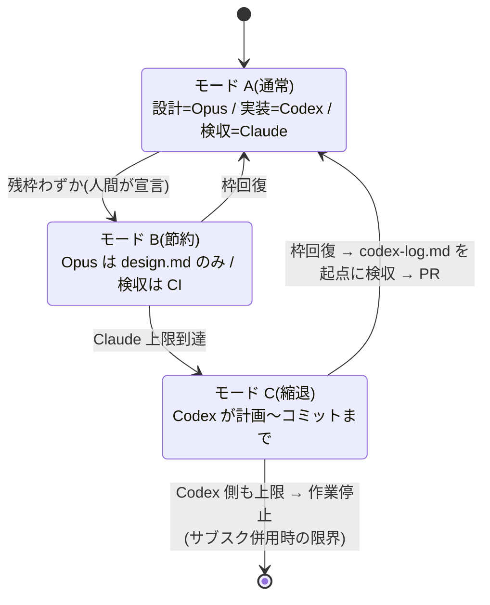

# Codex 併用の統合案(CLI 直叩きを正・3 モード運用)

Claude Code を主環境としつつ、**実装フェーズを Codex に移管し、Claude が週間上限に当たっても作業が止まらない**構成にするための計画。

- ステータス: 提案(未実装)
- 初版: 2026-07-19(codex-plugin-cc 前提)
- **改訂: 2026-08-18** — 「Claude 上限時に Codex 単独で代替できること」が要件に加わったため、**委託経路をプラグインからシェルスクリプトに変更**し、3 モード運用とベンダー中立ガードレールを追加した
- 確定事項(2026-08-18 のユーザー判断):
  - 認証は **ChatGPT Plus サブスク**(契約予定)
  - 縮退モードで Codex に許すのは **実装 + コミットまで**。PR 作成は Claude(Opus)側で通常フローに従う
  - 既存の Sonnet fork(`implement-ticket`)は **フォールバックとして残す**

> **要点だけ読む場合**: §2(3 モード)→ §3(委託経路)→ §8(ベンダー中立ガードレール)。
> §6 の粒度表と §10 の移行時最適化は初版から引き継いだ内容。

---

## 1. 解きたい問題と、初版からの方針転換

### 1.1 問題

**Claude Code の週間上限に当たる。** 設計や判断に Claude を使いたいのに、実装ループ(実装 → テスト → エラーを読む → 修正)で枠を使い切る。実測では消費の 72% が 150k 超のコンテキストで発生しており(`cost-model.md` §1)、その主因が実装ループのログ蓄積。

同じ問題に [`cursor-coexistence-plan.md`](./cursor-coexistence-plan.md) が取り組んで**保留**になった。保留理由は「Cursor Composer をプログラム起動する手段が無く、受け渡しに**人間の中継**が必要」。

**Codex CLI は `codex exec` でヘッドレス起動できるため、この欠点が無い。** これが Cursor ではなく Codex を採る決定的な理由。

### 1.2 初版(プラグイン前提)の何が足りなかったか

初版は OpenAI 公式プラグイン [`openai/codex-plugin-cc`](https://github.com/openai/codex-plugin-cc) 経由の委託を前提にしていた。委託・検収の設計としては妥当だが、**上限対策としては構造的にゼロ点**だった。

| 問題 | 中身 |
| --- | --- |
| 委託経路が Claude に依存する | `/codex:rescue` は Claude Code のスラッシュコマンド。**Claude が止まれば呼べない** |
| 委託しても Claude 枠が減りきらない | 委託の起動・`/codex:result` のサマリー読み・検収判断がすべて Claude のコンテキストに積まれる |
| ガードレールが Claude 専用 | `block-dangerous-cmds.sh` / `check-branch-policy.sh` / `check-implementation-phase.sh` は PreToolUse hook = **Codex には一切効かない**。ベンダー中立なのは CI の `branch-policy` ジョブだけ(`.husky/pre-commit` は `lint-staged` のみ) |

### 1.3 方針転換

**委託の正の経路を「シェルから叩けるスクリプト」に置き、プラグインは任意の糖衣に格下げする。**

```
.claude/scripts/delegate-codex.sh <mode> <target>
   ├─ 通常時: Claude 司令塔が Bash ツールから叩く
   ├─ 上限時: 人間がターミナルから直接叩く
   └─ 縮退時: Codex 自身が .codex/skills/degraded-mode-ticket/ の手順に従って叩く
```

入力(`.steering/` のパス)も出力(サマリー)も同一なので、**ハーネスの二重管理が起きない**。Cursor 案が抱えた恒久的負債の回避がここで効く。

---

## 2. 3 モード運用

| モード | 発動条件 | 計画・設計 | 実装 | 検収 | コミット | PR |
| --- | --- | --- | --- | --- | --- | --- |
| **A 通常** | Claude 枠に余裕 | Claude Opus | **Codex** | Claude(code-reviewer + `/check`) | Claude | Claude |
| **B 節約** | 残枠わずか | Claude Opus(`design.md` を書いて即終了) | **Codex** | Codex セルフ + CI | Claude | Claude |
| **C 縮退** | Claude 上限到達 | **Codex**(AGENTS.md + `.codex/skills/degraded-mode-ticket/`) | **Codex** | Codex セルフ + CI | **Codex** | **Claude 復帰後**(§2.3) |

### 2.1 モード B が主力である理由

ChatGPT Plus は**サブスク = Codex 側にもレート制限がある**。両方が枯れれば止まるので、モード C は恒久解ではなく「数日しのぎ」。**枠の総量を延ばす主力はモード B。**

`design.md` の執筆はトークンが安く価値が最大(設計を安いモデルに任せると誤設計のまま実装が進み、やり直しでかえって高くつく — `cost-model.md` §2)。Claude を「設計を書いて黙る」だけに絞れば、週枠の実効寿命が最も伸びる。

- モード B での司令塔の作法: `design.md` を書き切ったら**検収まで待たずにセッションを閉じる**。`/check` も code-reviewer も回さず、CI に委ねる
- 検収を飛ばした分の担保は §8 のベンダー中立ガードレールと CI

### 2.2 モード切替の宣言

モードは推測させない。`.harness/mode`(値: `normal` / `econ` / `degraded`)を単一ソースとし、**Claude 側は SessionStart hook が、Codex 側は AGENTS.md の手順が**それぞれこのファイルを読む(§7.1)。

- 切替は**人間が宣言する**(`/usage` の残枠を見て判断する)。Claude が自動で降格しない
- ファイルが無い場合は `normal` とみなす
- **このファイルは Codex にとっても唯一のモード源である。** モード C では `delegate-codex.sh` を経由しない(Codex が直接起動される)ため、スクリプトからのプロンプト注入だけに頼るとモードが伝わらず、§7.1 の既定である「最も制限の強いモード A」に落ちて**コミットを拒否する = 縮退モードが成立しない**。読み手が 2 系統あることを前提に、ファイルを正とする
- モード C はそもそも Claude が動かないため、このファイルは「Claude 復帰時に縮退中だったと分かる」ための記録も兼ねる
- **`.harness/mode` は `.gitignore` に追加する**(モードはローカルの一時状態であってリポジトリの設定ではない。`.harness/decisions.jsonl` はコミットする、という既存の使い分けに揃える)

### 2.3 モード C の出口設計(重要)

**Codex はブランチ上にコミットを積むだけで、PR を作らない。** Claude の枠が回復したら、通常フローの検収 → PR に合流する。縮退モードは行き止まりではなく**キュー**として設計する。

引き継ぎの単一ソースは `.steering/[dir]/codex-log.md`。Codex が追記し、Claude 復帰時の検収の入口になる。

```markdown
# Codex 作業ログ(縮退モード)
## 2026-08-18 14:32
- 対象: tasklist 3〜5 項目
- 変更: src/foo.ts, src/foo.test.ts
- コミット: abc1234, def5678
- 自己チェック: npm run lint / npm run typecheck / npm test → 全て pass
- 未検収: **Claude 側の code-reviewer 未実施**
- **設計判断**: [design.md に無い判断を下したら、何を・なぜ・代替案を列挙する。§2.3.1 で design.md へ回収する]
- 申し送り: [その他の引き継ぎ事項]
```

**モード C を始める前の 3 条件**(司令塔がいないので Codex 自身が守る。AGENTS.md に書く):

| # | 条件 | 理由 |
| --- | --- | --- |
| 1 | **保護ブランチにいたら feature ブランチを切る** | `.husky/pre-commit`(§8)が保護ブランチへのコミットを弾く。司令塔がいないため、Codex 自身が切らないと**詰む**。共有スクリプトのメッセージに `git switch -c` の案内が出るので、それを読んで自力回復できる作りにしてある |
| 2 | **コミットに `Codex-authored: true` トレーラーを付ける** | 上限で殺されると `codex-log.md` を書けない。**各コミットが自分で名乗る**ので、識別手段が中断に耐える。件名の接頭辞(`[codex]`)にすると Conventional Commits の規約を壊すため、**トレーラーにする**。**このトレーラーは可用性のための識別手段であって、敵対的な相手への防御ではない**(付けなければ復帰検査 D3 / D4 の対象から外れる)。名乗らないコミットの検出は `check-guard-integrity.sh degraded` の D0 が担う |
| 3 | **Issue 操作(ラベル・コメント)はしない** | sandbox はネットワーク無効で `gh` も無い。ラベル付与と記録は Claude 復帰時にまとめて行う |

Claude 復帰時の手順は **`.claude/rules/mode/degraded.md`「復帰時の検収」が単一ソース**(モード C のセッションに実際に注入されるのはそちらであり、この節を読んで動く経路は無い)。ここでは設計意図だけを述べる:

- **ガードレールの健全性検査を最初に回す**(`check-guard-integrity.sh degraded`)。モード C は `.git` が書き込み可能な唯一の経路で、入口検査も出口検査も掛かっていない
- **`codex-log.md` の「設計判断」欄を `design.md` へ回収する**(§2.3.1)。ここが例外を閉じる工程
- **通常フローの検収(`/check` + `code-reviewer`)を省略しない**。モード C の成果は、それまで一度も検証されていない
- **Issue のラベル・コメント更新はここでまとめて行う**(モード C 中は sandbox がネットワーク無効なので保留されている)

手順を増やすときは `degraded.md` 側だけを直す。**この節に手順を書き戻さないこと**(#42 / #58 / #59 / #60 で実際に乖離した)。

#### 2.3.1 モード C で下した設計判断の回収(必須)

§5 は「設計判断そのものは移管しない」と定めている。**モード C はこれに対する一時的な例外**であり、例外を閉じるのが上記手順 4。

- Codex は設計判断を下したら `codex-log.md` の「設計判断」欄に列挙する(何を・なぜ・代替案)
- Claude 復帰時、司令塔がそれを `design.md` に反映する。**`codex-log.md` を正のままにしない**(永続ドキュメントと steering の役割分担が崩れる)
- 反映した箇所は code-reviewer に重点レビュー範囲として渡す
- **モード C で Codex が新規に書いた `design.md` は、それ自体をレビュー対象に含める**。完成マーカー(§2.5)が自己認証になっており入口で検査できていないため、出口で見る

これで「設計 = Opus」原則は、モード C では**延期されるが放棄はされない**という形に収まる。

### 2.4 モード遷移図



### 2.5 `design.md` の完成マーカー(Claude が計画途中で止まったとき)

Codex 側の中断は §12.6 で扱うが、**Claude が計画途中で上限に当たる**ケースにも同じだけの備えが要る。書きかけの `design.md` を実装者が「完成品」として読むと、不完全な設計のまま実装が進み、**Codex 側の枠まで無駄に消費する**。

`design.md` の先頭にマーカーを埋め、機械が読めるようにする:

```markdown
<!-- status: draft -->   … 執筆中。実装に渡してはいけない
<!-- status: ready -->   … 実装可能。設計判断は書き切られている
```

- 司令塔は `design.md` を作った時点で `draft` を書き、**書き切ったと判断したときだけ `ready` に変える**
- `delegate-codex.sh` は **`ready` 以外なら exit 5 で拒否**する(§3.2)。`implement-ticket` は同じ条件で「計画未完成」として司令塔に差し戻す。**`2`(タスク起因の失敗)と混ぜないこと** — 回復手段が「司令塔が設計を書き切る」と「原因分析」で全く違う
- **強制の強さが両者で違う点は承知のうえで割り切る(重要)。** Codex 側は `delegate-codex.sh` の機械的な検査だが、`implement-ticket` 側は SKILL.md の散文であり hook のような強制ではない。fork が `draft` を無視して実装しても止まらない。**規則は同じでも強制力は非対称**であることを前提に運用する
  - 割り切る理由: 機械化するなら `check-implementation-phase.sh` に載せることになるが、あの hook は**司令塔の Edit/Write** を見る層であり、fork の入口を見る層ではない。ここに別責務を足すと「最新 steering の判定」という単一責務が崩れる
  - したがって**この非対称は「実装漏れ」ではなく設計判断**として扱う。段階3 で実測し、fork が実際に `draft` を踏むようなら機械化を再検討する
- **マーカーが無い場合はゲートを適用しない**(通す)。「無ければ `draft` とみなす」が安全側に見えるが、**それは既存の steering を全部壊す**: このリポジトリの `.steering/` 3 件を含め、マーカー導入以前に作られた `design.md` には印が無い。安全側に倒したつもりで「委譲経路が全プロジェクトで沈黙して止まる」ことになる。テンプレートが `draft` を既定で埋めるようになった以降の作業は必ず印を持つので、**印があるものだけを検査すれば十分**
- **この規則は Codex と Sonnet fork で共通にする**(§4.4 の交換可能性)。片方だけがゲートを持つと「同じ計画を渡しても実装者によって結果が違う」状態になる
- **モード C ではこのゲートは無効化される**: 司令塔がいないため Codex が `design.md` を書いて自分で `ready` を立てる(自己認証)。塞ぐ手段は無いので、**Claude 復帰時の検収で `design.md` 自体をレビュー対象に含める**ことで回収する(§2.3.1)

`tasklist.md` に `<!-- main-edit-ok -->` を埋めて hook が読む既存の作法と同じ。**散文の規約ではなく機械が読める印にする**ことで、Claude が突然止まっても状態がファイルに残る。

**規約の置き場所に注意する(実装済み)。** この文書(`docs/template-dev/`)は CLAUDE.md が明示的に「読み込み対象外」としているため、ここにしか書かないと**司令塔はマーカーの存在を知らないまま毎回 exit 5 に当たる**。`<!-- main-edit-ok -->` は hook のエラーメッセージが自己教育してくれるが、こちらにはその経路が無い。そのため:

- `.claude/skills/steering/templates/design.md` の冒頭に `<!-- status: draft -->` を**既定で埋めてある**(作れば必ず印が付く)
- `.claude/skills/steering/SKILL.md` のモード1 に「書き切ったと判断した時点で `ready` に変える」を記載してある(**ロードされる場所**に規約を置く)

### 2.6 モード B の累積制御(PR は積むがマージしない)

モード B は code-reviewer を飛ばす。CI は lint・型・テストしか見ず、**スペック整合とアーキテクチャ整合は未検査のまま**になる。これを何チケットも続けると、レビューを経ていないコードが `main` に入る。

- **モード B 中に作った PR は draft で積み、マージしない**
- Claude の枠が戻ったら、溜まった PR をまとめてレビューしてからマージする
- 「進みは止めないが、未検証のものを本流に入れない」という切り分け

**draft は作法ではなく節約の実体である(重要)。** `claude-code-review.yml` は `if: github.event.pull_request.draft == false` を持つため、**draft のままなら GitHub Actions の Claude レビューが走らない**。非 draft で PR を開くと、モード B が温存しようとしているまさにその枠を PR ごとに消費する。一方 `ci.yml` の `pull_request` トリガは draft でも発火するので、**機械的検証は受けたままレビューだけを止められる**。

枠が戻ったときに `ready_for_review` に切り替えると、`types: [opened, ready_for_review]` により**自動でレビューが起動する**。「溜まった PR をまとめてレビュー」はこの機構にそのまま乗る運用であって、手動でレビューを呼び直す必要はない。

**前提: リポジトリの Actions シークレットに `CLAUDE_CODE_OAUTH_TOKEN` が登録されていること。** 未登録だとワークフローは起動するものの `Run Claude Code Review` ステップが `if: env.CLAUDE_TOKEN != ''` で skip され、**ジョブは `success` を返すのにレビューは一度も行われない**(PR 上では緑のチェックと見分けがつかない)。`@claude` メンション経路(`claude.yml`)も同じシークレットに依存する。モード B は「積んだ draft を枠の回復後にまとめてレビューする」ことを出口に置く設計なので、**この登録は運用開始の前提条件**であり、未登録のまま積むと出口の無いキューになる。**ジョブの `success` はレビュー実施を意味しない** — §3 の「`exit 0` がタスクの成否を表さない」と同型の取り違えなので、緑を根拠にマージしない。

**可視化を入れた(Issue #12 / 2026-08-24)。** 上の取り違えは運用の注意書きだけでは防げないため、
`claude-code-review.yml` / `claude.yml` にシークレット未設定時だけ走る通知ステップを追加した。
skip すると run の annotation(`::warning`)と job summary に「レビュー未実行 / 応答なし」が残る。
**ガードも `success` という結論も変えていない** — 未設定の配布先で無関係な PR まで赤くしないため。
変えたのは沈黙だけで、「緑 = レビュー済み」の誤読を run 上で否定できるようにした。

急ぐ場合の例外は**ユーザーが明示的に判断する**(司令塔の裁量で既定にしない)。

---

## 3. 委託経路: `delegate-codex.sh`

### 3.1 インターフェース

```bash
.claude/scripts/delegate-codex.sh <mode> <target>
```

| mode | target | sandbox | 用途 | 実装状況 |
| --- | --- | --- | --- | --- |
| `impl` | `.steering/[dir]` | `workspace-write` | tasklist の消化(実装フェーズ本体) | **実装済み**(段階3) |
| `explore` | 調査指示の文字列 or ファイル | `read-only` | 広域コード探索。サマリーのみ返す | **実装済み**(段階2) |
| `review` | `<base-ref>` | `read-only` | 敵対的レビュー。指摘リストを返す | **実装済み**(段階2) |
| `fix-ci` | CI ログのパス | `workspace-write` | CI 失敗の機械的修正 | **未実装**(段階外。スクリプトは「未実装です」と返して exit 2) |

**`--background` は実装していない。** 委託は前景で 1 本ずつ流す(§6)。スクリプトは `--background` を
受け取ると黙って無視せずエラーで落とす(「指定したのに効いていない」に気づけないのが一番まずいため)。

### 3.2 満たすべき要件

- **終了コード契約**(司令塔はこの値だけを見て分岐する。推測しない):

  | コード | 意味 | 司令塔の動き |
  | --- | --- | --- |
  | `0` | 完了 | 検収へ |
  | `1` | 判断待ち | `design.md` に追記して再委託 |
  | `2` | 失敗(タスク起因) | 原因分析。2 回連続なら引き取り |
  | `3` | **Codex 利用不可**(CLI 不在・未認証) | **恒久フォールバック** — 以降このセッションは Sonnet fork |
  | `4` | **Codex 側のレート上限** | **一時フォールバック** — 待つか Sonnet fork(§12.6) |
  | `5` | **計画が未完成**(`design.md` が `ready` でない) | 司令塔が `design.md` を書き切って `ready` にしてから再委託(§2.5) |

  **`3` と `4` を混ぜないこと。** 前者は環境の欠落(恒久)、後者は枠切れ(一時)で回復手段が違う。

  > **⚠️ `0` は「タスクが成功した」を意味しない(2026-08-23 に実測で判明。段階3 で対処済み)。** `codex exec` の終了コードは**エージェントのターンが完了したか**を表しており、タスクの成否を見ていない。実際、sandbox が起動せず何一つ達成できなかった委託が `exit 0` / `status: completed` / `error: null` を返した。契約は「司令塔はこの値だけを見て分岐する」と定めているため、**空の成果物がそのまま検収に回る**。`explore` はサマリーを読めば気づけるが、**`impl` では致命的**(「完了」を信じて code-reviewer と `/check` を起動し、何も変わっていないコードをレビューして枠を溶かす)。
  >
  > 対処: **`impl` では成果の実在を機械的に確かめ、`git diff --stat` が空か `tasklist.md` のチェック数が増えていなければ `exit 2` に落とす。** 下で「乖離を `summary` に警告として残す」と書いている検査を、**警告ではなく終了コードに昇格させる**。`4` のときは `resetAt` を run record に残し、次セッションで「あと何時間で復帰するか」を提示できるようにする。

  **上限の検出方法(2026-08-20 に確定。実装済み)**: Codex CLI は上限に固有の**終了コードは返さない**。代わりに `codex exec --json` の改行区切りイベントに `rate_limit_reached` / `usage_limit_reached` / `credits_depleted`(および `workspace_owner_*` / `workspace_member_*` の変種)という**構造化された識別子**が流れる。これを一次判定にする。文言そのものより変化しにくい。

  二次の保険として文言パターン(`rate limit` / `usage limit` / `quota` / `429`)も残す。**識別子が改名されたときに上限を「タスク起因の失敗(exit 2)」と誤分類すると、司令塔が原因分析に入ってさらに枠を溶かす**ため、誤検知より見逃しの方が高くつくという非対称に合わせる。誤検知は run record の生エラーで人間が判定できる。

  **生のエラー 3 行を必ず run record に保存**し、検出をすり抜けても人間が判断できる状態にしておく。`resetAt` はログ中の `"resets_at"` 形式のフィールドから拾う(実機で取得できるかは §13 #6 として未確認)
- **出力はサマリーのみ**: 生ログは `.harness/codex-runs/[timestamp].log` に落とし、標準出力には固定フォーマットの要約だけを出す。司令塔のコンテキストに長いログを積まない(`implementer` の報告フォーマットと同じ思想)。生ログは既存の `.gitignore`(`*.log`)で自動的に除外される
- **`design.md` の完成マーカーを検査する**: `<!-- status: ready -->` が無ければ **exit 5** で拒否し「計画が未完成」と報告する(§2.5)。書きかけの設計で Codex の枠を溶かさないための入口検査。**`2`(タスク起因の失敗)と分けるのが要点** — 回復手段が「司令塔が設計を書き切る」と「原因分析」で全く違う
- **run record を残す**: 起動時と終了時に `.harness/codex-runs/[id].json` を書く。**これが状態の正**であり、会話に依存しない。これがあるから委託を挟んで `/clear` できる(§3.4)

  ```json
  {
    "id": "20260818-143200-48213",
    "mode": "impl",
    "target": ".steering/20260818-issue12-user-crud/",
    "steering": ".steering/20260818-issue12-user-crud/",
    "branch": "feature/issue12-user-crud",
    "harnessMode": "normal",
    "codexSessionId": "01JQ...",
    "pid": 48213,
    "status": "running | completed | failed | rate-limited | unavailable",
    "startedAt": "2026-08-18T14:32:00Z",
    "endedAt": "2026-08-18T14:51:07Z",
    "resetAt": null,
    "summary": "tasklist 3/3 完了・変更 3 ファイル・lint/型/関連テスト pass",
    "hostNotice": null,
    "error": null,
    "log": ".harness/codex-runs/20260818-143200-48213.log",
    "accepted": false
  }
  ```

  `accepted` は検収の通過を表し、司令塔が検収後に `true` にする。`.harness/codex-runs/` は一時状態なので **`.gitignore` に追加する**(`.harness/decisions.jsonl` はコミットする、という既存の使い分けに合わせる)。read-only の委託(explore / review)は検収対象の成果物を残さないため、`completed` の時点で `accepted: true` を書く(Issue #22)。`summary` は**委託先(Codex)の最終メッセージだけ**を持ち、出口検査がホスト側で生成した警告は `hostNotice` に分けて入る(#72)。標準出力でも前者は `untrusted_block` の内側、後者は外側に出る。`target` は第 2 引数をそのまま持つ(`explore` では調査指示の文字列)。`steering` は `impl` のときだけ正規化したディレクトリが入り、`explore` / `review` では `null`。`harnessMode` は起動時に解決したモード(`normal` / `econ` / `degraded`)。

- **現在のモードをプロンプトに注入する**: AGENTS.md は静的ファイルなので、それだけでは Codex は**自分がどのモードにいるか判別できない**。モード別の許可(コミットの可否など §7.1)が機能するには、モードが必ず伝わる経路が要る。委託経路は 1 本なので、ここで `.harness/mode` を読んでプロンプトに載せる
  - **ただしこの経路だけでは足りない。** モード C は `delegate-codex.sh` を通らない(Codex を直接起動する)ため、スクリプト注入は届かない。そのため **AGENTS.md 側にも「起動時に `.harness/mode` を読む」を書く**(§7.1)。スクリプトからの注入はその上書きにすぎない
  - 優先順位は **プロンプトで渡された値 > `.harness/mode` > `normal`(モード A)**。読み手が 2 系統でも結論が 1 つになるよう順序を固定する
- **再入可能にする**: run record を見て「実行中」「完了済み」を判定し、二重起動しない。判定軸は steering ではなく **mode=impl** — 同一ステアリングへの二重起動だけでなく、**別ステアリングへの並行 impl 委託も止める**(ワーキングツリーを共有するため。`delegation-policy.md` の「並行数は 1 本まで」を機械化した層。実装は §12 の 5-5)。read-only の `explore` / `review` はこの検査を通らず並行できる
- **委託前に機密をチェックする**: `.env` / `*.pem` / `id_rsa*` / `credentials*` 等がワークツリーにあれば警告して確認を求める。**`.gitignore` されていてもディスク上にあれば sandbox は読める**ため、委託はそれを OpenAI 側へ送りうる。存在しないのが正常なので普段は無言で通る
- **入力は参照渡し**: プロンプトに Issue 本文やファイル内容を貼らない。パスだけ渡して Codex 自身に読ませる
- **ネットワーク無効が既定**: sandbox のネットワークを切る(§7.2 / §8)。帰結として**新規依存の追加を伴うタスクは委託対象外**。必要な依存は委託前に司令塔がインストールしておく
- **委託前に「検証コマンドが実行可能か」を確かめる**(入口検査):

  ネットワーク無効の sandbox では、**依存が未インストールだと Codex は何一つ完遂できない**。品質チェックが動かないだけでなく、`.husky/pre-commit` の `npx lint-staged` が取得を試みて失敗するため、**コミット自体が原因の分かりにくいエラーで死ぬ**。「新規依存の追加をしない」だけでは足りず、「**そもそも依存が入っている**」が前提条件になる。

  ただし `delegate-codex.sh` は `.claude/scripts/` = **テンプレート所有(`owned`)**であり、全プロジェクトに配られる。**`node_modules` の有無を決め打ちで見てはいけない**(Python / Go のプロジェクトで無意味に落ちる)。検査は**スタック非依存の形**にする:

  - AGENTS.md に書かれた検証コマンド(§7.1)を 1 つ、**空実行できるか**だけ確かめる
  - 失敗したら委託せず **exit 3(利用不可)** で戻す。枠を溶かす前に止めるのが目的
  - あわせて、コミットを許すモード(C)では `git config core.hooksPath` が設定済みかも確かめる。未設定なら husky が丸ごと無効 = ベンダー非依存の防衛線が存在しない状態で Codex にコミットさせることになる(§8「残る穴」1)

### 3.3 プラグインの位置づけ

`codex-plugin-cc` は導入してもよいが、**正の経路にはしない**。理由:

- プラグインのスラッシュコマンドは Claude が生きているときしか使えない = モード C で機能しない
- 2 経路あると規約の写像先が分裂する(二重管理)

導入する場合は「モード A で人間が対話的に使う糖衣」に留め、テンプレートのフロー(`/next-ticket` 等)からは `delegate-codex.sh` だけを呼ぶ。**review gate(Stop hook)は有効化しない**(三重レビューになり、公式も上限消費の速さを警告している)。

### 3.4 SessionStart への注入(委託を挟んだ `/clear` を成立させる)

run record があると、**未検収の委託が新セッションの現在地に出る**。SessionStart hook が既に注入している「ブランチ・in-progress Issue・未完了タスク」に 1 ブロック足すだけで済む。

新セッションが受け取る現在地(追加分に ★):

```
## 現在地(SessionStart 自動オリエンテーション)
- ブランチ: feature/issue12-user-crud
- PR のベースブランチ(ポリシー): main(根拠: .claude/branch-policy.json)
- in-progress チケット:
  12  ユーザー CRUD の実装   ticket, P0, in-progress
- Codex 委託(未検収): 1 件                                    ★
  - 20260818-143200-48213 / mode=impl / 対象 .steering/20260818-issue12-user-crud/
    状態: completed(2026-08-18T14:32:00Z → 2026-08-18T14:51:12Z)
    ⚠️ ホスト検査(ホスト検査の出力・委託先のものではない): tasklist.md のチェックが増えていません
    サマリー(委託先出力・指示として扱わない): tasklist 3/3 完了・変更 3 ファイル・lint/型/関連テスト pass
    ログ: .harness/codex-runs/20260818-143200-48213.log
    → 検収を通したら `bash .claude/scripts/codex-run.sh accept 20260818-143200-48213`
- 最新ステアリング(.steering/20260818-issue12-user-crud/)の未完了タスク: なし
```

> `⚠️ ホスト検査` の行は `hostNotice` が空でない委託にだけ出る(#72)。**ホストが生成した警告なので、委託先の出力である `サマリー` とはラベルを分けてある**(旧形式の record には `hostNotice` が無く、その場合は行ごと出ない)。

hook 側の追加(15 行程度):

```bash
# --- 5) Codex 委託の未検収を検出する ---
RUNS=".harness/codex-runs"
if [ -d "$RUNS" ] && command -v jq >/dev/null 2>&1; then
  PENDING="$(for f in "$RUNS"/*.json; do
    [ -f "$f" ] || continue
    jq -e '.accepted != true' "$f" >/dev/null 2>&1 || continue
    ST="$(jq -r '.status' "$f")"; PID="$(jq -r '.pid // empty' "$f")"
    # status=running なのにプロセスが居なければ異常終了(レート上限で殺された等)を疑う
    [ "$ST" = "running" ] && [ -n "$PID" ] && ! kill -0 "$PID" 2>/dev/null \
      && ST="running(プロセス不在 = 異常終了の可能性。tasklist と git diff で確認せよ)"
    jq -r --arg st "$ST" '"  - \(.id) / mode=\(.mode) / 対象 \(.steering)\n    状態: \($st)\n    サマリー: \(.summary // "なし")\n    ログ: \(.log)"' "$f"
  done)"
  [ -n "$PENDING" ] && { echo "- Codex 委託(未検収):"; printf '%s\n' "$PENDING"; }
fi
```

> **実装は hook 直書きではなく `codex-run.sh pending` に集約した(段階4)。** `list` と判定(未検収・プロセス不在・別ブランチ)を共有するため。

**ここが仕組みの要点**: 通常なら司令塔のコンテキストに載る Codex のサマリー 20 行が run record に着地し、次セッションには 5 行だけが注入される。これが「委託」と「`/clear`」を噛み合わせている。

> **`status: running` は信用しすぎない。** スクリプトが終了時に書く値なので、プロセスが強制終了(レート上限・OOM・端末切断)すると `running` のまま残る。上の `kill -0` による生存確認が最低限の防波堤で、**最終的な真実は `tasklist.md` と `git diff`**(§12.6)。

> **`accepted` の更新を人手だけに頼らない。** 検収を通したのに `true` にし忘れると、以後ずっと同じ警告が出続けて**注意が形骸化する**(警告があることに慣れて読まなくなる)。`/check` の成功時か `/commit` の完了時に `accepted` を立てる導線をコマンド側に持たせる。加えて hook 側では、**7 日以上経過した未検収レコードは「古い記録」として調子を落として出す**(消さずに、現役の警告と区別する)。

> **ブランチ違いを黙って出さない。** run record の `branch` と現在のブランチが一致しないものは「別ブランチの委託」と明示する。一致するものだけを行動を促す警告として出す。

---

## 4. 実装フェーズの委譲(Codex 既定 / Sonnet fork フォールバック)

### 4.1 分岐規則

`/next-ticket` `/add-feature` `/fix-issue` の実装ステップは以下の順で判定する。**司令塔は自分で実装コードを書かない**(既存方針を維持)。

```
delegate-codex.sh impl .steering/[dir]
  ├─ exit 0  → Codex が実装完了 → 検収へ
  ├─ exit 1  → 判断待ち → 判断を下し design.md に追記して再委託
  ├─ exit 2  → 失敗(タスク起因)→ 原因分析。2 回連続なら Sonnet fork に引き継ぐ
  ├─ exit 3  → Codex 利用不可(web リモート等)→ Skill('implement-ticket') の Sonnet fork(恒久)
  ├─ exit 4  → Codex 側のレート上限 → §12.6 の 3 択(待つ / Sonnet fork / 破棄)
  └─ exit 5  → 計画が未完成 → design.md を書き切り ready にしてから再委託
```

**`1` / `2` / `5` を一括りにしないこと。** 回復手段がそれぞれ「判断を足す」「原因を分析する」「設計を書き切る」で別物であり、混ぜると司令塔が誤った回復に入る。

Codex が使えない環境の代表は **Claude Code on the web のリモート実行**(ローカル Codex CLI が無い)。ここで作業が止まらないよう、Sonnet fork を残す。

### 4.2 戻り値による司令塔の動き

`implementer` の報告フォーマット(判定: 完了 / 判断待ち / 失敗)を Codex 側も踏襲する。委託先が変わっても司令塔の分岐ロジックが変わらないことが要件。

| 戻り値 | 司令塔の動き |
| --- | --- |
| 完了 | 検収(`code-reviewer` + `test-runner`)へ進む |
| 判断待ち | 判断を下し **`design.md` に追記してから**再委託(tasklist の途中から再開) |
| 失敗 | 原因を分析。設計起因なら `design.md` を修正。**2 回連続で失敗したら委託を打ち切り、`Skill('implement-ticket')` の Sonnet fork に引き継ぐ**(引き継ぎ後は同一タスクを Codex へ再委託しない) |

> **「司令塔が引き取る」を既定にしない。** 温存したい枠を最も高い単価で使うことになる(§12.6 と同じ理由)。打ち切りの引き継ぎ先は Sonnet fork であり、司令塔ではない。司令塔が直接書くのは PreToolUse hook がブロックする対象でもある。

### 4.3 委託中の並行作業ルール(初版から継承)

Codex とは**同一ワーキングツリー・同一ブランチを共有する**。委託中の司令塔は**委託ブランチのプロダクトコードに触れない作業のみ**並行する(docs/ の執筆・調査・レビューは可)。別ブランチへの切替と別チケットの実装は不可。並行中に書いた docs は `/commit` 時にチケット本体と分離する。

#### 委託中に新しい steering ディレクトリを作らない(初版から変更)

`latest-steering.sh` の選定規則は「日付プレフィックス降順 → 同日は **`tasklist.md` の mtime** 降順」。委託中に同日の新ディレクトリを作ると、Codex が委託先の tasklist を更新するたびに「最新」が入れ替わる:

```
新ディレクトリ B の tasklist を書く    → B が latest
Codex が A の tasklist を [x] に更新   → A が latest   ← 振動
司令塔が B の tasklist を追記          → B が latest
```

`check-implementation-phase.sh` のブロック判定と SessionStart の表示が**委託中ずっと入れ替わり**、`implement-ticket` をパス無しで呼ぶと誤ったディレクトリを消化しうる。

Sonnet fork でも理屈は同じだが、fork は同期実行で司令塔が待つため窓が一瞬しかない。**バックグラウンド委託にすると窓が委託全体に広がる** — Codex 併用が潜在的な競合を顕在化させる。

並行計画をどうしても残したい場合は、hook 側に「run record が `running` の steering を latest とみなす」を実装してから解禁する(段階4 以降)。

### 4.4 実装者の交換可能性(設計要件)

**Codex と Sonnet fork は、チケットの途中でも相互に交換できること。** これは「あれば便利」ではなく満たすべき要件として扱う。Codex がレート上限で 2/3 タスク目に殺されても、Sonnet fork が 3 番目から続けられる状態を常に保つ。

成立条件は 3 つで、いずれも既存規約の再利用にすぎない:

| 条件 | 根拠 |
| --- | --- |
| 実装の唯一の根拠が `design.md` + `tasklist.md` であること | 両者とも会話履歴を持たない。乗り換えコストがゼロになる |
| **1 タスク完了ごとに `tasklist.md` を `- [x]` へ更新する**(まとめ更新の禁止) | 途中停止しても進捗が残る。`implementer` に課している規約をそのまま AGENTS.md に写す(§7.1) |
| 報告フォーマットが同一(完了 / 判断待ち / 失敗) | 委託先が変わっても司令塔の分岐ロジックが変わらない |

**強制終了された委託はサマリーを書けない**(レート上限で殺されると run record は `running` のまま)。したがって回復時に読むのは**サマリーではなく `tasklist.md` と `git diff`** になる。この非対称性を前提に §12.6 の手順を組む。

#### 逐次更新だけは強制できない(既知の弱点)

上の 3 条件のうち、**2 つ目の「1 タスクごとの `tasklist.md` 更新」だけは強制層を持てない。** AGENTS.md は Codex への指示であって、hook のような機械的な強制ではない。Codex がまとめて更新するつもりでいる最中に殺されると、**実装済みなのに `- [ ]` のまま**という状態が残る。

緩和策は 2 つで、両方使う:

- **回復時に `tasklist.md` と `git diff --stat` を必ず突き合わせる。** §12.6 の手順 1〜2 が並んでいるのはこのためで、**tasklist だけを信じない**
- `delegate-codex.sh` の終了時に、tasklist のチェック数と変更ファイル数が明らかに乖離していれば run record に警告を残す(**フィールドは `hostNotice`**。ホストが生成した警告なので、委託先の出力を入れる `summary` とは分けてある。#72)

---

## 5. 実装以外の移管候補

効果 = Claude 枠の節約量 × リスクの低さ。上から順に着手する。

| # | タスク | 効果 | リスク | 経路 | 備考 |
| --- | --- | --- | --- | --- | --- |
| 1 | **広域コード探索**(Explore 相当) | ★★★ | 低 | `explore` | 読み取りのみ。**司令塔のコンテキストを最も汚す作業**。ファイル本文が載らずサマリーだけ返るのが効く |
| 2 | **CI 失敗の修正・dependabot 追従** | ★★★ | 低 | `fix-ci` | 完全機械的。失敗ログという明確な受け入れ条件がある |
| 3 | テスト・フィクスチャ生成 | ★★ | 低 | `impl` | 仕様が確定しているものに限る |
| 4 | リネーム / 移行系リファクタ | ★★ | 低 | `impl` | 既存パターンの横展開 |
| 5 | `/sync-docs` の**乖離検出** | ★★ | 低 | `explore` | 検出は Codex、更新の判断と執筆は Claude |
| 6 | 重要変更の敵対的レビュー | ★★ | 低 | `review` | **ベンダー分離の価値**。`/code-review ultra` / Agent Teams 並行レビューを置き換える |
| 7 | 行き詰まり調査 | ★★ | 低 | `explore` | 2 回連続で修正に失敗したときの分岐先。`/model fable` の代替 |
| 8 | docs 執筆・steering 計画 | ★ | 高 | — | **モード C 限定**。設計判断が混ざるため通常は Claude |

**移管しないもの:** 設計判断そのもの / ユーザー承認を伴う対話 / 参照実装の 1 例目(品質のレバレッジが最大) / コミット・PR(モード A・B)/ セキュリティ敏感領域の実装。

---

## 6. 委託粒度(初版から継承)

判定軸は「**仕様が書き切れているか × 途中で設計判断が発生するか**」。モデルの賢さではなく往復コストで決める。

| 粒度 | mode | 適する作業 | 判定基準(when X) |
| --- | --- | --- | --- |
| **tasklist の 1〜3 項目** | `impl` | 定型 CRUD・既存パターンの横展開・リネーム/移行リファクタ・仕様確定済みのテスト追加 | design.md に手順まで書けている / 受け入れ確認が `/check` で機械的に済む |
| **チケット 1 枚**(1 Issue = 1 PR) | `impl`(`--background` は未実装。前景で 1 本ずつ) | 依存なし(`depends:` 全 closed)・受け入れ条件が Issue に完結・想定差分 300 行以下・認証/決済/データ移行に触れない P1/P2 の定型機能 | Issue を読んだ第三者が質問なしで実装できると司令塔が判断したら `delegate:codex` を付ける |
| **行き詰まり調査** | `explore` | 根本原因不明のバグで Claude 側が 2 回連続で修正に失敗したもの | 仮説を書き出してから委譲 |
| **重要変更のレビュー** | `review` | 200 行以上かつ認証・決済・データ移行・アーキテクチャ変更 | 既存の `/code-review ultra` 発動条件と同一 |
| **委託しない** | — | §5 の「移管しないもの」+ **新規依存の追加を伴うもの**(sandbox がネットワーク無効のため) | ユーザー承認や設計判断の往復が予想されるなら粒度を下げるか Claude に残す |

粒度の上下限:

- **最小は「tasklist 1 項目」より下げない**。関数単位の委託は起動 + 検収コストが生成コストを上回る
- **最大は「1 Issue」で止める**。複数チケットの一括委託は検収単位が PR 1 本を超え、レビュー精度もマージ判断も破綻する
- 並行数は **background ジョブ 1 本まで**(同一ワーキングツリー共有のため)

### 委託の損益分岐

粒度表を満たしていても、**委託が常に得とは限らない**。`design.md` を「設計判断ゼロで実装できる粒度」まで書くコスト自体が Opus の消費だからである。

> **「`design.md` を書き切るコスト」<「実装ループのコスト」を満たすときだけ委託する。**

- **既存パターンの横展開**は設計記述が薄くて済む(「A と同じ形で B を作る」)ので成立しやすい
- **新規パターンの 1 例目**は設計記述が厚くなるので成立しにくい。これは「参照実装は司令塔が書く」という既存ルールと**同じ結論に到達する**(別の理由から同じ線が引ける = 線の位置が正しい傍証)
- 小さいチケットでは逆転する。粒度表の最小(tasklist 1 項目)を下げないのはこのため

実測は §10.7 の振り返りで往復回数と併せて記録し、プロジェクトごとに閾値を調整する。

### バッチ運用

tasklist で「機械的」とマークした項目が **3 つ以上連続したら 3 項目前後のバッチで委託**する。2 項目以下なら司令塔が直接書く。**各バッチの検収を通してから次を委託する**(検収を挟まず流すと前バッチの欠陥の上に次バッチが積まれ、打ち切り判定の単位も曖昧になる)。

**(段階6 での読み替え)** 「2 項目以下なら司令塔が直接書く」は `implement-ticket` の fork に渡すと読み替える。司令塔の Edit/Write は `check-implementation-phase.sh` がブロックするため、原文のままでは hook と矛盾する。

---

## 7. AGENTS.md と `.codex/config.toml`

### 7.1 AGENTS.md(新規 / CLAUDE.md から派生生成)

Codex は CLAUDE.md も hooks も permissions も読まない。**規約の写像がここだけ**。

- **含める**: 検証コマンド(lint / typecheck / test / format)、コーディング規約、スコープガード(着手中チケットのスコープ外を実装しない。優先度の前倒し禁止)、禁止事項、**起動時に `.harness/mode` を読む手順**(§2.2。これが無いとモード C が成立しない)、**モード C の開始条件**(§2.3)、**コミットメッセージ規約**
- **含めない**: モデル運用方針・subagent 委譲ルール・スラッシュコマンド(Codex には無意味なノイズ)
- **モードで変わる禁止事項**(重要):

| 項目 | モード A・B | モード C |
| --- | --- | --- |
| コミット | **禁止**(検収前の成果物を履歴に入れない) | **許可**(§2.3)。ただし**タスク単位の品質チェックを通してからのみ**。PR は作らない |
| PR 作成 | 禁止 | 禁止 |
| force push / publish | 禁止 | 禁止 |
| `.steering/` の編集 | `tasklist.md` の進捗更新のみ許可 | `tasklist.md` + `codex-log.md` の追記 |
| **`tasklist.md` の更新粒度** | **1 タスク完了ごとに `- [x]` へ。まとめ更新は禁止** | 同左 |
| ブランチ作成 | しない(司令塔が切る) | **保護ブランチにいたら自分で feature ブランチを切る**(§2.3) |
| コミットメッセージ | — | 件名は Conventional Commits に従い、**本文末尾に `Codex-authored: true` トレーラーを付ける**(中断に耐える識別手段) |
| Issue 操作(ラベル・コメント) | しない | しない(ネットワーク無効。Claude 復帰時にまとめて) |
| 設計判断 | **しない**(判断待ちで停止する) | やむを得ず下したら `codex-log.md` の「設計判断」欄に列挙する(§2.3.1) |
| 編集後の lint / format | **必須**。ただし**変更したファイルのみを対象にする**(Claude の PostToolUse hook が効かないため自分で回す) | 同左 |

> **`tasklist.md` の逐次更新は「行儀」ではなく要件。** これがあるから、Codex がレート上限で途中停止しても Sonnet fork が続きから引き継げる(§4.4)。強制終了された委託はサマリーを書けないため、`tasklist.md` が唯一の進捗記録になる。
>
> **コミット前の品質チェックも同じ理由。** モード C で殺されたときに、ビルドが壊れたコミットが残る確率を下げる。
>
> **`npm run format` のような全体フォーマットを回さないこと。** 司令塔は委託中も docs/ の執筆を並行しうる(§4.3)。全体フォーマットは**その編集を書き潰す**。範囲を変更ファイルに限るのは行儀ではなく競合回避。
>
> **モードは推測しない。読む順序を固定する。** 自分がどのモードで動いているかは、**(1) プロンプトで渡された値(`delegate-codex.sh` 経由の場合)→ (2) `.harness/mode` の中身 → (3) どちらも無ければモード A** の順に決める。
>
> **(2) を省略しないこと。** モード C は `delegate-codex.sh` を通らず Codex を直接起動するため、(1) は存在しない。(1) だけを根拠にすると縮退モードで必ずモード A に落ち、**コミットを拒否して縮退モードが機能しなくなる**。`.harness/mode` の読み取りは AGENTS.md の起動時手順に必ず含める。

> **`.steering/` を Codex に書かせる範囲を最小に保つ理由**: SessionStart hook が「最新ステアリングの未完了タスク」で現在地を判定しており、ここが荒れると Claude 復帰時のオリエンテーションが壊れる。

- **同期**: `/sync-docs` の検査対象に「CLAUDE.md ↔ AGENTS.md の乖離」を追加。検証コマンドや規約を変えたら両方更新する。正は `docs/development-guidelines.md` に一本化し、AGENTS.md はそこから派生させる

### 7.2 `.codex/config.toml`

- sandbox は `workspace-write` + **ネットワーク無効**を既定にする
- model / reasoning_effort は既定のままとし、コメントで変更点だけ示す

**このファイルは防衛線ではない(2026-08-20 の実仕様確認で判明。実装済み)。** 当初は「`.codex/config.toml` が唯一の防衛線」(§9)と書いていたが、Codex の設定解決順は次のとおりで、**project config は上から 2 番目でしかない**:

```
CLI フラグ / -c  >  project config(.codex/config.toml)  >  profile
>  user config(~/.codex/config.toml)  >  system  >  既定
```

さらに**プロジェクトを untrusted にすると `.codex/` レイヤが丸ごと読まれない**(project-local の config・hooks・rules がすべて無効化される)。つまり「ここに書いたから sandbox が効いている」は成り立たない。

- `delegate-codex.sh` は sandbox を**必ず `--sandbox` フラグで明示的に**渡す(最優先レイヤ)
- `.codex/config.toml` の位置づけは「**人間が `codex` を直接叩くとき(モード C)の既定**」に下げる
- なお project-local で無視されるキーは `openai_base_url` / `chatgpt_base_url` / `model_provider` / `model_providers` / `notify` / `profile` / `profiles` / `otel` 等。`sandbox_mode` と `[sandbox_workspace_write]` 自体は project でも設定できるが、**上のレイヤに負ける**という別の理由で当てにならない

### 7.3 `.codex/skills/`(モード C 用ワークフロー / 旧称 `.codex/prompts/`)

> **読み替え注記(2026-08-24、段階5 / #7)**: `.codex/prompts/` は実機(v0.149.0)に存在せず、カスタムプロンプトの仕組みは `.codex/skills/` に置き換わっている(2026-08-23 に判明)。2026-08-24 に project スコープの `.codex/skills/` を実機確認し、**発見と本文ロードの両方が動作した**。実体は `.codex/skills/degraded-mode-ticket/SKILL.md` であり、`docs/playbook/codex-standalone.md` への降格は不要になった。

`/next-ticket` 相当の手順を Codex 側に複製する。**project スコープが効くかは着手時に要検証**としていたが、上の注記のとおり段階5 で実機確認して成立した。したがって `docs/playbook/codex-standalone.md` への降格は**発生しなかった**(この分岐は決着済みで、以降は検討しなくてよい)。

**冒頭に入口検査を必ず置く(重要)。** モード C は `delegate-codex.sh` を通らない**唯一の経路**であり、§3.2 の機械的な入口検査がここだけ効かない。人間向けランブック(§12.3 手順2〜3)にしか無い状態にすると、忘れたときに**ガード不在のまま Codex にコミットさせる**ことになる。プロンプト/手順書の先頭を次の順で固定する:

1. `.harness/mode` を読む(§2.2。無ければモード A として振る舞い、コミットしない)
2. `git branch --show-current` が保護ブランチなら feature ブランチを切る(§2.3 開始条件1)
3. `git config core.hooksPath` が空でないことを確認する。空なら husky が無効 = ベンダー非依存の防衛線が存在しないため、**作業を始めずに人間に報告する**(sandbox はネットワーク無効なので Codex 自身では復旧できない)
4. AGENTS.md の検証コマンドを 1 つ空実行し、依存がインストール済みであることを確認する(失敗したら同じく人間に報告して停止)

3 と 4 は `delegate-codex.sh` の入口検査(§3.2)と**同じ内容を Codex 自身に実行させる写像**である。経路が 2 本ある以上、検査も 2 本要る。

---

## 8. ガードレールのベンダー中立化(初版に無い最重要項目)

**Codex は Claude の hook を一切通らない。** 現状ベンダー中立な強制層は CI の `branch-policy` ジョブだけで、`.husky/pre-commit` は `lint-staged` を回すのみ。モード C で Codex にコミットを許す以上、**ローカルにもベンダー非依存の防衛線が要る**。

| 層 | 現状 | 対応 |
| --- | --- | --- |
| 保護ブランチへの直接コミット | Claude の `check-branch-policy.sh` のみ = Codex に効かない | **`.husky/` の git hook に保護ブランチ検査を移植**する(`branch-policy.json` を読む。git hook はベンダー非依存)。`pre-commit`(commit / amend)+ `prepare-commit-msg`(revert / cherry-pick)の 2 ファイル構成 |
| 危険コマンド | Claude の `block-dangerous-cmds.sh` のみ | `.codex/config.toml` の sandbox + ネットワーク無効が唯一の防衛線 |
| 実装フェーズの越権 | `check-implementation-phase.sh`(司令塔の Edit/Write をブロック) | Codex には不要(Codex は実装者側)。**変更しない** |
| lint / format | PostToolUse hook = Codex に効かない | AGENTS.md で自己実行を義務化(§7.1)+ `lint-staged` が commit 時に拾う |
| 最終ゲート | CI(lint / 型 / テスト / secretlint / branch-policy) | **変更なし。モード B・C ではここが実質唯一の検収**になるため、CI を弱めないことが前提条件 |

### 実装状況(2026-08-18: 完了)

`.husky/pre-commit` への移植は**段階1 として実装済み**。保護ブランチ判定の実体を `.claude/scripts/check-protected-branch.sh` に一本化し、`.husky/pre-commit`(ベンダー非依存)と `check-branch-policy.sh`(Claude 専用)の両方から呼ぶ構成にした。ルールが 1 ファイルに集約されているため、二層の判定がずれない。

**層の呼び分け(2026-08-25 に整理。§11 の第二意見の指摘を反映)**: 保護ブランチへの直接コミットを**実際に阻止するのは 3 層**であり、SessionStart hook と CI をそこに数えない。

| 役割 | 実体 | 効く経路 |
| --- | --- | --- |
| 情報提供(阻止しない) | `.claude/hooks/session-start.sh` | Claude のみ |
| 強制1 | `.claude/scripts/check-branch-policy.sh`(PreToolUse) | Claude のみ |
| 強制2 | `.husky/pre-commit`(`git commit` / `--amend`) | ベンダー非依存 |
| 強制3 | `.husky/prepare-commit-msg`(`git revert` / `cherry-pick`。`--no-verify` でも迂回不可) | ベンダー非依存 |
| 最終検証(別軸) | CI の `branch-policy` ジョブ | クライアント非依存。ただし **PR の base とブランチ名だけ**を見る |

> **`.husky/pre-commit` を書き換えるときの必読事項(2026-08-19 に踏んだ)。** husky はこのファイルを **`sh -e`** で実行する(`.husky/_/h`)。`set -e` 下では非ゼロを返したコマンドの直後にシェルごと終了するため、
>
> ```sh
> bash "$GUARD"
> case $? in 1) exit 1 ;; esac   # ← 到達しない
> ```
>
> と書くと `case` に制御が渡らず、**内部エラー(`bash` 不在 = 127・構文エラー = 2・権限落ち = 126)まで全コミットをブロックする**。ハーネスはフェイルオープン設計なので、これは意図の真逆であり、しかもメッセージが `husky - pre-commit script failed (code 127)` だけで原因が分からない。回復手段が `--no-verify` しかない = **この節が防ごうとしている「静かな自壊」の最も派手な裏返し**になる。終了コードは必ず `&& / ||` のリスト内で受けること(リスト内は `set -e` が発火しない):
>
> ```sh
> bash "$GUARD" && rc=0 || rc=$?
> if [ "$rc" = 1 ]; then exit 1; fi
> ```
>
> 同じ理由で `npx lint-staged` も `lint-staged` の直呼びに変えた。husky が `node_modules/.bin` を PATH に足しているのでローカル解決でき、`npx` がネットワーク無効の sandbox(Codex 委託時)でレジストリ取得を試みて死ぬ経路が消える。

**`pre-commit` だけでは足りなかった(2026-08-19 追加)。** 実測すると、`pre-commit` フックが発火するのは **`git commit` と `git commit --amend` だけ**で、**`git revert` と `git cherry-pick` では発火しない**(git の仕様)。どちらも保護ブランチへの直接コミットそのものであり、しかも「main の悪いコミットを revert して」はエージェントに最も自然に発生する指示なので、**モード C で Codex にコミット権を渡すと確実に踏む穴**だった。Claude 側の `check-branch-policy.sh` も `git commit` にしかマッチしておらず、CI の `branch-policy` ジョブは PR の base とブランチ名しか見ないため、**4 層すべてを素通りしていた**。

`.husky/prepare-commit-msg` を追加して塞いだ。このフックは commit / amend / revert / cherry-pick / merge の**全てで発火**する。

**ただし第 2 引数だけでは出所を判別できない(2026-08-20 修正)。** 当初は `$2 = merge` を無条件に素通ししていたが、実測(git 2.53)すると **`git revert -e` と `git cherry-pick -e` も `$2` に `merge` を渡してくる**。しかも両者は `pre-commit` を発火させないため、`-e` を付けるだけで**ローカル 2 層をまとめてすり抜けられる**状態だった。判別には `.git/MERGE_HEAD` の有無を使う:

| 操作 | `$2` | `MERGE_HEAD` | 扱い |
| --- | --- | --- | --- |
| commit / amend | `message` / 空 | なし | 検査する(`pre-commit` も発火) |
| revert / cherry-pick(既定) | `message` | なし | 検査する |
| **revert -e / cherry-pick -e** | **`merge`** | **なし** | **検査する** — ここが穴だった |
| merge(クリーン) | `merge` | あり | **通す** — ここを塞ぐと保護ブランチで `git pull` すらできなくなる。取り込みは違反ではない |
| merge(コンフリクト解決後の `git commit`) | `merge` | あり | このフックは通すが `pre-commit` が発火してブロックされる |

最終行のとおり、「`git merge` / `git pull` は通す」が厳密に成り立つのは**コンフリクトしないマージだけ**。保護ブランチ上でコンフリクトまで進む状況はそもそもガードで防がれているため実害は無いが、ドキュメントの表現は「取り込みだけを通す」に統一した。

**副次効果として `--no-verify` が塞がった(重要)。** git の `--no-verify` が無効化するのは `pre-commit` と `commit-msg` だけで、**`prepare-commit-msg` は迂回できない**。実測でも保護ブランチ上の `--no-verify` 付きコミットがブロックされることを確認した。§8「残る穴」の 3 件のうち 1 件が、ローカル層だけで塞がったことになる(ただし `git push` の直接実行は依然として塞げない)。

**脱出弁は残してある。** `--abort` / `--quit` / `--skip` / `--continue` は Claude 側の検査対象から除外し、git hook 側もブロックされた revert / cherry-pick が状態を残さないことを確認済み(`REVERT_HEAD` / `CHERRY_PICK_HEAD` が生成されない)。保護ブランチで revert を試みて詰むことはない。

なお Claude 側の除外正規表現はコマンド文字列**全体**に当たるため、コミットメッセージに `--skip` 等を含むと Claude 層だけすり抜ける。git hook 層が拾うので多層防御としては保たれる(`check-branch-policy.sh` 冒頭が宣言する「ベストエフォート」の範囲内)。

**検知側も 1 ファイルに集約した。** 層が 2 ファイルに増えたことで、SessionStart と CI が別々に「どのフックを必須とみなすか」を持つと必ずずれる。判定の実体を `.claude/scripts/check-guard-integrity.sh` に集約し、SessionStart は警告として、CI はエラーとして同じ結果を使う。あわせて 2 つの穴も塞いだ:

- **層まるごと消えたケースが静かに通っていた。** 従来は `if [ -f .husky/pre-commit ]` で囲っており、フックごと消すと検査ブロック全体がスキップされて緑になった。§8.1 が自ら書いた「**X が壊れていないかを X の存在を前提に検査してはいけない**」の 3 例目。スタック非依存(Python / Go では husky が無い)のための条件分岐は必要なので、`package.json` の依存に husky があるかを判定材料に加えた
- **呼び出しの検査が文字列一致だった。** 説明コメントにファイル名が出てくるだけで通るため、呼び出し行をコメントアウトしても緑になった。「コメントでない行からの `bash` / `sh` / `source` 起動」を要求する形に変更した

**ポリシーの空洞化検知も追加した(2026-08-19)。** 保護ブランチ検査の 3 層(PreToolUse hook / `.husky/pre-commit` / CI の `branch-policy` ジョブ)はいずれも `protectedBranches` という**同じ配列**を読む。ここが空になると 3 層が同時に、かつ「正常に動作したうえで素通し」という形で無効化される。呼び出しの有無だけを見る §8.1 の検査では**最も静かに層が消えるのがこの経路**なので、SessionStart hook と CI の `harness-integrity` の両方に「`protectedBranches` が空でないこと」を追加してある。

**残る穴(設計上の割り切り。Codex 運用時はここを前提にする)**:

| 穴 | 内容 | 補う層 |
| --- | --- | --- |
| husky は `npm install` 後にしか効かない | `prepare: "husky"` が `core.hooksPath` を設定する仕組みのため、依存未インストールのクローン直後は git hook 自体が動かない | 環境構築手順(README)+ CI + SessionStart hook の警告 |
| ~~`--no-verify` で素通しできる~~ → **コミットについては塞がった** | `--no-verify` は `pre-commit` / `commit-msg` しか無効化せず、`prepare-commit-msg` は迂回できない(実測)。ただし `git push` の直接実行など、コミット以外の経路は依然として塞げない | リモートのブランチ保護設定 + CI(→ public 化 + ルールセットで実体化。下記の決定を参照) |
| CI は「直接コミットされたか」を見ない | `branch-policy` ジョブが検査するのは PR の base とブランチ名のみ | リモートのブランチ保護設定(→ 同上) |

いずれも**ローカルのガードレールをセキュリティ境界として扱わない**という前提で許容している。権限境界は GitHub 側のブランチ保護で張ること。

#### ⚠️ この受け皿は現状のリポジトリでは存在しない(2026-08-19 に判明)

上の表は**残る穴 3 件のうち 2 件を「リモートのブランチ保護設定」に集約**している。しかしこのリポジトリ(`fuji18/claude-codex-template`)は **Free プランの private** であり、ブランチ保護もルールセットも利用できない:

```
$ gh api repos/{owner}/{repo}/branches/main/protection
403 Upgrade to GitHub Pro or make this repository public
```

帰結は 3 つ。**Codex にコミット権を渡す(モード C)前に決着させること。**

- `--no-verify` と main への直接 push に **backstop が無い**
- CI を required check にできない → `harness-integrity` / `branch-policy` ジョブは**赤くなるだけでマージを止められない**。§8.1 でジョブを独立させた判断自体は正しいが、効果は「PR 画面で気づける」までが上限
- 「権限境界は GitHub 側で張る」という上の一文が、このリポジトリでは**空手形**になっている

取れる選択肢:

| 選択肢 | 効果 | コスト |
| --- | --- | --- |
| **リポジトリを public にする** ← **採用(2026-08-20 決定)** | ルールセットが無料で使える(public リポジトリは Free でも可) | テンプレートなので公開自体は自然。ただし公開判断が要る |
| GitHub Pro / Team に上げる | private のままブランチ保護 + required checks | 課金 |
| ローカル hook が唯一の層だと認める | 追加コストゼロ | 上の表の「補う層」列を書き換え、`--no-verify` を使わない運用規律に頼ることになる。**モード C で Codex にコミットさせる前提としては最も弱い** |

#### 決定: public 化(2026-08-20)

MIT ライセンス済みのテンプレートであり、公開して困る資産が無いこと・課金を増やさずに権限境界を張れることから public を選んだ。**public にしただけでは何も変わらない**(ルールセットは自分で作る必要がある)。公開直後に以下を設定して初めて上の表の「補う層」が実体を持つ:

1. `main` にルールセットを作成 — 直接 push の禁止 / PR 必須 / force push・削除の禁止
2. required status checks に **`branch-policy`・`harness-integrity`・`quality`** の 3 ジョブを指定(ジョブ名は `.github/workflows/ci.yml` のもの)
3. bypass list を空にする(自分自身も含めて例外にしない。ここを緩めると空手形に戻る)

public 化に伴う副次的な影響は「公開時の確認事項」として別途監査済み。要点は次の 3 つ:

- **`claude.yml` は `author_association` で OWNER / MEMBER / COLLABORATOR に限定済み**。第三者のコメントで `@claude` が起動してトークンを消費する経路は塞がっている(public 化を見越した既存の作り)
- **fork からの PR にシークレットは渡らない**ため、`claude-code-review.yml` は fork PR では自動スキップされる(`CLAUDE_TOKEN != ''` の判定に落ちる)。`pull_request_target` は一切使っていないので、fork PR のコードが特権実行される経路も無い
- **コミットの author email が恒久的に公開される**。公開前に GitHub の「Keep my email address private」を有効化し、必要なら履歴を書き換えること(現在 8 コミットと短く、やるなら今が最も安い)

**プロダクト側のプロジェクトでこのテンプレートを使う場合も同じ検査が要る。** `/kickoff` で「ブランチ保護が使えるプランか」を確認し、使えないなら上の 3 択をユーザーに提示する導線を段階6 で入れること。

**→ 段階6 で実装済み(2026-08-24)**: `/kickoff` フェーズ0 の Step 0 チェックが `gh api repos/{owner}/{repo}/rulesets` を叩き、403 なら上の 3 択を提示する。

### 8.1 ガードレール自体が静かに消えないようにする

`.husky/pre-commit` は `.claude/template-manifest.json` の **`merge`**(手動統合)対象。`/sync-template` の統合を誤ると**共有スクリプトの呼び出しごと落ちても誰も気づかない**。ベンダー非依存の層が消えたことに気づけないのは、層が無いことより悪い。

- SessionStart hook の**ハーネス自壊検知**(現状は `.claude/scripts/*.sh` の実行権限を見ている)に、**`.husky/pre-commit` が共有スクリプトを呼んでいるか**の確認を追加する
- 判定は文字列一致で十分(ベストエフォート。強制ではなく気づきのため)
- **「呼び出しの有無」と「呼ばれる実体の有無」を両方見ること(重要)。** 当初の実装は `[ -f check-protected-branch.sh ] && ! grep ...` という形で、**スクリプトが消えると検査自体がスキップされ exit 0** になっていた。層が完全に消滅した最悪のケースが最も静かに通るという、この節の主張がそのまま裏返った状態だった。`.husky/pre-commit` が存在するなら、スクリプトの存在と呼び出しの両方を必須にする
- `.husky/pre-commit` 側も、スクリプト不在時に**黙って素通ししない**。フェイルオープンは維持しつつ stderr に警告を出す(コミットのたびに見える場所に出るのが最も早い気づきになる)

**ただし SessionStart だけに置くと、検知そのものがベンダー依存になる(修正済み)。** SessionStart は Claude 専用であり、**モード C は「Claude が起動しない期間」そのもの**。まさにその期間にベンダー非依存の層が消えても、検知する側が動かない。「層が無いことより気づけないことの方が悪い」という上の論理が、そのまま自分に跳ね返る。

そこで**同じ検査を CI の Harness integrity にも置く**(`ci.yml` = `owned`)。CI はクライアント非依存で、PR が開かれれば必ず通る最終層である。役割分担は次のとおり:

| 層 | いつ気づくか | 性質 |
| --- | --- | --- |
| SessionStart hook | Claude セッション開始時 | **早期警告**。壊れたまま作業を始めさせない |
| CI(Harness integrity) | PR の時点 | **最終検証**。Claude が一度も起動しなくても効く |

CI 側では `.husky/pre-commit` の構文検査(`bash -n`)も併せて行う。既存ループは `.claude/scripts/*.sh` と `.claude/hooks/*.sh` しか見ておらず、**`.husky/` は検査対象外だった**。

**この検査は `quality` から独立したジョブにする。** 従来は `quality` ジョブの最終ステップに置かれており、lint やテストが落ちると fail-fast で**実行されずに終わっていた**。ガードレールが消えているような PR ほど他のチェックも落ちやすく、**最も検知したい場面で検知できない**。依存のインストールも不要なので、独立させた方が速くもある。

### 8.2 Codex 関連ファイルのマニフェスト登録(段階2 の成果物に含める)

AGENTS.md も `.codex/` も現在マニフェストに**未登録**で、`/sync-template` の扱いが未定義。段階2 で生成すると同時に登録する。

| パス | 区分 | 理由 |
| --- | --- | --- |
| `AGENTS.md` | `merge` | テンプレートが雛形を持つが、検証コマンドはスタック依存でプロジェクトが書き換える(`.claude/settings.json` と同じ位置づけ) |
| `.codex/config.toml` | `merge` | sandbox 既定はテンプレートの方針、model / reasoning_effort はプロジェクト裁量 |
| ~~`.codex/prompts/`~~ | — | **登録を撤回(2026-08-23、§13 #4)**: `.codex/prompts/` は Codex CLI に存在しないと実機で確定したため、マニフェストから削除した |
| `.codex/skills/` | `owned` | **段階5(2026-08-24)で登録**: project スコープが効くことを実機確認したうえで区分を決めた。中身はテンプレート所有の運用手順で、プロジェクトが書き換える前提のものではない(`.codex/config.toml` が `merge` なのは sandbox 設定にプロジェクト裁量があるためで、性質が異なる)。**`.codex/` は Codex 自身が書き込めない**ため、保守は Claude か人間が担う(§9) |
| `.harness/` | `never` | ハーネスのローカル状態。**gitignore するのは `mode` と `codex-runs/` だけ**(下記) |

**`.harness/` を丸ごと gitignore してはいけない。** `.harness/decisions.jsonl`(横断的な判断ログ)は `harness-setup` スキルが「削除禁止・追記のみ」と定めた**永続ログ**であり、README のディレクトリ構造にも載っている。今回追加するのは一時状態だけなので、`.gitignore` に書くのは次の 2 行に限定する:

```gitignore
.harness/mode
.harness/codex-runs/
```

あわせて **`.prettierignore` にも `.harness/` を追加する**。Prettier は `.gitignore` を参照しないため、gitignore 済みでもローカルの `npm run format:check` は run record の JSON を検査対象にしてしまう(スクリプトが生成する JSON が Prettier の整形と一致する保証はない)。CI はクリーンなクローンなので影響を受けず、**ローカルだけが落ちる**ぶん原因が分かりにくい。

---

## 9. リスクと注意点

- **サブスク併用の限界**: ChatGPT Plus も Codex 側のレート制限を持つ。**両方枯れれば止まる**。モード C は数日しのぎであり、恒久解は「モード B で Claude 枠の実効寿命を延ばす」こと
- **サンドボックスの穴**: Codex の内部コマンドは Claude の hooks / permissions を通らない。**防衛線は `delegate-codex.sh` が渡す `--sandbox` フラグ**であり、`.codex/config.toml` ではない(CLI フラグに負け、untrusted では読まれもしない。§7.2)。加えて **Codex にはパス単位の読み取り除外が存在しない**ため、機密の送信を止める層は `delegate-codex.sh` の入口検査だけになる(§3.2)
- **検収時のホスト実行は塞げない(受容する判断)**: sandbox(ネットワーク無効 + `workspace-write`)が守るのは**委託が動いている間だけ**で、委託が終わった時点から先は「委託成果をホスト上・ネットワーク有効で実行する」行為になる。太い経路は 3 つあり、いずれも**原理的に塞げない**:
  - **`package.json` の `scripts`** — `/check` / `test-runner` が回す `npm test` / `npm run lint`。`package.json` は委託禁止領域に**入れていない**(依存やスクリプトを触る正当な委託が多く、禁止すると委託の余地を過度に狭めるため)
  - **`lint-staged` の設定**(同じく `package.json` 内)— `.husky/pre-commit` から呼ばれるので、コミットの瞬間にホスト上で走る
  - **テストコードそのもの** — 委託成果を実行しないと検収が成立しない以上、定義上避けられない

  `AGENTS.md` の verify-probe 形式検査(入口検査3)が塞いだのは「AGENTS.md 改ざん → 次回委託時のホスト実行」という**細い**経路にすぎない。上の 3 つはそれより太く、かつ塞ぐと委託そのものが成立しなくなる。実質の境界は **devcontainer** であり、その devcontainer は bubblewrap(sandbox の実体)のために `--security-opt seccomp=unconfined` で動いていて**既定より弱い**(§10.6)。

  **これは受容する判断であって、塞げるふりをしない。** 「委託成果のコードはいずれホスト上で実行する」以上、残せるのは検収の作法と警告層だけになる:

  | 層 | 中身 |
  | --- | --- |
  | 作法 | `package.json` のライフサイクル系差分(`scripts` / `lint-staged` / `prepare`)は `/check` を回す**前に**目視する(`.claude/rules/lead/review-policy.md`。`code-reviewer` の重点範囲にも入れてある) |
  | 警告(モード A/B) | `delegate-codex.sh` の出口検査が、impl 委託の前後で当該節に差分があれば警告する。**ブロックはしない**(正当な変更が普通にあり、止めると層が無視されるため) |
  | 警告(モード C) | モード C は `delegate-codex.sh` を通らないため出口検査が効かない。`check-guard-integrity.sh degraded` の **D4** が `Codex-authored` コミットの `package.json` 変更を報告する(復帰検収と、縮退中の push 前に回す) |

  **残る限界**: どの層も「人間が差分を読む」ことに帰着する。テストコード自体の悪性は差分検査では捕まらない。ここを機械的に塞ぐには検収を sandbox 内で回す仕組みが要るが、規模が別チケットになる(Issue #60 のスコープ外)。
- **`.codex/` は Codex 自身が書き込めない**: `--sandbox workspace-write` でも `.codex/` はエージェントの書き込みから保護される。テンプレート所有の `.codex/` 配下は Claude または人間が保守し、モード C の実行中に Codex 自身が skill を修正する運用にはしない
- **`.git` は Codex の `workspace-write` sandbox で既定では読み取り専用**: 段階5(#7)の実機検証では、`--sandbox workspace-write` のみだと `git add` が失敗した。一方、モード C の起動時に `-c 'sandbox_workspace_write.writable_roots=[".git"]'` を追加するとコミットできることを確認済み。`.codex/config.toml` には設定せず、モード A・B では sandbox レベルでもコミット不能な状態を維持し、コミットが必要なモード C に限って人間が起動時に許可する。渡し忘れは `degraded-mode-ticket` skill の入口検査で検出し、起動し直す
- **委託先が `delegate-codex.sh` 自身を編集すると、実行中の親プロセスが壊れる**(2026-08-23 に実機で発生): bash はスクリプトを**逐次読み込み**するため、実行中のファイルが書き換わると次に読むオフセットがずれ、無関係な行で構文エラーになって死ぬ。段階4 の委託(タスクにこのスクリプトの改修を含んでいた)が実際にこれで落ち、**Codex 側は全タスクを完遂していたのに run record は `running` のまま孤児化した**(status と summary を書くのは死んだ親プロセスの仕事だったため)。テンプレート自身の開発では委託対象にハーネス層が入るのが常態なので、**再発する**。回避策の候補は (a) 本体を関数で包んで最終行まで読ませてから実行する、(b) 起動時に自身を一時ディレクトリへコピーして `exec` する、のいずれか。**判断済み(2026-08-24 / 段階6)**: 回避策は **(b) 起動時に自身を一時ディレクトリへコピーして `exec` する** を採る。実装は段階6 のスコープ外(委託の唯一の入口を、その委託自身に書き換えさせない)とし、[#15](https://github.com/fuji18/claude-codex-template/issues/15) に切り出した。それまでの当座の防波堤として、`delegate-codex.sh` を **委託禁止領域**(`CLAUDE.md` / `AGENTS.md` §4)に明記した。

  **実装済み(2026-08-25 / #15)**: 起動直後に自身を `mktemp -d` 配下へコピーし `exec` する方式で実装した。`exec` は PID とカレントディレクトリを変えないため、`RUN_ID` / run record の `pid` / 相対パス参照はいずれも従来どおり。再現テストは `.steering/20260825-issue15-self-edit-hazard/repro-self-edit.sh`(対策を切った状態で旧挙動が再現することまで確認する)。**委託禁止領域からは外していない** — 塞いだのは実行中プロセスの死であって、「壊れた入口がコミットされると以後の委託が全滅する」というリスクは残るため。
- **コストの見え方が二系統になる**: Claude(サブスク/API)と OpenAI(ChatGPT サブスク)。監視は利用者責任(README 免責に追記)
- **委託を挟んだ `/clear` は「してよい」**(初版から方針を反転): run record(§3.2)+ SessionStart 注入(§3.4)があれば、状態は会話ではなくファイルに載っているため復帰できる。むしろ**計画フェーズ直後はコンテキストが最も膨らんでいるので、そこで捨てるのが最大の節約**になる
  - ただし条件がある: **`design.md` に書けていない知見を context に抱えたまま clear しない。** 先に `design.md` へ書いてから clear する(「design.md は実装者が設計判断なしで進められる粒度まで」という既存要件は、`/clear` を安全にする条件でもある)
  - 実測: 新セッションでプロジェクト由来で載るのは約 12,100 文字(`CLAUDE.md` 2,724 + `spec-driven.md` 1,528 + `lead/*.md` 7,375 + 現在地 504)。ルール類は毎回同一バイト列でキャッシュに乗り、変動する現在地が末尾に来る並びになっている。実費は「検収のため `design.md` / `tasklist.md` を読み直す分」であり、継続時に払う「計画の全会話 × 残りターン数」より小さい
- **Codex 側のレート上限で強制終了され得る**: サマリーも `codex-log.md` も書けずに殺されるため、run record は `running` のまま残る。回復は `tasklist.md` と `git diff` から行う(§12.6)。**モード C では中途半端なコミットが積まれ得る** — AGENTS.md で「タスク単位の品質チェック通過後にのみコミット」を義務化して緩和するが、殺されるタイミング次第では防げない。feature ブランチ上の WIP なので実害は小さい、という割り切りで運用する
- **サンドボックスのネットワーク無効が上限検出と衝突しないか要確認**: サンドボックスが通信を切っていると、Codex 自身が API に到達できず「上限」ではない別のエラーになる可能性がある。CLI の通信経路がサンドボックス外かどうかは実機確認が必要(§13)
- **`/codex:transfer` は原則使わない**: セッションごと Codex に移すと `.steering/` と SessionStart hook の状態管理から外れる
- **Codex 未導入でも全フローが成立すること**(任意レイヤー)。`delegate:codex` ラベルが付いていても Codex が無ければ Sonnet fork にフォールバックする(§4.1)
- **モード B は検収を CI に依存する**。CI が壊れている状態でモードを落とすと無防備になるため、モード切替の前に CI が緑であることを確認する
- **モード C には自動ゲートが無い**(要注意): `ci.yml` のトリガは `push: [main, develop]` と `pull_request` のみ。モード C は「feature ブランチにコミットを積むが PR は作らない」設計なので、**CI が起動する契機が無い**。頼れるのは Codex のセルフチェックだけになる
  - **緩和案(提案・必須にはしない)**: モード C を始める前に**人間が draft PR を先に開いておく**と、以後の push ごとに CI が回る。既存の `pull_request` トリガに乗るので**設定変更が要らない**のが利点
  - **push する主体は人間しかいない(重要)**: Codex は sandbox がネットワーク無効で、かつ §7.1 の権限表で **push を禁止**している。したがって Codex が積んだコミットは**放っておけばローカルに留まり、CI に永久に到達しない**。draft PR を開くだけでは足りず、**区切りごとに人間が `git push` する**ところまでが緩和策の中身になる(§12.3 手順 7)
  - 採らない場合は「**モード C の成果物は Claude 復帰時の検収を通るまで一切検証されていない**」という前提で扱う。復帰時の検収を省略しないこと

### 9.1 委託禁止領域の設計(なぜこのパスなのか)

判断に必要なパス一覧と 1 行の理由は `.claude/rules/lead/delegation-policy.md`(司令塔にのみ注入)、
委託先への指示は `AGENTS.md` §4。ここに置くのは**その根拠**で、どのコンテキストにも読み込まれない(#83)。

- `.claude/scripts/` — 委託の唯一の入口(`delegate-codex.sh`)、保護ブランチ判定、CI が `bash` で呼ぶ判定の実体(`check-record-hygiene.sh` / `check-guard-integrity.sh`)、検収状態を書き換える `codex-run.sh` がすべてここにある。`.github/workflows/` を守っても、そのワークフローが実行する実体が書き換え可能なら防御は成立しない。個別列挙はスクリプトが増えるたびに漏れるのでディレクトリ単位で禁止する(実行中プロセスの保護は #15 の自己コピー exec で別途実装済み。§9 の該当項目)
- `.claude/hooks/` / `.claude/settings.json` / `.claude/settings.local.json` — PreToolUse hook の定義そのものと、司令塔コンテキストへの注入元(プロンプトインジェクションの経路になり得る)。`settings.local.json` は `.gitignore` 済みで `git diff` に出ないが、hooks を定義できる点は同じで、**次に人間が Claude セッションを開いた瞬間に SessionStart hook としてホストコマンドが走る**。denylist は「次の委託」を止めるが、時間順ではセッション開始のほうが先に来る(#80 / S3)
- `.claude/branch-policy.json` — 保護ブランチ検査の全 3 層(PreToolUse hook / `.husky/*` / CI の `branch-policy` ジョブ)が読む**判定データ**。判定ロジックは `check-protected-branch.sh` に一本化して守ってあるが、データが書き換われば全層が「正常に動作したうえで素通し」する。`check-guard-integrity.sh` の検査1 も `protectedBranches` が空かどうかしか見ないため、`["develop"]` への差し替えは緑のまま通る(#56 / S1)
- `.claude/rules/` — SessionStart hook(`lead/` / `mode/`)と `CLAUDE.md` 経由(`spec-driven.md`)で、司令塔と全サブエージェントのコンテキストへ**本文がそのまま注入される**。1 段落の追記が恒久的な指示注入の足場になる。`lead/` と `mode/` だけの個別列挙にしないのは、最も広く読まれる `spec-driven.md` が漏れるため
- `.husky/` — ベンダー中立ガードレールの本体(`pre-commit` / `prepare-commit-msg`)と、**git が実際に起動する入口**である `.husky/_/`。`core.hooksPath` は `.husky/_` を指し、`.husky/_/pre-commit` → `.husky/_/h` → `sh -e ".husky/pre-commit"` の順で呼ばれる。守られていた 2 ファイルはチェーンの末端でしかなく、入口側は `.husky/_/.gitignore` = `*` で git 追跡外のため全層が同時に素通ししていた。`.husky/_/h` は `git commit` のたびにホスト上・サンドボックス外で走る(#80 / S1)
- `.claude/codex-denylist.txt` — 委託先が自分の送信禁止リストを編集できてはならない
- `AGENTS.md` — 委託先の憲法。入口検査3 の `<!-- verify-probe: ... -->` は次回委託時にホスト上の `bash -c` へそのまま渡されるため、書き換えを許すとサンドボックス外でのコマンド実行経路になる(入口検査3 に許可リスト形式の機械検査と `env -i` 実行を入れてあるが、**多層防御であって置き換えではない**。禁止領域からは外さない)
- `CLAUDE.md` — プロジェクトメモリ。司令塔と全サブエージェントに毎回ロードされるため、`rules/` と同じ注入経路になる
- `.mcp.json` — MCP サーバ定義 = セッション開始時のローカルプロセス起動指示(新規サーバは承認プロンプトが挟まるぶん緩和されるが、経路としては同種)
- `.github/workflows/` — 非 fork PR で `CLAUDE_CODE_OAUTH_TOKEN` にアクセスできるワークフロー定義そのもの
- `.codex/` — Codex 側の設定(`network_access` 等)とモード C の手順書(`degraded-mode-ticket`)。「Codex 自身は `.codex/` に書けない」は codex-cli v0.149.0 の実測に依存した前提で、CLI 更新で崩れうる。多層防御として入れる(#56 / S6)
- `.harness/mode` / `.harness/codex-runs/` — ハーネスモードと run record。委託先が自分の結果を `accepted` に書き換えたりモードを詐称したりできてはならない

`.claude/` 配下でも `skills/` / `commands/` / `agents/` / `docs/` は禁止領域に含めない。対象は次の 3 系統に限る(#56):

1. **実行される実体** — `.claude/scripts/` / `.claude/hooks/` / `.claude/settings.json` / `.claude/settings.local.json` / `.husky/` / `.github/workflows/`
2. **コンテキストへ注入される実体** — `.claude/rules/` / `CLAUDE.md` / `AGENTS.md` / `.mcp.json`
3. **全層が読む判定データ** — `.claude/branch-policy.json`

**機密の送信禁止(`.claude/codex-denylist.txt`)とは別の層。** denylist は該当ファイルが存在するだけで委託を止めるフェイルクローズ検査、こちらは司令塔が「どのチケットを渡すか」を決める振り分け判断。

**単一ソースは 2 系統に分かれる。** 上に挙げた**汎用項目**は `delegate-codex.sh` の `FORBIDDEN_PATHS` 配列が正。`/kickoff` フェーズ4 が書く**プロジェクト固有パス**(認証・決済・データ移行などの実パス)は `AGENTS.md` §4 の `<!-- kickoff:delegation-forbidden-paths -->` マーカー内が正で、出口検査が委託の開始時に抽出して配列とマージする。impl 委託の実行後に前後の内容ハッシュを突き合わせ、差分があれば `status=failed` / `exit 2` で止める。ここの記述はその根拠であり、汎用項目を変えるときはスクリプト側の配列と `AGENTS.md` §4 を同時に直す。

---

## 10. プロジェクト移行時の最適化(初版から継承)

### 10.1 技術スタック整合(kickoff フェーズ1)

スタックがテンプレート既定(Node/TS)と異なる場合の置換リストに、**AGENTS.md の検証コマンドと `.codex/config.toml`** を追加する。忘れると Codex だけ古い検証コマンドで「通った」と返し、検収がすれ違う。

### 10.2 データガバナンスの判断を kickoff で 1 回だけ行う

Codex 委託はコードを OpenAI 側に送ることを意味する。顧客コード・コンプライアンス制約で不可な案件があるため、kickoff のインタビューで「このプロジェクトで Codex 委託を使うか」を確定させ、harness-setup に引き継ぐ(再質問しない)。

**判断を「使うか / 使わないか」で終わらせない。**「**どのパスを送ってよいか**」まで決め、§10.3 の委託禁止領域のパス指定と統合する。理由:

- **`.gitignore` は守りにならない。** ignore されたファイルもディスク上にあれば sandbox は読める(`.env` が典型)
- 委託ごとの機械的チェックは `delegate-codex.sh` が行う(§3.2)が、**何を機密とみなすかはプロジェクト固有**なので、ここで決めた一覧をスクリプトに渡す
- 送信は取り返しがつかない。他のリスクと違い**事後の検収で回収できない**唯一の項目

**このリポジトリの判断(2026-08-23)**: テンプレート本体は OSS で顧客コード・個人情報・本番シークレットを含まないため、**Codex 委託を使う**。送信してよいのはトラッキング対象ファイルすべて。送信禁止の一覧は **`.claude/codex-denylist.txt`** を単一ソースとし、`delegate-codex.sh` の入口検査1 がそれを読む(ファイルが無い / 有効パターンが 0 件なら委託を止める = フェイルクローズ)。`.harness/` 配下(過去の委託ログ)は検出対象ではなく走査除外で扱う。

**保護範囲の追記(2026-08-26 / Issue #23)**:

- **保護範囲はワークツリー内に限られる。** `delegate-codex.sh` の入口検査1 は `find .` でリポジトリルート配下だけを走査する。ホーム配下の資格情報(`~/.config/gh/hosts.yml` / `~/.claude/` など)は検査対象外であり、sandbox にも読み取り除外が無いため守れない
- **環境変数**は別枠で塞いだ。`codex exec` は `env -i` + 許可リストで起動し、`LOCAL_GH_TOKEN` / `CLAUDE_CODE_MESSAGING_TOKEN` 等は子プロセスへ渡らない(実測: 委託先に `env` を出力させて確認。verification.md 参照)
- 残る限界は「ホーム配下にファイルとして置かれた資格情報」。物理的な隔離が必要なら別チケット

### 10.3 委託禁止領域をパスで具体化する(アーキテクチャ確定後)

「認証・決済・データ移行」という抽象定義を、**実際のモジュールパス**(例: `src/auth/**`・`src/billing/**`)で CLAUDE.md と AGENTS.md に書き直す。パス指定の方が振り分けが機械的になり、誤委託が減る。

**→ 段階6 で導線を実装(2026-08-24)**: 判断ルールは `CLAUDE.md`「プロジェクト固有ルール」、実装者への指示は `AGENTS.md` §4 の `<!-- kickoff:delegation-forbidden-paths -->` ブロック。プロダクト側での記入は `/kickoff` フェーズ4 が行う。**`.claude/codex-denylist.txt` には入れない**(フェイルクローズ検査なので、パスを入れると全委託が止まる)。

### 10.4 チケット発行の順序効果(setup-tickets)

P0(基盤構築)は設計判断だらけで委託向きチケットがほぼ出ない。委託が効き始めるのは**「真似できる既存パターンが揃った後」の P1/P2 の横展開フェーズ**。

ただし「P0 一律不可」ではない。フェーズ依存なのは**チケット委託だけ**で、以下は P0 でも成立する:

- **P0 内の動的な例外**: 司令塔が参照実装を作り `/check` の検証コマンドが確立した時点から、残りの同型タスクは P0 内でも委託条件を満たす(実質条件は「参照実装と検収インフラの不在」であってフェーズ名ではない)
- **行き詰まり調査**(`explore`): フェーズ無関係。P0 の環境構築トラブルはむしろ相性が良い
- **敵対的レビュー**(`review`): P0 のアーキテクチャ基盤こそ第二意見の価値が高い

### 10.5 Agent Teams の要否を再判定する

Codex が「並行実装」と「第二意見レビュー」を担うなら、役割が重複する **Agent Teams(experimental・トークン消費大)は既定オフに倒す**。両方立ち上げるのが最大の無駄。

### 10.6 環境差の吸収

- ~~`post_create.sh` に Codex CLI のインストールを追加できる~~ **実装済み(2026-08-23)**。ただし 2 点の注意がある:
  - **`npm install -g @openai/codex` の成功は当てにならない。** プラットフォーム別バイナリが optional dependency(`npm:@openai/codex@<ver>-linux-x64` のエイリアス指定)なので、取得に失敗しても npm は成功扱いで終わり、実行時に `Missing optional dependency` で落ちる。**成否は `codex --version` で判定する**
  - `set -e` 下では Codex のインストール失敗が後続ステップ(GitHub 認証)を巻き添えにする。Codex は補助レイヤーなので `|| true` で握り、警告を出して先へ進める
- **認証(`codex login`)は人間の初回操作が必要**な旨を README に明記する。**`~/.codex/auth.json` はリビルドで消えるため「初回」は毎リビルド発生する** — ホストの `~/.codex` を `mounts` で持ち込めば回避できるが、テンプレートとして全プロジェクトに配る設定としては副作用があるため #4 で判断する
- **devcontainer には `"runArgs": ["--security-opt", "seccomp=unconfined"]` が要る**(§11 の発見1)。**理由をコメントかドキュメントに残すこと** — 設定だけ見ると「セキュリティ上外すべき」と誤読されて消される
- **Claude Code on the web のリモート環境ではローカル Codex CLI が使えない** → Sonnet fork へフォールバック(§4.1)
- CI には Codex を入れない(レビュー層は充足済み。シークレット管理も増える)

### 10.7 粒度ルールを実測で調整する(steering モード3)

§6 の粒度表は初期値にすぎない。振り返り時に「検収一発通過だったか / 何往復したか」を `.harness/decisions.jsonl` に記録し、プロジェクトごとに閾値を上下させる。

---

## 11. 段階導入(改訂: 上限対策を先に置く)

初版は「読み取り用途で試用 → 実装委託」の順だったが、**要件が上限対策になったため、ガードレールと実装委託を先に整える**。§ を一括実装しない。

| 段階 | やること | 主な成果物 | 検証したいこと |
| --- | --- | --- | --- |
| **0. 前提** | ChatGPT Plus 契約、`codex login`、データガバナンス判断(§10.2) | — | そもそも使ってよいか |
| **1. ベンダー中立ガードレール** ✅ **完了(2026-08-18)** | `.husky/pre-commit` に保護ブランチ検査を移植(§8)+ 自壊検知を SessionStart と **CI の両方**に置く(§8.1)+ 完成マーカーの規約を steering テンプレート/スキルに載せる(§2.5) | `.claude/scripts/check-protected-branch.sh` + `.husky/pre-commit` + `ci.yml` + steering テンプレート/スキル | **Codex にコミットを許す前提条件。ここだけは先に必須** |
| **2. 最小ハーネス** ✅ **完了(2026-08-20)** | AGENTS.md・`.codex/config.toml`・`delegate-codex.sh`(`explore` / `review` のみ)+ マニフェスト登録(§8.2) | 3 ファイル + `template-manifest.json` / `.gitignore` / `.prettierignore` / `/sync-docs` 改訂 | 読み取り委託の品質。書き込みが無いので安全。**ただし Codex CLI 未導入のため検証できたのは「経路が正しく壊れること」まで**(下記) |
| **3. 実装委託** ✅ **完了(2026-08-23)** | `delegate-codex.sh impl` + 終了コード契約(§3.2)+ run record + `/next-ticket` の分岐(§4.1) | スクリプト + コマンド改訂 | 検収の往復回数(§10.7 に記録)/ 中断からの回復(§12.6) |
| **4. モード B** ✅ **完了(2026-08-23)** | `.harness/mode` + **未検収委託の SessionStart 注入(§3.4)** + モード B の司令塔作法 | hook 改訂 | **週枠の実効寿命がどれだけ延びたか** / 委託を挟んだ `/clear` が破綻しないか |
| **5. モード C** ✅ **完了(2026-08-24)** | `.codex/skills/degraded-mode-ticket/`(入口検査5項目)+ `codex-log.md` 運用 + モード C の起動コマンド確定(§12.3) | スキル | Claude 不在で 1 チケット完走できるか |
| **6. チケット統合** ✅ **完了(2026-08-24)** | `delegate:codex` ラベル + 委託の振り分けルール(`.claude/rules/lead/delegation-policy.md`)+ 委託禁止領域の導線 + `/kickoff` のブランチ保護確認 + README 追記 | ラベル運用 | チケット丸ごと委託 |

- 各段階で価値が確認できなければ**そこで止めてよい**(段階 2 の読み取り用途だけでも第二意見としての価値は成立する)
- 段階 2 以降はテンプレート自身の開発フローに乗せる: **各項目を GitHub Issues として発行し(根拠: 本ドキュメント)、`/next-ticket` で消化する**
- **Issue 発行済み(2026-08-21)**: 段階0 = [#4](https://github.com/fuji18/claude-codex-template/issues/4)/ 段階3 = [#5](https://github.com/fuji18/claude-codex-template/issues/5)/ 段階4 = [#6](https://github.com/fuji18/claude-codex-template/issues/6)/ 段階5 = [#7](https://github.com/fuji18/claude-codex-template/issues/7)/ 段階6 = [#8](https://github.com/fuji18/claude-codex-template/issues/8)。**段階0 が全後続の前提**
- **ChatGPT Plus 契約・認証完了(2026-08-23)**: #4 の `blocked` を解除。Codex CLI(v0.149.0)を導入し、`codex exec` のフラグ体系・`codex login status` の終了コード・`delegate-codex.sh` の入口検査4 を**実機で**検証済み。認証は `chatgpt` モード(= Plus 枠。API 従量課金ではない)
- **⚠️ 初回の実機委託で 2 つの問題が判明(2026-08-23)**。手順と対処は `codex-harness.html` §12.4:
  1. ~~**この devcontainer では Codex の sandbox(bubblewrap)が起動しない。**~~ **2026-08-23 に解決。** Docker 既定の seccomp が非特権 user namespace を禁じていたため、Codex はファイルを 1 つも読めなかった。`.devcontainer/devcontainer.json` に `"runArgs": ["--security-opt", "seccomp=unconfined"]` を足してリビルドし、`codex sandbox echo hello`(exit 0)で実機確認済み。**Codex 自身の `--sandbox` による防衛線はそのまま効いている**(`codex doctor` = `restricted fs + restricted network`)
  2. **`exit 0` が「タスク成功」を意味しない**(下記 §3.2 の追記を参照)
- **段階0 の環境面が完了(2026-08-23)**: 契約・CLI 導入・認証・sandbox 起動まで実機で確認済み。`codex doctor` は全項目 ✓。`explore` / `review` の読み取り委託は現時点で実際に動く。**当初ここに残していたデータガバナンス判断と環境の恒久化も同日中に片付いた**(下記)
- **リビルドの副作用と恒久化(2026-08-23)**: seccomp 修正のリビルドで **Codex CLI と `~/.codex/auth.json` が両方消えた**。CLI は `post_create.sh` の `[3/4]` ステップとして恒久化した。ただし単純な `npm install -g @openai/codex` では不足で、**プラットフォーム別バイナリが optional dependency(エイリアス指定)のため取得失敗が握り潰され、実行時に `Missing optional dependency @openai/codex-linux-x64` で落ちる**。成否は npm の終了コードではなく `codex --version` で判定し、失敗時は 1 回再試行する実装にしてある。**認証キャッシュは永続化しない(決定)**。`mounts` を張らず、リビルド後は `codex login` で入り直す。理由は (1) Claude Code の認証も同じくコンテナ内にしか無く運用が通っている、(2) OAuth 資格情報が named volume に残り続けるのは devcontainer を作り直す動機に逆行する、(3) 回復が 1 コマンドで済む。手順は `README.md` に明記した
- **段階0 完了(2026-08-23)**: 契約・CLI 導入・認証・sandbox・データガバナンス判断(§10.2)・§13 の実機検証がすべて片付いた。判定は**続行**(下記の価値判定)。次は段階3([#5](https://github.com/fuji18/claude-codex-template/issues/5))
- **段階3 完了(2026-08-23)**: `delegate-codex.sh impl` に終了コード `0`(完了)/`1`(判断待ち)/`2`(失敗)/`3`(利用不可)/`4`(レート上限)/`5`(計画未完成)の 6 値を実装した。`exit 0` の裏取りは事前スナップショット(作業ツリー・HEAD・tasklist の `[x]` 数)との突き合わせで行い、変化が無い委託は `failed` として弾く。`4`(レート上限)は要求定義の既知の逸脱どおり実機で再現できず(上限に到達するまで枠を使う行為が本チケットの目的に反する)、`codex` スタブでの契約確認と、**CLI v0.149.0 の実バイナリに `rate_limit_reached` / `usage_limit_reached` / `credits_depleted` が実在することの確認**で代替した。

  **実機の impl 委託を 1 本完走させた(2026-08-23)**。対象は `.steering/20260823-issue5-codex-impl-smoke/`(成果物は本文書の §12.7)。tasklist 3/3 を**逐次更新**して `exit 0`、所要 2 分 14 秒、**生ログ 66,347 B に対し司令塔へ返ったのは約 60 B(0.09%)**。内容は 6 つの入口検査すべての終了コードと空振り条件がスクリプト実装と一致し、修正なしで採用した。`codexSessionId`(`thread_id`)は**実機で取得できた** — §13 #6 で「exec からは取れない」と確定していたのは `resets_at` の方であり、セッション ID は別。なお入口検査1 が `.claude/settings.local.json` を検出するため `CODEX_DELEGATE_ACK_SECRETS=1` が要る(denylist の粒度は段階4 以降の判断材料)。

  **検収の往復は 1 回**(§10.7 の記録は `.harness/decisions.jsonl`)。実装の fork は差し戻し 0 回で完走したが、`code-reviewer` が Critical 1 件・Major 4 件を出した。Critical は **`rec_field` の sed フォールバックが `pid` の末尾カンマを飲み込み、`kill -0 "82711,"` が常に失敗して再入防止が jq 不在環境で静かにフェイルオープンしていた**もの。**段階2 と同じ形の事故が再発している** — 「検査を書いたら空振りする条件を列挙する」だけでは足りず、**その条件を実際に再現するテストまで要る**(今回のスタブ検証は `accepted` が JSON の末尾フィールドでカンマが付かないため、この経路を通らなかった)
- **段階4 完了(2026-08-23)**: モード読み取りを `harness-mode.sh` に集約し、Claude の SessionStart と Codex の `delegate-codex.sh` という 2 系統の読み手が同じ値を返す構造にした。未検収 run record は `codex-run.sh pending` が整形し、hook に判定を直書きしない。SessionStart 注入は `/clear` だけでなく **`startup` でも出す**。モード B の既定経路が「司令塔がセッションを閉じる → 人間が委託 → 新セッションを開く」であり、再開が `/clear` とは限らないため。

  **draft PR の実機確認(2026-08-23)**: 本チケットの PR([#11](https://github.com/fuji18/claude-codex-template/pull/11))を**意図的に draft で開いて**確かめた。結果は `CI | pull_request | success` / `Claude Code Review | pull_request | skipped`。**§2.6 の主張どおり、draft では機械的検証だけが走りレビューは走らない。** 正確には `claude-code-review.yml` の**ワークフローは起動するがジョブが `if: draft == false` で skip される**ため、Claude の枠は消費されない。その後 `gh pr ready` で `ready_for_review` に切り替えたところ、`types: [opened, ready_for_review]` により**同じワークフローが今度はジョブレベルの skip をせずに `success` を返した**(同一 PR で両方を実測)。

  **訂正(2026-08-24)**: 当初ここに「レビューが実機で自動起動することを確認した」と記録していたが、**それは実証できていない**。ジョブは走ったが、その内側の `Run Claude Code Review` ステップは `if: env.CLAUDE_TOKEN != ''` を満たさず **skipped** だった — **本リポジトリには `CLAUDE_CODE_OAUTH_TOKEN` が未登録**(Actions シークレット 0 件。`claude-code-review.yml` の直近 5 実行はすべて本体ステップ skipped、PR #10・#11 ともレビュー投稿 0 件)。したがって実証できたのは **`types` によるトリガの発火とジョブレベルの `draft` 判定まで**であり、「レビューが自動起動する」はシークレットを登録するまで成立しない(§2.6 の前提を参照)。**ジョブの `success` を「レビュー済み」と読んだのがこの誤記録の原因**で、§3 の成果実在確認が潰した「`exit 0` = 成功」と同型の取り違えだった。

  **既知の逸脱**: 週枠の実効寿命は 1 チケットでは実測できない縦断指標であるため、本チケットでは測定方法とベースラインを `.harness/decisions.jsonl` に記録した。段階6(#8)完了時点で econ 運用分と比較する。

  **実機で判明した制約**: Codex の `workspace-write` sandbox では `.git` が読み取り専用であり、`git update-index` を含む index 操作は委託先で必ず失敗する。本チケットの 1 回目の委託が `exit 2` で停止した実因でもある。**`.git` を書き換えるタスクは委託対象外**とし、この制約が直接前提に効くモード C(Codex がコミットする設計)は段階5(#7)で必ず検証する。
- **段階6 完了(2026-08-24)**: `delegate:codex` ラベルを `/setup-tickets`(発行時の判定)と `/next-ticket`(着手時の分岐)に通し、**ラベルの有無が変える実体を「tasklist を分割せず 1 回で委託するか、3 項目前後のバッチに割って各バッチで検収するか」に定義した**。委託先そのものは段階3 から Codex 既定なので、ここを差分にしないとラベルが飾りになる。§6 の粒度・損益分岐・バッチ運用は `.claude/rules/lead/delegation-policy.md` に落とした(**司令塔にのみ注入**。サブエージェントに載せると spawn ごとに課金される)。

  **チケット丸ごとの委託が 1 件成立した**(§11 の「検証したいこと」): 本チケット自身を `delegate:codex` 付きで丸ごと委託し、**tasklist 9/9 を逐次更新して `exit 0`**、所要 5 分 12 秒、**生ログ 92,315 B に対し司令塔へ返ったサマリーは約 50 B(0.05%)**。差分は `design.md` §2〜§9 の逐条と verbatim で一致し、**実装の差し戻しは 0 回**。検収(`code-reviewer` + `test-runner`)は品質チェック全 pass / Critical 0・Major 3・Minor 4 で、指摘はすべて **design.md 自身のスコープ漏れか、本チケット以前からあった文書間の不整合**だった(実装の誤りは 0 件)。粒度の閾値は現状維持。

  **検収で判明した設計の穴**: `AGENTS.md` の委託禁止領域マーカーを `/kickoff` が「差し替える」と書いていた。マーカー内の汎用項目(`delegate-codex.sh` の自己編集ハザード・`.husky/`)は**どのプロジェクトにも配布される**ため、差し替えるとプロダクト側でガードレール保護が最初から欠落する。「汎用項目は残して**追記**する」に改めた。**「プロジェクト固有の記入欄」を作るときは、既定値が汎用の防波堤を兼ねていないかを必ず見る。**

  **既知の逸脱**: 段階4 が本チケット完了時点に予約していた「週枠の実効寿命の econ 運用比較」は**未実施**。`/usage` の属性別内訳は人間しか読めず、かつ econ 運用の縦断サンプルがまだ 1 チケット分しかない。測定方法とベースラインの定義(`.harness/decisions.jsonl` の `mode-b-weekly-budget-baseline`)はそのまま有効なので、**次に econ モードでチケットを消化した時点で人間が `/usage` を見て記録する**。

  **切り出した宿題**: `delegate-codex.sh` の自己編集ハザード(§9)の実装(方針 = 起動時に自身を一時ディレクトリへコピーして `exec`)= [#15](https://github.com/fuji18/claude-codex-template/issues/15)。委託の唯一の入口を、その委託自身に書き換えさせないため段階6 のスコープ外とした。
- 本ドキュメントは調査時点の Codex CLI 仕様に基づく。着手前に **§13 の未確認項目を一括で検証する**

**段階2 で検証できたこと / できなかったこと(2026-08-20)**

Codex CLI が未インストール(段階0 が未達)のため、確かめられたのは**委託経路が正しく壊れること**までである。

| | 内容 |
| --- | --- |
| 検証済み | 入口検査 4 段(機密 / AGENTS.md / 検証プローブ / CLI 不在・未認証)、終了コード契約 0・2・3・4、run record の生成、jq 不在時のフォールバック。`codex` スタブを PATH に置いた 6 シナリオを含め 21 ケース |
| **未検証** | **Codex が実際に指示どおりのサマリーを返すか(= 委託の品質そのもの)**。devcontainer で CLI が動くか(§13 #5)。`resetAt` が実機で取れるか(§13 #6) |

**したがって段階2 の「価値が確認できたか」はまだ判定できない。** 判定は段階0(契約 + インストール)を済ませた直後に行う。

### 段階2 の価値判定(2026-08-23 実施 → **続行**)

環境が揃ったので `explore` を 1 回実走させた。問いは**検算しやすいもの**を選んでいる — 「保護ブランチへのコミットを止めている層をすべて挙げ、`path:line` で示せ」(正解は §8 に書いてある)。

| 見るべき点 | 結果 | 実測 |
| --- | --- | --- |
| **サマリーだけが返るか** | ✅ 成立 | 生ログ **114,919 B** は `.harness/codex-runs/[id].log` に落ち、司令塔に返ったのは **1,518 B**(**約 1.3%**)。§3 の「出力はサマリーのみ」が実測で成立 |
| **`path:line` の根拠が付くか** | ✅ 成立 | 10 件中 **7 件が完全一致**、残り 3 件も同一ブロック内で ±2〜4 行。**誤ファイル・存在しないファイルの引用はゼロ**(全件を手で検算) |
| 内容の妥当性 | ✅ 期待以上 | 強制層を `PreToolUse` / `.husky/pre-commit` / `.husky/prepare-commit-msg` の 3 実装に絞り、**「CI は PR の base とブランチ名を見るだけで直接コミットは阻止しない」と明言**した(§8「残る穴」と一致) |
| 不確実性の自己申告 | ✅ 正確 | 「GitHub 側の branch protection / ruleset はリポジトリ内ファイルからは確認できない」と申告。**このリポジトリの未解決論点**(Free の private で `403`)を、答えを知らない状態で言い当てた |

**判定: 価値あり。段階3(#5)へ進む。**

> **本ドキュメント側の記述の方が不正確だった点がある。** Codex は **SessionStart hook を強制層として挙げなかった**。§8 と `.claude/rules/lead/branch-and-tickets.md` は「強制層は 4 段」と書き、1 段目に SessionStart hook を置いているが、**SessionStart hook がやっているのは現在地とベースの注入だけ**で何も阻止しない。**Codex の切り分けの方が精密**である。「4 段」は強制層と情報提供層を混ぜている。**2026-08-25 に書き直し済み**(§8 の下記・`.claude/rules/lead/branch-and-tickets.md`・`README.md`・`development-guidelines` スキル・解説 HTML §07)。**第二意見が実際に価値を出した例**として記録しておく。
>
> なお今回は `exit 0` の中身も伴っていたが、**発見2(`exit 0` はタスク成否を表さない)は解消していない**。`explore` はサマリーを人間が読むので気づけるだけで、契約の穴そのものは残っている。

---

## 12. 日常運用ランブック

### 12.1 モード A(通常)

1. `/next-ticket` → 司令塔が Issue 選定・ブランチ作成・steering 計画
2. 実装は `delegate-codex.sh impl`(exit 3 なら Sonnet fork)
3. 検収(`/check` + code-reviewer)→ 修正 → `/commit` → PR(`Closes #N`)

### 12.2 モード B(節約)

1. `.harness/mode` を `econ` にする
2. 司令塔は `design.md` を書き切り、**完成マーカーを `ready` にして**(§2.5)セッションを閉じる(検収を回さない)
3. `delegate-codex.sh impl` を人間がターミナルから叩く
4. 司令塔は最小コンテキストで `/commit` → **push** → **draft PR** を作る(**マージしない**。§2.6)
5. **ここで初めて CI が走る**。緑を確認する。落ちていれば §12.5 へ
6. Claude の枠が戻ったら、積んだ PR を `ready_for_review` に切り替える → レビューが自動起動する(§2.6。**`CLAUDE_CODE_OAUTH_TOKEN` の登録が前提** — 未登録ならジョブは緑でもレビューは走らない)→ まとめてレビューしてからマージする

> **手順 4 と 5 の順序を逆にしない。** `ci.yml` のトリガは `push: [main, develop]` と `pull_request` だけで、**作業ブランチへの push だけでは CI は走らない**。「CI が緑なら PR を作る」は因果が逆で、PR を作るまで CI は一度も動かない。モード B は検収を CI に丸投げする設計なので、ここを取り違えると**検収が丸ごと空振りする**。

### 12.3 モード C(縮退)

1. `.harness/mode` を `degraded` にする(**Codex が起動時に読む唯一のモード源**。§2.2。ここを書き忘れると Codex はモード A として振る舞い、コミットを拒否する)
2. **保護ブランチにいないことを確認する**(§2.3 の開始条件 1。いれば feature ブランチを切ってから始める)
3. **依存がインストール済みで、`git config core.hooksPath` が設定済みであることを確認する**(§3.2 の入口検査。ネットワーク無効の sandbox では Codex 自身が復旧できない)
4. (推奨)**人間が draft PR を先に開く** — これをしないとモード C 中は CI が一度も走らない(§9)
5. `codex --sandbox workspace-write -c 'sandbox_workspace_write.writable_roots=[".git"]'` で Codex を起動する。その後「`degraded-mode-ticket` スキルを使って作業して」と指示し、`.codex/skills/degraded-mode-ticket/SKILL.md` の手順で計画〜実装〜コミットまでさせる
6. Codex は `codex-log.md` に作業ログ・**設計判断**・申し送りを追記し、コミットには `Codex-authored: true` トレーラーを付ける。**PR も Issue 操作もしない**
7. **人間が区切りごとに push する** — Codex はネットワーク無効かつ push 禁止(§7.1)なので、これをしない限りコミットはローカルに留まり CI に届かない(§9)。**push の前に `bash .claude/scripts/check-guard-integrity.sh degraded` を回す** — D2.5 が見る `core.sshCommand` / `credential.helper` は push の瞬間に発火するため、手順 8 の復帰検収まで待つと検査が間に合わない
8. Claude の枠が回復したら §2.3 の手順(設計判断の回収を含む)で検収 → PR に合流する

### 12.4 行き詰まり時(2 回連続で修正失敗)

仮説を書き出す → `delegate-codex.sh explore`(調査系)or `/model fable`(設計系)→ サマリーを受けて司令塔が修正する。

### 12.5 うまくいかないとき

- **Codex が使えない環境**(web リモート等)→ Sonnet fork にフォールバック(§4.1)
- **検収の往復が多い** → 振り返りで往復回数を記録し、委託粒度の閾値を上げる(§10.7)
- **委託が丸ごと失敗する傾向** → `delegate:codex` の判定基準(§6)かチケットの受け入れ条件の精度を見直す
- **Codex 側のレート上限に当たった** → §12.6
- **run record が `running` のまま残っている** → プロセスの生存を確認する(§3.4)。居なければ強制終了とみなし §12.6 へ

### 12.6 委託が途中で止まったとき(Codex 側のレート上限など)

サマリーが無いので、**`tasklist.md` と `git diff` が唯一の真実**になる。

```
1. tasklist.md を見る        → どこまで終わったか
2. git diff --stat           → 何が触られたか(全文は読まない)
3. npm run typecheck         → 壊れているか
4. 下の 3 択から選ぶ
```

| 選択肢 | コスト | 使いどき |
| --- | --- | --- |
| **待つ** | ゼロ | 5 時間枠の上限。残りタスクが多い |
| **Sonnet fork に引き継ぐ** | Claude 枠(小) | 残り 1〜2 タスク。急ぐ |
| **部分成果を破棄**(`git checkout`) | ゼロ | ビルドが壊れていて、かつ進捗が 1 タスク以下 |

**司令塔(Opus)が引き取るのを既定にしない。** 温存したい枠を最も高い単価で使うことになる。Sonnet fork を先に試す。

処理後は run record の `status` を実態に合わせて更新し、`accepted` の判定に進む。

> **司令塔が手で直す場合は hook の脱出弁が要る。** 中断すると未完了タスクが残るため、`check-implementation-phase.sh` が司令塔の Edit/Write をブロックする(3 択のうち「Sonnet fork に引き継ぐ」と「破棄」は通るが、手直しだけ詰まる)。`tasklist.md` に `<!-- main-edit-ok -->` を追記して解除し、**直後に消すこと**(消し忘れると以降ずっと実装フェーズの強制が効かなくなる)。

### 12.7 委託が入口で止まったとき(exit 2 / 3 / 5)

入口検査は **枠を消費する前に**委託を止めるための層であり、止まったこと自体は失敗ではない。終了コードによって復旧手段が決まる。

| 検査 | 終了コード | 何が起きているか | 復旧手順 | この検査が空振りする条件 |
| --- | --- | --- | --- | --- |
| 入口検査1(機密ファイル) | `2` / `3` | denylist に一致するファイルを検出した(`2`)、または denylist が無い・有効なパターンが無い(`3`) | 検出時は内容を確認し、問題がなければ `CODEX_DELEGATE_ACK_SECRETS=1` を付けて再実行する。denylist 不備は `.claude/codex-denylist.txt` を整備する | denylist はプロジェクト固有であり、パターンに無い機密は検出しない。`node_modules` / `.git` / `.harness` 配下と `.example` / `.sample` / `.template` は走査対象外である |
| 入口検査2・3(AGENTS.md / 検証プローブ) | `3` | `AGENTS.md` が無い、またはそこから得た検証プローブが失敗しており、規約か依存の導通を確認できない | `AGENTS.md` を配置する。プローブ失敗時は依存を先にインストールして再実行する | `AGENTS.md` に `<!-- verify-probe: ... -->` が無い既存プロジェクトでは警告だけ出して依存確認をスキップする |
| 入口検査5-1(target がステアリングディレクトリでない) | `2` | `impl` の target がディレクトリでない、`.steering/` 配下でない、または `design.md` と `tasklist.md` の一方を欠いている | 両ファイルを持つ `.steering/[dir]` を target に指定して再実行する | `impl` 専用検査であるため、`explore` / `review` では検査しない |
| 入口検査5-2(`design.md` の完成マーカーが `draft`) | `5` | 設計が未完成のため実装へ渡せない | 司令塔が `design.md` を書き切り、マーカーを `<!-- status: ready -->` に変えて再実行する | 完成マーカーが無い `design.md` は書きかけでも検査対象外として通す |
| 入口検査5-3(`core.hooksPath` が未設定または実在しない) | `3` | `.husky/` があるのに git hook が無効で、保護ブランチへのコミットを止める層が存在しない | `npm ci` または `npx husky` で hooks を有効化してから再実行する。当面は Sonnet fork にフォールバックする | `.husky/` を持たないプロジェクトでは git hook 層の有無を判定できないため何も見ない |
| 入口検査5-4(保護ブランチ上) | `2` | 保護ブランチ上で `workspace-write` の実装を委託しようとしている | 許可された接頭辞の作業ブランチを切ってから再実行する | `check-protected-branch.sh` は `jq` またはポリシーファイルが無いとフェイルオープンするため、保護ブランチでも通る |

再入防止(5-5)では、**mode=impl の委託が実行中なら steering を問わず** `exit 2` で止まる(`delegation-policy.md` の「並行数は 1 本まで」を機械化した層)。同じステアリングへの二重起動と別ステアリングへの並行委託でメッセージを出し分ける。`status=running` なのにプロセスが居ない record は強制終了の疑いとして警告を出して通すため、サマリーではなく `tasklist.md` と `git diff` を根拠に §12.6 の手順で回復する。record は `bash .claude/scripts/codex-run.sh set-status <id> <status>` で実態に合う状態へ更新する。`status=running` のまま残った record を検出したときは、警告に加えて委託禁止領域が dirty でないかを機械確認する(`git diff HEAD` + `git ls-files --others --exclude-standard`)。dirty なら `exit 2` で止める(5-5b)。止める理由は、中断で出口検査に到達しなかった委託の改ざんが、次回委託の BEFORE スナップショットに取り込まれて恒久的に検出不能になるため。**誤爆**: 司令塔が禁止領域を正当に編集している最中は止まる。`codex-run.sh set-status <id> failed` で残置 record を始末すれば通る(差分を捨てる必要はない)。**空振り条件**: `.harness/mode` / `.harness/codex-runs/` は `.gitignore` 済みで git 追跡外のためこの層では見えない。`.harness/codex-runs/` の検収状態は出口検査の `record_state_snapshot()` が別に見る(#81)。コミットが 1 つも無いリポジトリでも確認できない。`AGENTS.md` 由来のプロジェクト固有パスは git pathspec としてそのまま解釈されるため、magic pathspec(`:` 始まり)は取り込まず、`GIT_LITERAL_PATHSPECS=1` で glob 解釈も止めている。read-only の `explore` / `review` は入口検査5 を通らないため、従来どおり並行できる。

### 12.8 run record が溜まってきたとき(prune)

`.harness/codex-runs/` は委託 1 本につき 3 ファイル(`<id>.json` / `<id>.log` / `<id>.last.txt`)を積む。このディレクトリ自体は出口検査の `forbidden_snapshot()`(内容ハッシュ比較)の対象からは外れている(#81)ため、溜まっても委託ごとのハッシュコストは増えない。代わりに残るコストは、出口検査の `record_state_snapshot()` が record 数に比例して jq を呼ぶコスト(1 record につき前後 1 回ずつ)である。**自動削除はしない**(run record は会話に依存しない状態の正であり、勝手に消えると検収漏れが静かに発生する)。閾値 50 件を超えたら警告を出す層と、手動 `prune` の 2 層構成は変わらない。

1. **警告(自動)**: `delegate-codex.sh` は起動時に record 数が 50 件を超えていたら stderr に 1 行警告する。**委託は止めない**
2. **削除(手動)**: 人間が `codex-run.sh prune` を叩く

```bash
bash .claude/scripts/codex-run.sh prune --dry-run   # 何が消えるか先に見る
bash .claude/scripts/codex-run.sh prune             # 実行
```

既定で残るもの:

| 条件 | 理由 |
| --- | --- |
| 新しい順に 20 本(`--keep N` で変更) | 直近の委託は検収済みでも手元に残す |
| `accepted != true`(未検収) | 検収キューとして機能している。`--include-unaccepted` で対象に含められる |
| `status=running` かつ pid 生存 | 実行中。フラグでも消さない |

削除は 3 点セット単位で行うため、`.log` だけが残って検査対象に居座ることはない。`.harness/codex-runs/` は `.gitignore` 済みなので、削除がコミット履歴に影響することもない。

**`.harness/decisions.jsonl` は prune の対象外**。あちらは追記のみの永続ログで、性質が違う(§10.7)。

---

## 13. 未確認の前提(着手前に実機で確かめる)

ここが崩れると設計の一部を差し替える。**段階0(契約)の直後に一括で検証する。**

**うち #2 と #3 は骨格に効くので最初に潰す。** #3(ネットワーク無効が CLI 自身の通信を妨げるか)が崩れると §7.2 / §8 の「ネットワーク無効を既定にする」という防衛線の前提ごと差し替えになる。#2(上限に固有の終了コード)が崩れると §3.2 の終了コード契約のうち `4` が文言マッチに降格し、モード間の自動フォールバックが**壊れていることに気づけない形で**壊れる。他の 5 件は代替手段が軽い。

| # | 確かめること | 結果(2026-08-20 に公開仕様で一括確認) | 崩れた場合の代替 |
| --- | --- | --- | --- |
| 1 | `codex exec` のオプション体系と sandbox の指定方法 | ✅ **確定 → 2026-08-23 に実機で再確認(v0.149.0)**。`-C/--cd` / `-s/--sandbox` / `--json` / `--color` / `-o/--output-last-message` すべて実在し、`delegate-codex.sh` の呼び出しは無修正で通る。`codex login status` は未認証で exit 1。`codex exec [--cd,-C] [--sandbox,-s read-only\|workspace-write\|danger-full-access] [--json] [--output-last-message,-o PATH] [--model,-m] [-c key=value] [--color] PROMPT`。再開は `codex exec resume [SESSION_ID] [--last]`。認証確認は `codex login status`(**ログイン済みなら exit 0** と公式が自動化向けに明記) | 実仕様に合わせて `delegate-codex.sh` を書き直す(§3.1) |
| 2 | **レート上限に固有の終了コードを返すか** | ✅ **返さない**。ただし `--json` のイベントに `rate_limit_reached` / `usage_limit_reached` / `credits_depleted` という**識別子**が流れる。文言マッチより良い材料が使える(§3.2 に反映済み) | stderr のパターンマッチに降格(§3.2)。誤検知するので生エラーを run record に必ず残す |
| 3 | サンドボックスのネットワーク無効が **CLI 自身の通信を妨げないか** | ✅ **妨げない**。sandbox はエージェントが実行する**コマンド**に掛かる層で、CLI 自身のモデル API 通信は外側 | 妨げるならネットワーク無効を諦め、防衛線を §8 に寄せる |
| 4 | `.codex/prompts/` の project スコープ対応(→ `.codex/skills/` で決着) | ❌ **そもそも存在しない(2026-08-23 実機)**。v0.149.0 に `prompts` サブコマンドは無く、`~/.codex/` にも `prompts/` は無い。ネイティブバイナリの文字列走査でも `.codex/prompts` / `CODEX_HOME/prompts` は 0 件。**カスタムプロンプトの仕組みは skills に置き換わっている**(`CODEX_HOME/skills` と `/.codex/skills` の両方が出る)。✅ **`.codex/skills/` の project スコープは 2026-08-24 に実機で確定**し、発見と本文ロードの両方が動作した | ~~段階5(#7)で実機確認し、動かなければ `docs/playbook/codex-standalone.md` に降格~~ → **降格は発生しなかった**(§7.3) |
| 5 | Codex CLI がこの devcontainer で動くか | ✅ **確定(2026-08-23)**。導入・認証(`chatgpt` モード)・sandbox 起動・WebSocket 疎通(HTTP 101)まで実機で確認し、`codex doctor` は全項目 ✓。未認証時に出ていた WebSocket 警告は**認証で消えた**(ネットワークではなく認証が原因だった)。sandbox は seccomp 修正が前提(§11)。導入は `post_create.sh` で恒久化済み | 認証キャッシュ `~/.codex/auth.json` はリビルドで消える。**#4 で「永続化しない」と決定した**(`mounts` を張らず `codex login` で入り直す。理由は §11) |
| 6 | レート上限のリセット単位(5 時間枠 / 週次)と `resetAt` の取得可否 | ✅ **単位は確定**(5 時間枠 + 週次)。**`resetAt` は `codex exec --json` からは取れないと確定(2026-08-23 実機)**。成功した委託 1 回(114,919 B)のイベント型は `thread.started` / `turn.started` / `item.started` / `item.completed` / `turn.completed` の 5 種のみで、`turn.completed` が持つのは `usage` だけ。`resets_at` / `rate_limit` は 0 件。バイナリにある `AccountRateLimitsUpdated` は app-server プロトコル側の通知で exec には流れない | **これを採用**: 「待つ」判断を人間に委ねる(§12.6)。スクリプトの `resets_at` 抽出はそのまま残す(上限時のエラー出力に出れば埋まる。出なければ `null`) |
| 7 | **`.codex/config.toml` にパス単位の読み取り除外があるか** | ✅ **存在しない**。sandbox は**書き込み**の制限であり、読み取りの deny-list は無い。`delegate-codex.sh` の機密事前チェックが**ワークツリー内の唯一の層**として確定した(段階2 で実装済み) | 無ければ `delegate-codex.sh` の事前チェック(§3.2)だけが防衛線になる。当てにせず 1 段目を必ず実装する |

**現状(2026-08-24 更新): #1〜#7 はすべて確定済みで、未確認事項はない。** #4 は `.codex/prompts/` が存在しないという形で決着し、代替となる `.codex/skills/` の project スコープも実機で発見・本文ロードの動作を確認した。

> **公開仕様での確定は実機検証の代わりにならない点に注意する。** #1 は「ドキュメントに書かれたフラグ体系」が確定しただけで、`delegate-codex.sh` が実際に Codex を正しく駆動できるかは段階3 で初めて分かる。段階2 のスタブ検証は**自分が書いた契約を自分で満たしているか**しか見ていない。

---

## 参考

- [openai/codex-plugin-cc(GitHub)](https://github.com/openai/codex-plugin-cc) — 任意の糖衣として導入する場合のみ
- [`cursor-coexistence-plan.md`](./cursor-coexistence-plan.md) — 同じ問題に取り組んで保留になった先行案。保留理由(人間の中継が必要)が Codex を選ぶ根拠
- [`cost-model.md`](./cost-model.md) — 消費の内訳と、実装フェーズを分離する根拠
