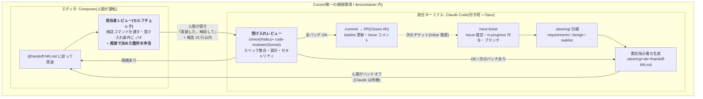

# Cursor + Claude Code 併用ガイド(Cursor 主環境・実装は Composer に委託)

Cursor を唯一の開発環境とし、その統合ターミナルから Claude Code を動かす構成の準備手順と運用ルール。

- ステータス: **保留**(未実装 / 設定サンプルは未検証)
- 調査日: 2026-08-08
- **保留の理由(2026-08-10)**: 週上限対策として、より安く可逆な **「実装フェーズだけ Sonnet に切り替える」** を先に採用した(`CLAUDE.md`「実装フェーズのモデル切替」)。Cursor 導入はハーネスの二重管理・人間の中継・二系統のコストという恒久的な負債を伴うため、**Sonnet 切替で足りなかった場合の次の手段**として本ドキュメントを保存する
- **再開する前に確認すること**(§ の該当箇所):
  1. Sonnet 切替後も上限に当たるか。`/usage` で内訳を見て、**実装ループが主因である**ことを確認する(主因でないなら Cursor 導入は的外れ)
  2. Cursor の devcontainer が動くか。**本リポジトリの `devcontainer.json` は既知のクラッシュ報告条件(`customizations.vscode` ブロックあり)に一致する**(§3 ステップ2)
  3. Cursor 側の枠が受け皿になるか。Pro は $20 のクレジットプール制で、残があってもレート制限がかかる(§3 ステップ0)
- 前提の確定事項:
  - **Codex は使わない**([`codex-delegation-plan.md`](./codex-delegation-plan.md) は不採用として保存)
  - **VS Code から Cursor へ全面移行する**(併存させない)
  - **Claude Code は Cursor の統合ターミナルから起動する**
  - **設計・計画・検収は Claude Code、実装は Cursor の Composer**

> **すぐ手を動かす場合は §3(導入手順)から読む。** §1〜2 は「なぜこの分担なのか」、§4 が委託フローの本体、§5〜7 が日々の運用。

---

## 1. 狙いと、それが成立する理由

### 解きたい問題

**Claude Code の週間上限に頻繁に当たる。** 設計や判断のために Claude を使いたいのに、実装ループで枠を使い切ってしまう。

エージェント開発でトークンを最も食うのは「実装 → テスト → エラーを読む → 修正」のループ。ここはツール呼び出しが多く、エラーログと差分がコンテキストに積み上がり、**それが毎ターン再送されるため加速度的に高くつく**。逆に言えば、**このループだけを外に出せれば消費は大きく落ちる**。

### 分担の結論

| フェーズ | 担当 | 理由 |
| --- | --- | --- |
| チケット選定・`.steering/` 計画(requirements / design / tasklist) | **Claude Code** | ここが Claude を使う価値の本体。安く済む(生成量が少ない) |
| **委託指示書の作成** | **Claude Code** | 設計を Composer が実行できる形に翻訳する。§4.2 |
| **実装(コードを書く)** | **Cursor Composer** | 最も高くつく区間を Cursor 側の枠に移す |
| **担当者レビュー(提出前セルフチェック)** | **Cursor Composer** | 安い通貨(Cursor 枠)で検収の往復を先に潰す。§4.3 |
| 受け入れレビュー(`/check` + code-reviewer) | **Claude Code** | 品質の砦。ただし**差分全文を司令塔に読ませない**作法が必須(§7) |
| コミット・PR・Issue 操作 | **Claude Code** | ブランチポリシー hook と `/commit` の粒度規約に乗る |

### なぜ Composer なのか(CLI ではなく)

Claude Code から Cursor の Composer をプログラム的に起動する手段は**存在しない**(GUI にプロンプトを注入する API が無い)。したがって受け渡しは**人間が仲介する**。

これは一見不便だが、この構成ではむしろ利点になる:

- **Claude Code が Cursor の統合ターミナルで動いている**ので、指示書を書いた Claude と、それを貼り付ける Composer が同一ウィンドウ内にある。切り替えコストがほぼゼロ
- Cursor の `@` ファイル参照が使えるので、**指示書の全文をコピペする必要がない**(`@handoff-01.md に従って実装して` の一行で済む。§4.4)
- 人間が必ず一度は介在するため、**的外れな委託が走り出す前に気づける**(委託の失敗は二重コストになる。§7.4)

Cursor CLI(`cursor-agent -p` によるヘッドレス委託)も技術的には可能だが、本構成では**採用しない**。理由は §8。

---

## 2. 全体像



守るべき不変条件は 3 つ:

1. **Composer から `/commit`・PR・Issue 操作への直行ルートを作らない。** SessionStart hook が注入する「現在地」の正確さは、これらを Claude が独占していることで担保されている
2. **`.steering/` を Composer に書かせない。** 進捗が二重管理になると tasklist が必ず壊れる
3. **同時に手を動かすのは常に一方だけ。** Claude の Edit と Composer の編集が競合すると、後勝ちで静かに消える(§6)

**レビューは二段**(担当者レビュー = Composer / 受け入れレビュー = Claude)。ただし役割は重複させず、Composer 側は「自分の記憶がある方が有利な項目」だけを担う。設計と分担の根拠は §4.3。

---

## 3. 導入手順(ハンズオン)

設定ファイルの中身と設計理由は §5 に分離してある。初回は本節を上から実行し、詰まったら §5 の該当項を読む。

> **所要**: ステップ 1〜5 で 40 分程度(Cursor のインストールと索引作成を含む)。

### ステップ 0: 前提を確定する(コードを書く前)

1. **データガバナンス**: Cursor を使うとコードが Cursor 側に送信される。顧客コード・コンプライアンス制約のある案件ではここで「不可」の判断があり得る。不可なら本構成は採れない(Claude Code 単独で全フローが成立する設計なので、導入しないことによる欠損は無い)
2. **プライバシー設定**: 導入するなら Cursor の **Privacy Mode**(コードを保存・学習に使わせない設定)の有無を先に決める。組織利用なら Teams/Enterprise 側で強制する
3. **コストが二系統になる**: Claude(サブスク / API)と Cursor(サブスク + 従量)。**週上限の壁を片方からもう片方へ移すだけにならないか**を数チケット回して実測する前提で始める(§7.5)

### ステップ 1: Cursor をインストールし、VS Code から移行する

[cursor.com](https://cursor.com) からインストーラを取得する。

| OS | 方法 |
| --- | --- |
| macOS | 公式サイトから `.dmg`、または `brew install --cask cursor` |
| Windows | 公式サイトから `.exe` |
| Linux | 公式サイトから `.AppImage`(実行権限を付けて起動) |

初回起動時:

- **VS Code からの設定インポートを実行する**(拡張・キーバインド・Dev Containers 拡張が引き継がれる)。全面移行するので、ここで一度に移す
- サインイン(GitHub 連携が最短)
- Privacy Mode をステップ 0 の判断どおりに設定

移行後、**VS Code はこのリポジトリでは開かない**。両方で開くと devcontainer の二重起動やファイルロックの原因になる。

### ステップ 2: devcontainer で開く

本テンプレートは devcontainer 前提(Node.js v24 固定)。**ホストで開くと Node のバージョン差で `npm run` もフックも動かない。**

1. `File → Open Folder` でリポジトリを開く
2. 拡張に **Dev Containers** があることを確認(ステップ 1 でインポート済みのはず)
3. コマンドパレット(`Cmd/Ctrl+Shift+P`)→ **`Dev Containers: Reopen in Container`**
4. コンテナ内のターミナルで確認:

```bash
node -v            # v24.x
jq --version       # フックが依存する。無ければ入れる
npm run lint       # 通ること
git branch --show-current
```

**リビルドに失敗する場合**: Cursor の Dev Containers サポートは本家 VS Code ほど枯れていない。ただし本構成では VS Code を残さない方針なので、回避策は次の 2 つ:

- **A**: `devcontainer` CLI(`npm i -g @devcontainers/cli`)でコンテナを先に起動し、Cursor から `Dev Containers: Attach to Running Container` でアタッチする
- **B**: devcontainer を諦めてホストに Node v24 を直接入れる(`.devcontainer/devcontainer.json` と同じバージョンに揃える)。この場合 `post_create.sh` 相当の初期化を手で行う

### ステップ 3: Cursor 側の初期設定

`Cmd/Ctrl+,` の Cursor Settings で、本構成に必須の 3 つ:

| 設定 | 値 | 理由 |
| --- | --- | --- |
| **Auto-Run / 自動実行(旧 YOLO モード)** | **オフ** | ターミナルコマンドを無承認で走らせる設定。§5.2 の hooks は fail-open なので、ここを開けると Claude 側のガードを完全に迂回した実行経路ができる |
| **Background Agent** | **オフ** | Claude Code と同一ツリーで衝突する(§6) |
| **Codebase Indexing** | オン(ただし `.cursorignore` 設置後) | Composer の精度に効く。**先に `.cursorignore` を置いてから索引を作る**(ステップ 4 の順序) |

※ 設定項目名はバージョンで変わる。見つからない場合は設定検索で `auto` / `background` / `index` を引く。

> **Auto-Run オフとセルフチェックの緊張関係**: セルフチェック(§4.3)は `npm run lint` / `typecheck` / `test` の実行を要求するが、Auto-Run オフだと毎回承認ダイアログが出る。Composer が「ユーザーに実行を促して終了」してしまうと報告が来ない。
>
> 対策は 2 つ組み合わせる: ①`guard-shell.sh` で**検証コマンドだけを完全一致で自動許可**する(§5.2)、②`stop` フックが**フック自身で検証を実行する**(§5.2.1)。②は Auto-Run 設定と無関係に動くため、①が効かない場合の保険になる。
>
> **①がフックの `allow` だけで承認ダイアログを飛ばせるかは公式ドキュメントに明記が無く、未検証**。ステップ 6 の #7 で実測すること。飛ばせなくても ② があるので構成は成立する。

### ステップ 4: リポジトリ側のファイルを設置する

順序に意味がある。**`.cursorignore` を最初に置く**(索引が走る前に秘匿情報を除外するため)。

```bash
# 1) 除外設定を先に置く(中身は §5.3)
touch .cursorignore .cursorindexingignore

# 2) Composer が読む唯一の規約ファイル(中身は §5.1)
#    Claude Code に生成させるのが早い:
#    「CLAUDE.md から AGENTS.md を派生生成して。
#      含める/含めないは docs/template-dev/cursor-coexistence-plan.md §5.1 に従って」
touch AGENTS.md

# 3) Cursor 固有ルール(中身は §5.1)
mkdir -p .cursor/rules
touch .cursor/rules/00-harness-boundary.mdc

# 4) ハーネス再現(中身は §5.2 / §5.2.1)
mkdir -p .cursor/hooks
touch .cursor/hooks.json \
  .cursor/hooks/guard-shell.sh .cursor/hooks/after-edit.sh .cursor/hooks/verify-on-stop.sh
chmod +x .cursor/hooks/*.sh
git update-index --chmod=+x .cursor/hooks/*.sh

# 5) MCP(中身は §5.4)
cp .mcp.json .cursor/mcp.json
```

各ファイルの中身は §5 からコピーする。**`.cursor/` を `.gitignore` に足さないこと**(§5.5)。設置後、**Cursor を再起動する**(hooks とルールの読み込みはウィンドウ単位)。

### ステップ 5: Claude Code を統合ターミナルで起動する

```bash
# Cursor の統合ターミナル(コンテナ内)で
claude
```

確認すること:

- SessionStart hook の現在地注入が出ること(ブランチ・ベースブランチ)
- `/model` が **Opus** であること
- `gh auth status` が認証済みであること

**ターミナルを 1 枚に固定する**。Claude Code のセッションを複数開くと、どちらが今のチケットを持っているか分からなくなり、`.steering/` の更新が競合する。

### ステップ 6: 動作確認(ここまでやって初めて「導入済み」)

`AGENTS.md` を置いただけでは効いている保証がない。実際に試す。

| # | 確認方法 | 期待する結果 |
| --- | --- | --- |
| 1 | Composer に「このリポジトリのテスト実行コマンドは?」と聞く | `AGENTS.md` の検証コマンドを答える(答えられない = 規約が読まれていない) |
| 2 | Composer に「`.steering/` の tasklist を更新して」と頼む | 禁止事項に従って断る、または確認を求める |
| 3 | **保護ブランチで** Composer に `git commit` を実行させる | `check-branch-policy.sh` のメッセージでブロックされる(§5.2 が効いている証拠) |
| 4 | Composer に `npm publish` を実行させる | `block-dangerous-cmds.sh` でブロックされる |
| 5 | Composer に `.ts` を編集させる | 保存後に prettier が当たっている(整形差分が出ない) |
| 6 | Composer で `@.env` を参照させる | `.cursorignore` により参照できない |
| 7 | **Composer に `npm test` を実行させる**(Auto-Run はオフのまま) | 承認ダイアログが出ずに実行される(§5.2 の自動許可が効いている)。**出る場合は §3 ステップ3 の注記のとおり ② に頼る** |
| 8 | **わざとテストを 1 件失敗させ、Composer に何か実装させて応答を終わらせる** | `stop` フックが検証を回し、**自動で差し戻しメッセージが送られる**(§5.2.1 が効いている証拠) |
| 9 | 8 の状態で `@handoff-01.md に従って実装して` だけを指示 | 実装後、セルフチェックの報告(15 行以内・推測箇所つき)まで到達する |

**3〜5 が動かない場合**の頻出原因は ①実行権限が落ちている ②コンテナに `jq` が無い ③`cd "$(dirname "$0")/../.."` がリポジトリルートに解決していない、の 3 つ。

```bash
# 手動でフックを叩いて切り分ける
echo '{"command":"npm publish"}' | ./.cursor/hooks/guard-shell.sh
# → {"permission":"deny", ...} が返れば OK

echo '{"command":"npm test"}' | ./.cursor/hooks/guard-shell.sh
# → {"permission":"allow"} が返れば OK

echo '{"status":"completed","loop_count":0}' | ./.cursor/hooks/verify-on-stop.sh
# → {"followup_message":"..."} が返れば OK(検証が走るので時間がかかる)
```

**#9 が通らない**(報告が来ない)場合は、§4.3「遵守の担保」のプロンプト側の手当て(3 箇所に書く / 手順に番号で入れる / 完了定義を報告にする)を順に足す。それでも安定しないなら、**運用でカバーしてよい** — 「推測で決めた箇所は?」と一行返すだけで済み、消費するのは Cursor 側の枠だけ。

### ステップ 7: チームへ展開する

- `AGENTS.md`・`.cursor/`(rules / hooks / mcp)・`.cursorignore` を**コミットする**
- README に「開発環境は Cursor。実装フローは `docs/template-dev/cursor-coexistence-plan.md` を読むこと」の一行を足す
- **§6 の排他運用ルールを口頭でも共有する**。設定で防げない唯一の事故がこれ

---

## 4. 委託フロー(本体)

### 4.1 `/next-ticket` の改造

通常の `/next-ticket` はチケット選定から実装・PR までを一気通貫で行う。本構成では**実装フェーズの直前で止まり、委託指示書を出して人間にハンドオフする**。

| # | 実行者 | やること |
| --- | --- | --- |
| 1 | Claude | Issue 選定 → `in-progress` ラベル付与 → ブランチ作成(ポリシーは `.claude/branch-policy.json`) |
| 2 | Claude | `.steering/[YYYYMMDD]-[タスク名]/` に `requirements.md` / `design.md` / `tasklist.md` を作成 |
| 3 | Claude | tasklist をバッチに割り、**先頭バッチの `handoff-01.md` を生成**して停止。ユーザーに「Composer に渡してください」と伝える |
| 4 | **人間** | Composer で `@handoff-01.md に従って実装して` と指示。差分を目視して保存 |
| 5 | **Composer** | **提出前セルフチェック**(検証コマンドを通す・受け入れ条件に ✓/✗・推測箇所の申告)。§4.3 |
| 6 | **人間** | ターミナルの Claude に戻り「実装した、検収して」+ セルフチェック報告を貼る |
| 7 | Claude | **受け入れレビュー**: `git diff --stat` で範囲確認 → `/check` → code-reviewer(差分の中身は subagent に読ませる。§7.1) |
| 8 | Claude | 指摘があれば `handoff-01-fix.md` を出して 4 へ戻る。無ければ tasklist を更新し、次バッチの `handoff-02.md` を生成して 4 へ |
| 9 | Claude | 全バッチ完了 → `/commit` → PR(`Closes #N`)→ Issue に `.steering/` ディレクトリ名と PR URL をコメント |

**バッチを挟む理由**: 検収なしで全タスクを流すと、前半の欠陥の上に後半が積まれ、修正コストが跳ね上がる。**1 バッチ = tasklist 3〜5 項目、または想定差分 150 行程度**を目安にする。

**レビューが二段になっている**(ステップ 5 と 7)。役割は重複させない — 分担の設計は §4.3。

### 4.2 委託指示書(`handoff-NN.md`)の書式

`.steering/[dir]/handoff-01.md` として Claude が生成する。**Composer が単独で完遂できる自己完結性**が要件。

```markdown
# handoff-01: [バッチの目的を一行で]

> このタスクは**報告の提出をもって完了**。コードを書いただけでは未完了。

## 対象
- tasklist.md の 1〜3
- 触るファイル: `src/foo/*.ts`(新規)、`src/index.ts`(登録のみ)

## 前提(読むべきもの)
- `design.md` の §2「データフロー」
- 既存パターン: `src/bar/baz.ts` を踏襲する

## 手順
1. ...
2. ...
3. **提出前セルフチェック**(下記)を実行し、報告を出す ← ここまでが手順

## 受け入れ条件
- `npm run lint` / `npm run typecheck` / `npm test` が通る
- [機能面の条件を具体的に]

## この範囲でやらないこと
- `.steering/` の編集
- `git commit` / `git push` / PR 作成
- 依存パッケージの追加
- 上記「対象」以外のファイルの変更

## 提出前セルフチェック(実装後に必ず実行)
1. `npm run lint` / `npm run typecheck` / `npm test` を実行し、**すべて通してから**報告する
2. 上の「この範囲でやらないこと」に違反していないか `git status` で確認する
3. 上の「受け入れ条件」の各項目に ✓ / ✗ を付ける
4. **迷った箇所・仕様が曖昧で推測で決めた箇所を列挙する**(最重要)

報告は **15 行以内**。差分の説明は書かない(Claude 側で読む)。
「問題ありません」だけの報告は不可 — 4 が無いなら「推測なし」と明記する。
修正は上の「対象」の範囲内に限る(ついでの改善はしない)。
```

書き方のコツ:

- **手順は design.md からの引き写しではなく、実行可能な粒度に翻訳する**。ここが Claude を使う価値。曖昧なまま渡すと Composer が設計判断を始め、往復が増えて委託が損になる
- **「やらないこと」を毎回書く。** AGENTS.md にも同じ禁止事項があるが、指示書側にもあると遵守率が上がる
- **参照はパスで渡す。** 指示書に design.md の内容を貼らない(Composer は `@` で読める)
- **セルフチェックを `## 手順` の最終ステップとしても番号で挙げる**(上のテンプレート参照)。独立した末尾セクションだけだと脱落しやすい。冒頭の「報告の提出をもって完了」も同じ目的(§4.3)

### 4.3 二段レビュー — 担当者レビュー(Composer)と受け入れレビュー(Claude)

Composer 側にもレビューを持たせる。**同一エージェントの自己レビューは検出率が落ちる**が、それでも入れる価値がある。理由は品質ではなく**通貨**にある。

**Composer で潰せた欠陥は、検収の往復を 1 回まるごと消す**(Claude が読む → 修正指示を書く → 人間が中継 → Composer が直す → Claude が再検収)。この 1 往復は Claude 側で数千トークン規模で、しかも以降ずっと再送される。対してセルフチェックは Cursor の枠で消費される。**安い通貨で高い通貨を買っている**構図なので、検出率が 5 割でも割に合う。

#### 分担(重複させない)

人間の担当者レビューが機能するのは**別人がやるから**。同一セッションの Composer は自分の設計判断を前提に読むため、**設計の誤りは高確率で見逃す**。したがって Composer に任せるのは「**自分の記憶がある方が有利な項目**」に限定する。

| 項目 | 担当 | 理由 |
| --- | --- | --- |
| 検証コマンド(lint / typecheck / test)を通す | **Composer** | 最大の往復発生源。機械判定なので自己レビューの弱点が出ない |
| 「やらないこと」への違反(`git status` で範囲確認) | **Composer** | 自分が触った範囲は自分が一番知っている |
| 受け入れ条件の各項目に ✓ / ✗ | **Composer** | 指示書と実装の対応は本人が最も速い |
| **推測で決めた箇所の申告** | **Composer** ★ | 下記のとおり最も価値が高い |
| `docs/` とのスペック整合 | **Claude** | Composer に設計全体の文脈が無い。やらせると的外れなノイズが出る |
| 既存パターンの踏襲・設計の妥当性 | **Claude** | 自己レビューが最も苦手な領域 |
| セキュリティ・認証まわり | **Claude** | 見逃しのコストが非対称 |

★ **これが二段レビューの本命。** 実装者は「どこで推測したか」を知っている。これは差分を外から読む Claude には推測できない情報で、「`design.md` にエラー時の挙動が無かったので握り潰した」の一行があれば、Claude は該当箇所だけを狙って確認できる。**隠れた欠陥が、安い質問に変換される。**

#### 遵守の担保 — プロンプトだけに頼らない

`@handoff-01.md に従って実装して` の一行で、Composer は実装からセルフチェックまで**一応やる**。指示書はコンテキストに入っているので実行はされる。ただし**エージェントの典型的な失敗としてタスク末尾ほど脱落する** — 実装が終わった時点で「実装完了しました」+ 自前の要約で締めてしまい、指定した書式の報告に落ちてこない。

そこで**項目ごとに担保の方法を分ける**。

| セルフチェック項目 | 担保の方法 | 信頼度 |
| --- | --- | --- |
| 1. 検証コマンドを通す | **`stop` フックで機械的に実行・差し戻し**(§5.2.1) | **高**(エージェント非依存) |
| 2. 範囲違反の確認 | 同上のスクリプトに `git status` を足せば機械化可 | 高 |
| 3. 受け入れ条件に ✓ / ✗ | プロンプト遵守 + `followup_message` での催促 | 中 |
| 4. **推測で決めた箇所の申告** | プロンプト遵守のみ(内容の検査は原理的に不可) | 中 |

**項目 4 は機械化できない。** 何を推測したかはエージェントしか知らないため。ただし**回復は非常に安い** — 報告が来なければ Composer に「推測で決めた箇所は?」と一行返すだけで済み、消費するのは Cursor 側の枠だけ。

プロンプト側で遵守率を上げる手も併用する:

- **3 箇所に書く。** `.cursor/rules/00-harness-boundary.mdc`(`alwaysApply: true`)・`AGENTS.md`・指示書(§5.1 / §4.2)
- **セルフチェックを独立した末尾セクションにせず、`## 手順` の最終ステップとして番号を振る。** 手順の一部として扱われ、脱落率が下がる
- **完了定義を報告にする。** 指示書の冒頭に「このタスクは報告の提出をもって完了。コードを書いただけでは未完了」と書く

#### 守るべき 3 つの制約

1. **報告は 15 行以内。** セルフチェックの結果は Claude が読む → コンテキストに載る → 毎ターン再送される。長い review レポートを返すと §7.1 で潰したはずの無駄が復活する。**差分全文を読ませない原則は、レポート自体にも適用される**
2. **Claude 側は報告を理由に検収を省略しない。** セルフチェックは参考情報であって受け入れレビューの代替ではない。`/check` と code-reviewer は報告の内容にかかわらず必ず回す。ここを曖昧にすると二段構えのつもりが一段になる
3. **セルフチェックが追加実装を誘発しない。** 「ついでにここも直しました」が出ると差分が膨らみ、検収コストが上がってスコープガードも崩れる。修正は指示書の「対象」の範囲内に限る

#### 別セッションレビュー(大きいバッチのみ)

より本来の担当者レビューに近づけたい場合は、**Composer の新規タブ(実装文脈なし)で「この差分をレビューして」と別途かける**。実装時の思い込みが引き継がれないぶん検出率が上がる。Cursor のサブエージェント機能を使う手もある。

ただしコストは上がるので、**既定は上記のセルフチェック、想定差分 150 行を超えるバッチや敏感な領域のときだけ別セッションレビュー**という切り分けにする。

### 4.4 ハンドオフの実際の操作

Composer に貼るのは一行でよい。Cursor の `@` 参照が指示書を読み込む。

```
@.steering/20260808-add-user-profile/handoff-01.md に従って実装して
```

必要なら参照を足す:

```
@handoff-01.md に従って実装して。既存パターンは @src/bar/baz.ts を踏襲。
```

**戻すときの合図を決めておく**: 「実装した、検収して」。Claude 側はこれを受けて必ず `git status` / `git diff --stat` から始める(自分が書いていない差分を認識するため)。

このとき **Composer のセルフチェック報告(15 行以内)も一緒に貼る**。Claude は報告の「推測で決めた箇所」を受け入れレビューの重点確認項目として扱う(§4.3)。

### 4.5 打ち切りルール

**同じバッチの検収指摘が 2 回連続で解消しなければ、委託を打ち切って Claude が直接実装する。** 打ち切った後は同じバッチを再委託しない(Claude ↔ Composer の往復ループを閉じる)。

これは CLAUDE.md の既存ルール(「同じエラーの修正に 2 回連続で失敗したら同じアプローチを繰り返さない」)の委託版。往復が増えた時点で、委託によるトークン削減はすでに消えている。

### 4.6 委託しないもの

| 委託しない | 理由 |
| --- | --- |
| `docs/` の永続ドキュメント・`.steering/` | 状態の正。Claude が独占する |
| アーキテクチャに影響する実装・参照実装(お手本になるコード) | 後続が真似するため品質のレバレッジが最大。Claude が書く |
| 認証・決済・データ移行など敏感領域 | 検収コストが生成コストを上回る |
| 仕様に曖昧さが残るもの | Composer が設計判断を始めて往復が増える。先に design.md を詰める |
| 新規依存パッケージの追加を伴うもの | 追加判断は Claude 側。先に入れてから委託する |
| tasklist 2 項目以下の小さな塊 | ハンドオフと検収の固定費が生成コストを上回る |

なお **P0(基盤構築)フェーズは委託向きの塊がほとんど出ない**。真似できる既存パターンと `/check` の検証コマンドが揃った後、つまり P1/P2 の横展開フェーズから効き始める。P0 でも、Claude が最初の参照実装を書き終えた時点で、同型の残りは委託条件を満たす。

---

## 5. 設定ファイルの準備

### 5.1 規約の橋渡し — AGENTS.md

**Composer は `CLAUDE.md` も `.claude/settings.json` も hooks も読まない。** 読むのはルートの `AGENTS.md` と `.cursor/rules/*.mdc`。

方針は **`CLAUDE.md` を正とし `AGENTS.md` を派生生成する**(手書きで二重管理しない)。

- **含める**: 検証コマンド(lint / typecheck / test / format)、コーディング規約、ディレクトリの意味、スコープガード、禁止事項
- **含めない**: モデル運用方針・subagent 委譲ルール・スラッシュコマンド一覧(Composer には無意味なノイズ)

禁止事項は最低限これを書く:

```markdown
## 禁止事項

- `git commit` / `git push` / PR 作成をしない(コミットは Claude Code の `/commit` が行う)
- `.steering/` 配下を編集しない(作業進捗の正は Claude Code が管理する)
- `docs/` 直下の永続ドキュメント6点を編集しない(変更提案はコメントに留める)
- ブランチの切り替え・作成をしない(`.claude/branch-policy.json` が正。現在のブランチのまま作業する)
- 依存パッケージを独断で追加しない
- 委託指示書(`handoff-NN.md`)の「対象」に無いファイルを変更しない

## 報告の作法

実装を終えたら、指示書の「提出前セルフチェック」を実行して報告する。

- 報告は **15 行以内**。差分の説明は書かない(Claude Code 側で読む)
- 「問題ありません」だけの報告は不可。**推測で決めた箇所を必ず申告する**(無ければ「推測なし」と明記)
- セルフチェックで見つけた問題の修正は、指示書の「対象」の範囲内に限る
```

`.cursor/rules/` には **Cursor 固有の話だけ**を置く。常時適用は短く保ち、細かい規約は glob で絞る。

```
.cursor/rules/
  00-harness-boundary.mdc   # alwaysApply: true(短く。禁止事項の再掲)
  10-typescript.mdc         # globs: src/**/*.ts — 型・命名規約
  20-tests.mdc              # globs: **/*.test.ts — テストの書き方
```

`.mdc` のフロントマターは 3 キー(`description` / `globs` / `alwaysApply`)。

```md
---
description: 'ハーネス境界。Composer が触ってはいけない領域'
alwaysApply: true
---

このリポジトリは Claude Code(設計・検収)と併用されている。
実装の指示は `.steering/<dir>/handoff-NN.md` で渡される。
**指示書のタスクは「提出前セルフチェックの報告」を出して完了**であり、
コードを書いただけでは未完了。報告は 15 行以内。
詳細な規約と禁止事項は @AGENTS.md を参照すること。
```

> 適用タイプは frontmatter の組み合わせで決まる: `alwaysApply: true` = 常時 / `description` のみ = エージェント判断 / `globs` 指定 = ファイル一致時 / どちらも無し = `@` メンション時のみ。

**同期の担保**: `/sync-docs` の検査対象に「`CLAUDE.md` ↔ `AGENTS.md` ↔ `.cursor/rules/` の乖離」を追加する。検証コマンドを変えたときに片方だけ古くなるのが最頻の事故。

### 5.2 ハーネスの再現 — Cursor Hooks から既存スクリプトを呼ぶ

Claude Code の PreToolUse / PostToolUse hook は **Claude の操作にしか効かない**。Composer の操作には別途ガードが要る。

`.claude/scripts/*.sh` は「stdin から JSON を読み、ブロック時に exit 2」という作りで、Cursor Hooks の規約(exit 2 = deny)と一致している。ペイロードの形だけが違うので、**薄いアダプタを噛ませて同じスクリプトを再利用する**(規約を二重実装しない)。

`.cursor/hooks.json`:

```json
{
  "version": 1,
  "hooks": {
    "beforeShellExecution": [{ "command": "./.cursor/hooks/guard-shell.sh", "timeout": 15 }],
    "afterFileEdit": [{ "command": "./.cursor/hooks/after-edit.sh" }],
    "stop": [{ "command": "./.cursor/hooks/verify-on-stop.sh", "timeout": 300 }]
  }
}
```

3 本の役割:

| フック | 役割 | 対応する Claude Code 側 |
| --- | --- | --- |
| `beforeShellExecution` | 危険コマンド・ブランチポリシーのブロック + **検証コマンドの自動許可** | PreToolUse(Bash) |
| `afterFileEdit` | 保存時の prettier + lint | PostToolUse(Write\|Edit) |
| **`stop`** | **応答完了時に検証コマンドを実行し、失敗なら自動で差し戻す** | 相当なし(Cursor 固有。§5.2.1) |

`.cursor/hooks/guard-shell.sh`(危険コマンド + ブランチポリシーの再現):

```bash
#!/bin/bash
# Cursor の beforeShellExecution ペイロード({command, cwd, sandbox})を
# Claude Code の PreToolUse 形({tool_input:{command}})に変換し、
# .claude/scripts/ の既存ガードをそのまま再利用する。
set -uo pipefail
cd "$(dirname "$0")/../.." || {
  echo '{"permission":"allow"}'
  exit 0
}
export CLAUDE_PROJECT_DIR="$PWD"

cmd="$(jq -r '.command // empty')"
[ -z "$cmd" ] && {
  echo '{"permission":"allow"}'
  exit 0
}
payload="$(jq -nc --arg c "$cmd" '{tool_input:{command:$c}}')"

for s in block-dangerous-cmds.sh check-branch-policy.sh; do
  msg="$(printf '%s' "$payload" | "./.claude/scripts/$s" 2>&1 >/dev/null)"
  if [ $? -eq 2 ]; then
    jq -nc --arg m "$msg" '{permission:"deny", user_message:$m, agent_message:$m}'
    exit 0
  fi
done

# 読み取り専用の検証コマンドは明示的に許可する。
# Auto-Run オフのままセルフチェック(§4.3)を回すために必要
# (ここを通さないと承認ダイアログ待ちで Composer が止まる)。
case "$cmd" in
  "npm run lint" | "npm run typecheck" | "npm test" | "npm run format:check" | "git status" | "git diff --stat")
    echo '{"permission":"allow"}'
    exit 0
    ;;
esac

echo '{"permission":"allow"}'
```

> **完全一致でマッチさせている**のは意図的。`npm test && rm -rf /` のような連結を許可しないため、前方一致やパターンにしない。使う検証コマンドがプロジェクトで違う場合はここを書き換える(`docs/development-guidelines.md` の検証コマンドと揃える)。

`.cursor/hooks/after-edit.sh`(整形 + lint の再現):

```bash
#!/bin/bash
# Cursor の afterFileEdit({file_path, edits})→ prettier + lint-on-edit。
# 観測系フックなので出力は {} 固定(ブロックはできない)。
set -uo pipefail
cd "$(dirname "$0")/../.." || {
  echo '{}'
  exit 0
}
export CLAUDE_PROJECT_DIR="$PWD"

f="$(jq -r '.file_path // empty')"
[ -n "$f" ] && npx --no-install prettier --write --ignore-unknown "$f" >/dev/null 2>&1
[ -n "$f" ] && printf '{"tool_input":{"file_path":"%s"}}' "$f" |
  ./.claude/scripts/lint-on-edit.sh >/dev/null 2>&1 &
echo '{}'
```

#### 5.2.1 `stop` フック — セルフチェックの機械的強制

**プロンプトだけではセルフチェックは尻すぼみになる**(§4.3 の「担保の 2 層」)。Cursor の `stop` フックは `followup_message` を返すと**それが次のユーザーメッセージとして自動送信される**ため、エージェントの善意に頼らず差し戻せる。

`.cursor/hooks/verify-on-stop.sh`:

```bash
#!/bin/bash
# 応答完了時に検証コマンドを実行し、失敗なら自動で差し戻す。
# stdin: {status: "completed"|"aborted"|"error", loop_count: N}
# stdout: {followup_message: "..."} を返すと Cursor が次のメッセージとして自動送信する。
set -uo pipefail
cd "$(dirname "$0")/../.." || {
  echo '{}'
  exit 0
}

payload="$(cat)"
# 2 回目以降は介入しない(自動送信のループを 1 往復で止める)
[ "$(printf '%s' "$payload" | jq -r '.loop_count // 0')" -ge 1 ] && {
  echo '{}'
  exit 0
}
# 中断・エラー終了時は何もしない
[ "$(printf '%s' "$payload" | jq -r '.status // empty')" = "completed" ] || {
  echo '{}'
  exit 0
}

if out="$(npm run --silent lint 2>&1 && npm run --silent typecheck 2>&1 && npm test 2>&1)"; then
  jq -nc '{followup_message: "検証コマンドは通りました。提出前セルフチェックの報告(15 行以内・受け入れ条件の ✓/✗・推測で決めた箇所)を出してください。"}'
else
  jq -nc --arg o "$(printf '%s' "$out" | tail -30)" \
    '{followup_message: ("検証コマンドが失敗しています。修正してから、提出前セルフチェックの報告を出してください。\n\n" + $o)}'
fi
```

設計上の注意:

- **`loop_count >= 1` で必ず抜ける。** Cursor 側にも `loop_limit`(既定 5)があるが、こちらでも 1 往復に制限する。無限に回すと Cursor の枠を無駄に食う
- **タイムアウトを長めに取る**(上の `hooks.json` では 300 秒)。テストが重いプロジェクトでは実測して調整する
- **`status` が `completed` のときだけ動かす。** ユーザーが中断した(`aborted`)ときに走ると邪魔になる
- **副作用として、Composer が「テストが通っている」と誤申告する事故が構造的に消える。** 実行したのはフックでありエージェントではないため、自己申告の信頼性問題そのものが無くなる
- Claude Code 側は同じ検証を `/check`(test-runner)で回す。**二重実行になるが、Cursor 側は枠が別なので問題にしない**(むしろ Claude 側に失敗が届く前に潰れる)

注意点:

- **`chmod +x` して git に実行権限を記録する**(`git update-index --chmod=+x`)。実行権限落ちはこのリポジトリで既に一度踏んでいる(コミット `221dd0c`)
- Cursor Hooks は **exit 0/2 以外は fail-open**(素通り)。ベストエフォートであり、最終防衛線は CI の `branch-policy` ジョブと pre-commit のまま
- `after-edit.sh` の整形が効いていると、**Claude 側の検収で「整形だけの差分」が出なくなる**。これは検収トークンの節約に直結する(§7)
- `lint-on-edit.sh` のロック(`.claude/.lint-on-edit.lock`)は Claude 側と共有される。§6 の排他運用を守る限り問題にならない

### 5.3 `.cursorignore`

`.gitignore` 記法。**AI(Composer / Tab / Inline Edit / `@` 参照)からのアクセスを遮断する**。索引だけ外したい大きな生成物は `.cursorindexingignore`(こちらは AI からは読める)。

```gitignore
# .cursorignore — 秘匿情報と、Composer に読ませたくないもの
.env
.env.*
!.env.example
*.pem
*.key
node_modules/
dist/
coverage/
```

**`.steering/` は除外しない。** 委託指示書(`handoff-NN.md`)がここに置かれ、Composer が `@` で読む必要があるため。編集の禁止は `.cursorignore` ではなく AGENTS.md の禁止事項で担保する。

```gitignore
# .cursorindexingignore — 索引から外すだけ(必要なら AI は読める)
package-lock.json
docs/template-dev/
```

> 注意: `.cursorignore` は完全な保護ではない。**ターミナル経由や MCP サーバー経由では読めてしまう**。秘密情報の本命の防衛は従来どおり secretlint + GitHub Secret scanning。

### 5.4 MCP 設定

`.mcp.json`(Claude Code)と `.cursor/mcp.json`(Cursor)の二重管理になる。形式(`mcpServers` キー)はほぼ同じなのでコピーする。

```json
{
  "mcpServers": {
    "context7": { "command": "npx", "args": ["-y", "@upstash/context7-mcp"] }
  }
}
```

**サーバーを増やしたら両方に足す。** `/sync-docs` の乖離チェックに含める。

### 5.5 コミット対象

| パス | 扱い |
| --- | --- |
| `AGENTS.md` | **コミットする**(Composer が読む唯一の規約) |
| `.cursor/rules/`・`.cursor/hooks.json`・`.cursor/hooks/`・`.cursor/mcp.json` | **コミットする**(ハーネスの一部) |
| `.cursorignore`・`.cursorindexingignore` | **コミットする** |
| `.steering/*/handoff-NN.md` | **コミットする**(委託の記録。振り返りで粒度調整に使う。§7.5) |
| Cursor のローカル状態(索引キャッシュ等) | `.gitignore` に追加 |

現在の `.gitignore` には `.vscode/` と `.idea/` があるが `.cursor/` は無い。**`.cursor/` を一括 ignore しないこと**(上記が全部消える)。

---

## 6. 排他制御 — 設定で防げない唯一の事故

Claude Code(ターミナル)と Composer(エディタ)は**同じディレクトリ・同じブランチ**を見ている。両者が同時に書くと後勝ちで編集が消える。

### 鉄則

**手を動かすのは常に一方だけ。** 本構成はハンドオフが明示的なので、これは自然に守れる。

| 状態 | Claude Code | Composer |
| --- | --- | --- |
| 計画中・指示書生成中 | 動く | **触らない** |
| 実装中(ハンドオフ後) | **待機**(指示を出さない) | 動く |
| 検収中 | 動く | **待機** |

### ハンドオフ時のチェック

- **Composer に渡す前**: Claude 側の編集が終わっていること。`.steering/` の生成物が保存済みであること
- **Claude に戻す前**: **エディタの未保存バッファを保存する**(`Cmd/Ctrl+S`)。Claude はディスク上のファイルしか読めないため、未保存だと「実装されていない」と判断して二度手間になる
- **戻した直後**: Claude は必ず `git status` / `git diff --stat` から始める

### やってはいけないこと

- Claude Code のセッションを**複数のターミナルで同時に開く**
- Composer の **Background Agent / 複数エージェント並行**を走らせる
- Composer 側でのブランチ切り替え(Claude のセッション認識と `claude/*` ブランチの紐付けが壊れる)
- Claude が動いている最中に Tab 補完でファイルを直す(**静かに上書きされる**)

### 並行したくなったら: worktree 分離

どうしても並行が要るときだけ `git worktree` で物理分離する。**既定にはしない**(検収が分断されるため)。

```bash
git worktree add ../proj-b -b feature/other-ticket
```

チケットを分け、PR も別にする。`/check` と code-reviewer を worktree ごとに回す必要がある。

---

## 7. 週上限を実際に減らす作法

**委託しても、やり方を間違えると消費は減らない。** ここが本構成の成否を分ける。

### 7.1 差分全文を司令塔に読ませない ★最重要

Claude Code の消費は「コンテキストに入れたものを毎ターン再送する」構造で効いてくる。**Composer が書いた差分を司令塔が `git diff` で全文読むと、それが以降ずっと再送され、委託前より高くつく。**

検収の正しい手順:

```bash
git diff --stat          # ← 司令塔が読むのはここまで(範囲の確認)
```

- **差分の中身は code-reviewer subagent(Sonnet)に読ませる。** 司令塔にはサマリーだけ返る
- **`/check` は test-runner subagent(Haiku)に委譲する。** lint / テストの長いログを司令塔に残さない
- 司令塔が直接 `git diff` の全文を読むのは、**指摘の修正を自分で行うと決めたときだけ**

### 7.2 指示書は短く、参照で渡す

`handoff-NN.md` に design.md の内容を貼らない。Composer は `@` でファイルを読める。**指示書自体が長いと、生成コスト(Claude 側)が委託の利得を食う。**

目安: `handoff-NN.md` は **50 行以内**。それを超えるならバッチが大きすぎる。

### 7.3 セルフチェックで往復を先に潰す

**往復 1 回の削減効果は、セルフチェックのコストより桁で大きい。** Composer 側のセルフチェック(§4.3)は Cursor の枠で消費され、それが潰した欠陥は Claude 側の往復をまるごと 1 回消す。**安い通貨で高い通貨を買う**取引なので、検出率が低くても入れる価値がある。

ただし報告が長いと相殺される。**セルフチェック報告は 15 行以内**を守ること — 報告も Claude のコンテキストに載り、以降ずっと再送される(§7.1 の原則がレポート自体にも効く)。

### 7.4 失敗委託は二重コスト

的外れな実装が返ると、Claude が読んで捨てて書き直すぶん、**委託しないより高い**。防ぐ手は 3 つ:

- **委託前に人間が指示書を一読する。** ハンドオフに人間が介在する構成の最大の利点がこれ。曖昧さに気づいたらその場で Claude に直させる(安い)
- **セルフチェックの「推測で決めた箇所」を活用する**(§4.3 ★)。実装者しか知らない不確かさが、検収前に安い質問へ変換される
- **§4.5 の打ち切りルールを守る。** 2 往復した時点で削減効果は消えている

### 7.5 実測して粒度を調整する

§4.1 のバッチサイズ(tasklist 3〜5 項目 / 差分 150 行)は初期値にすぎない。振り返り(steering モード3)で以下を記録し、プロジェクトごとに調整する:

- 各バッチの**検収往復回数**(1 回で通ったか)
- **セルフチェックで自己申告された推測箇所が、実際に受け入れレビューの指摘になった割合**(高ければ指示書の詰めが甘い = §4.2 の手順翻訳を厚くする)
- **受け入れレビューの指摘のうち、セルフチェックで潰せたはずのもの**(検証コマンド漏れ・範囲外変更)。これが多いならセルフチェックが形骸化している
- 打ち切りに至った割合
- Claude 側 / Cursor 側それぞれの消費感

記録先は `.harness/decisions.jsonl`。数チケット回した時点で最適点に収束させる。

### 7.6 委託以外の削減手段も併用する

外部委託は最後の手段ではなく、**組み合わせるもの**:

- **`/check` と `/sync-docs` を必ず subagent 経由で使う**(ログを司令塔に残さない)。CLAUDE.md に既にあるルール
- **チケット完了ごとに `/clear`**。前チケットのツール結果を次チケットで再送し続けるのが最大の浪費
- **広範囲の探索は Explore subagent へ**。司令塔で `grep` の結果を大量に受けない

これらを守った上で委託すると効果が乗る。守らずに委託しても、削減分が司令塔の再送で相殺される。

---

## 8. Cursor CLI(`cursor-agent -p`)を採らない理由

Cursor には CLI があり、`-p` で非対話実行できる。`--output-format json`、`--model`、`--resume` があり、**`AGENTS.md` / `CLAUDE.md` / `.cursor/rules` / `mcp.json` を自動で読む**。つまり Claude Code の Bash から `cursor-agent -p "..."` を呼んで**完全自動の委託ループを組むことは技術的に可能**。

それでも本構成では採らない:

1. **非対話モードはフル書き込み権限を持つ。** `.cursor/hooks.json` を CLI が読むかは公式ドキュメントに記載がなく未確認で、§5.2 のガードが効かない前提で組む必要がある。安全にやるなら worktree 分離とサンドボックス設定が追加で要る
2. **人間の一読が挟まらない。** §7.4 のとおり、失敗委託は二重コスト。自動化するとそれが検収まで気づけない
3. **司令塔が待機する。** `cursor-agent` を Bash で同期実行すると、その間 Claude Code のセッションは何もできない。バックグラウンド実行にすると結果回収のロジックが要る
4. **削減効果は Composer 方式と同じ。** 実装トークンが Cursor 側に移るという本質は変わらない。自動化で得られるのは人間の手数だけ

**将来の選択肢としては有効。** §7.5 の実測で「委託の一発通過率が高く、人間の一読が形骸化している」と分かったら、そのとき CLI 化を検討する(段階 5 相当)。

---

## 9. 段階導入

| 段階 | やること | 変更 | 検証したいこと |
| --- | --- | --- | --- |
| **0. 前提確認** | データガバナンス判断、コスト二系統の了解(ステップ 0) | なし | そもそも使ってよいか |
| **1. 環境移行のみ** | Cursor へ全面移行し、devcontainer で開いて Claude Code を統合ターミナルで動かす。Composer はまだ使わない | `.cursorignore` のみ | 移行で開発が止まらないか、devcontainer が動くか |
| **2. 規約の橋渡し** | `AGENTS.md` + `.cursor/rules/` 最小セット(§5.1) | あり | Composer の出力が規約に沿うか(ステップ 6 の 1〜2) |
| **3. ハーネス再現** | `.cursor/hooks.json` + スクリプト 3 本(ガード / 整形 / **`stop` 検証**。§5.2・§5.2.1) | あり | ブロックと自動差し戻しが実際に効くか(ステップ 6 の 3〜8) |
| **4. 委託の試行** | 手動で `handoff-01.md`(セルフチェック節つき)を書いて Composer に渡し、検収まで 2〜3 回回す | なし | 往復回数と削減の実感。粒度の初期値が妥当か。**プロンプト一行でセルフチェックまで到達するか**(ステップ 6 の #9)。§7.5 の 2 指標 |
| **5. フロー統合** | `/next-ticket` を §4.1 の分岐に改造、README 追記(§10) | あり | チケット単位で回るか |

- **各段階で価値が確認できなければそこで止めてよい。** 段階 1〜3 だけでも「Cursor に移行してハーネスを維持した」という価値は成立する
- 段階 4 は**スキル改造の前に手動でやる**。粒度の感覚が掴めないまま `/next-ticket` を改造すると、作り直しになる
- 段階 5 を実装するなら、テンプレート自身の開発フローに乗せる(各項目を GitHub Issues として発行 → `/next-ticket` で消化)

---

## 10. テンプレート側への反映(実装タスク候補)

| 対象 | 変更 |
| --- | --- |
| `/next-ticket` | §4.1 の委託フローに分岐(指示書生成 → 停止 → 担当者レビュー → 受け入れレビュー → バッチ反復)。バッチ割りと `handoff-NN.md`(セルフチェック節を含む)生成のロジックを追加。**セルフチェック報告を理由に検収を省略しない**旨を明記 |
| `steering` スキル | モード1に「tasklist の項目へ委託可否マークを付ける」を追加。モード3に往復回数とセルフチェックの有効性(§7.5)の記録を追加 |
| `CLAUDE.md` | 「開発環境と分担」節を新設: Cursor 主環境・実装は Composer 委託・**二段レビューと受け入れレビューを省略しないこと**(§4.3)・排他運用(§6)・検収で差分全文を読まない(§7.1)。**Codex 関連の記述は入れない** |
| `/harness-setup` | Cursor 前提の生成物(`AGENTS.md`・`.cursor/*`・`.cursorignore`)を作るステップを追加 |
| `/sync-docs` | 検査対象に `CLAUDE.md` ↔ `AGENTS.md` ↔ `.cursor/rules/`、`.mcp.json` ↔ `.cursor/mcp.json` の乖離を追加 |
| `/kickoff` フェーズ1 | スタック置換リストに `AGENTS.md` の検証コマンドと `.cursor/rules/` を追加 |
| `.devcontainer/devcontainer.json` | `customizations.vscode.extensions` は Cursor でも概ね解釈される。`jq` がコンテナに無ければ `post_create.sh` に追加(hooks が依存) |
| `.gitignore` | `.cursor/` を一括 ignore しない旨のコメントを追加 |
| `README.md` | 開発環境を Cursor に書き換え。実運用フローに委託フローの概要 + 本ドキュメントへの導線。免責にコスト二系統を追記 |

---

## 11. アンチパターン集

| アンチパターン | 何が起きるか |
| --- | --- |
| **検収で `git diff` の全文を司令塔に読ませる** | 差分が毎ターン再送され、**委託前より消費が増える**。委託の意味が消える(§7.1) |
| 指示書に design.md の内容を貼る | 指示書の生成コストが削減分を食う。`@` 参照で渡す(§7.2) |
| 検収を挟まず全バッチを一気に流す | 前半の欠陥の上に後半が積まれ、修正コストが跳ね上がる |
| 曖昧な指示書のまま委託する | Composer が設計判断を始め、往復が増えて二重コストになる(§7.4) |
| 打ち切りルールを無視して 3 回目を委託する | 削減効果はとうに消えている。Claude が引き取る方が安い(§4.5) |
| **セルフチェック報告が長い**(差分の説明・review エッセイ) | 報告が Claude のコンテキストに載って毎ターン再送され、§7.1 で潰した無駄が復活する。**15 行以内**(§4.3) |
| **セルフチェック報告を信じて受け入れレビューを省略する** | 二段構えのつもりが一段になる。自己レビューは設計の誤りを高確率で見逃す。`/check` と code-reviewer は報告にかかわらず必ず回す(§4.3) |
| **「問題ありません」だけのセルフチェック報告を許容する** | トークンを使って偽の安心を買っている状態。「推測で決めた箇所」が空なら「推測なし」と明記させる(§4.2) |
| セルフチェックで「ついでの改善」をさせる | 差分が膨らみ検収コストが上がる。スコープガードも崩れる。修正は指示書の「対象」内に限る(§4.3) |
| Composer に docs/ とのスペック整合をレビューさせる | 設計全体の文脈が無いため的外れなノイズが出る。ここは Claude の担当(§4.3 の分担表) |
| Composer に `.steering/tasklist.md` を更新させる | 進捗が二重管理になり、SessionStart hook の注入内容が実態とずれる |
| Composer にコミットさせる | `/commit` の粒度規約とブランチポリシーを迂回する。履歴の語彙も混ざる |
| 未保存のまま Claude に「実装した」と伝える | Claude はディスクしか読めない。「実装されていない」と判断して二度手間 |
| Claude が動いている最中に Tab 補完で直す | 静かに上書きされ、原因不明の不整合になる |
| `CLAUDE.md` と `.cursor/rules/` に規約を別々に手書きする | 検証コマンドを変えたとき片方が古くなり、Composer だけ古いコマンドで「通った」と言う |
| `.cursor/` を `.gitignore` に足す | ハーネス(hooks・rules)がチームに共有されず、自分の環境でだけ効く |
| Auto-Run(旧 YOLO モード)をオンにする | Claude 側ガードを完全に迂回した実行経路ができる |

---

## 参考

- [Cursor Docs — Rules(`.cursor/rules` / `.mdc` / AGENTS.md)](https://cursor.com/docs/context/rules)
- [Cursor Docs — Hooks(`hooks.json`・イベント一覧・exit code)](https://cursor.com/docs/agent/hooks)
- [Cursor Docs — Ignore Files(`.cursorignore` / `.cursorindexingignore`)](https://cursor.com/docs/context/ignore-files)
- [Cursor Docs — CLI Overview](https://cursor.com/docs/cli/overview) / [Using the CLI](https://cursor.com/docs/cli/using)
- [`codex-delegation-plan.md`](./codex-delegation-plan.md) — **不採用**。Codex は使わない方針が確定したため、記録としてのみ保存
